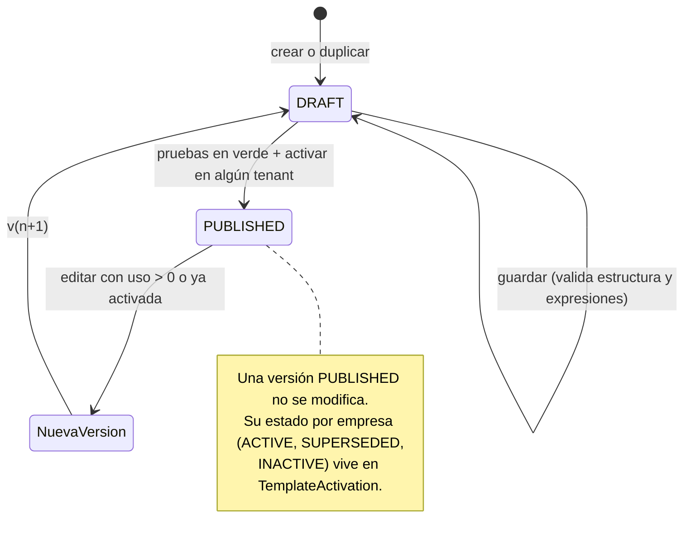

# Data Model: Configuración Contable y Motor de Plantillas

**Feature**: 001-motor-plantillas-contables · **Fuente de verdad**: SDD v3.0 §13 y §20–§21

Este documento concreta, para el prototipo, las entidades del SDD. Los nombres de campo van en inglés (constitución VII); las descripciones, en español. Cada entidad se implementa como `@typedef` JSDoc en `src/domain/accounting/types.js`.

## 1. Convenciones

| Concepto | Representación |
|---|---|
| Importe | Entero en unidades mínimas de la moneda (`*Minor`). Decimales por moneda en `src/domain/shared/currencies.js` (`PEN: 2`, `USD: 2`, `EUR: 2`, `JPY: 0`, …). |
| Tasa de impuesto | Entero en puntos básicos (`rateBp`; 18 % = `1800`). |
| Tipo de cambio | Entero en milésimas (`rateMilli`; 3.745 = `3745`), como en `fx.js`. |
| Fecha | `YYYY-MM-DD`. Timestamps en ISO 8601. |
| Vigencia | `effectiveFrom` (incluida) y `effectiveTo` (incluida, `null` = abierta). |
| IDs | Se generan con el `idGenerator` inyectado; el reloj también se inyecta. |
| Expresión | Nodo AST según [contracts/expression-language.md](contracts/expression-language.md). |

## 2. JurisdictionPack

Dato estático en `src/data/jurisdictions/pe/`, registrado en `src/data/jurisdictions/index.js`.

```js
/** @typedef {Object} JurisdictionPack
 * @property {string} code                    // 'PE'
 * @property {number} version                 // 1
 * @property {string} name                    // 'Perú'
 * @property {string} effectiveFrom
 * @property {string} defaultFunctionalCurrency // 'PEN'
 * @property {string} referenceChartOfAccounts  // 'PCGE'
 * @property {number} roundingToleranceMinor    // 1 unidad mínima por línea convertida (tope total = líneas × tolerancia)
 * @property {number} extractionConfidenceThreshold // 0.85 (lo usa el spec 002)
 * @property {FiscalIdType[]} fiscalIdTypes
 * @property {DocumentTypeDefinition[]} documentTypes
 * @property {TaxDefinition[]} taxes            // incluye retenciones y percepciones
 * @property {OperationType[]} operationTypes
 * @property {Record<'RECEIVED'|'ISSUED'|'INTERNAL', string|null>} mixedOperationTypes // { RECEIVED: 'PURCHASE_MIXED', ISSUED: null, INTERNAL: null }
 * @property {AccountRole[]} accountRoles
 * @property {LegalBook[]} legalBooks
 * @property {ASTTemplate[]} baseTemplates      // scope 'PACK'
 */
```

- **FiscalIdType**: `{ code, name, pattern }`. Ejemplo `{ code: 'RUC', name: 'RUC', pattern: '^\\d{11}$' }` (el dígito verificador se valida en el spec 002).
- **TaxDefinition**: `{ code, name, kind: 'VALUE_ADDED'|'EXCISE'|'WITHHOLDING'|'PERCEPTION'|'DEFERRED_PAYMENT'|'OTHER', rates: [{ rateBp, effectiveFrom, effectiveTo }], recoverableAccountRole?, payableAccountRole?, nonRecoverableTreatment?: 'ADD_TO_COST'|'EXPENSE' }`.
- **OperationType**: `{ code, name, description, allowedPerspectives: [...] }`. Los 25 códigos de la SDD §21.3.
- **AccountRole**: `{ code, name, description, suggestedAccountCode, qualifier?: { name: 'costCenter'|'bankAccount', suggestions: Record<string,string> } }`. Ejemplo `COST_DESTINATION` con `qualifier: { name: 'costCenter', suggestions: { 'CC-ADMIN': '94', 'CC-VENTAS': '95', 'CC-LOGISTICA': '95' } }`.
- **LegalBook**: `{ code, name, officialCode }`. Los 5 de la SDD §21.6.

## 3. DocumentTypeDefinition

```js
/** @typedef {Object} DocumentTypeDefinition
 * @property {string} code                 // 'INVOICE'
 * @property {number} version
 * @property {string} name                 // 'Factura'
 * @property {'COMMERCIAL'|'ADJUSTMENT'|'PROFESSIONAL_FEES'|'CUSTOMS'|'LABOR'|'FINANCIAL'|'TAX_CERTIFICATE'|'INTERNAL'} family
 * @property {string[]} officialCodes      // ['01']
 * @property {Array<'RECEIVED'|'ISSUED'|'INTERNAL'>} allowedPerspectives
 * @property {'RECEIVED'|'ISSUED'|'INTERNAL'|null} fixedPerspective // p. ej. PAYROLL_SUMMARY → 'INTERNAL'
 * @property {Record<string, string[]>} operationTypesByPerspective // { RECEIVED: ['MERCHANDISE_PURCHASE', ...] }
 * @property {Array<'ISSUER'|'RECEIVER'|'EMPLOYEE'|'CUSTOMS'|'BANK'|'OTHER'>} requiredPartyRoles
 * @property {FieldDefinition[]} headerFields
 * @property {FieldDefinition[]} lineFields
 * @property {boolean} linesRequired
 * @property {string[]} allowedTaxCodes
 * @property {string[]} allowedWithholdingCodes
 * @property {{ required: boolean, documentTypeCodes: string[] }} reference
 * @property {CoherenceRule[]} coherenceRules
 * @property {number} coherenceToleranceMinor
 * @property {string|null} defaultLegalBookCode
 * @property {boolean} generatesEntry
 * @property {string} effectiveFrom
 * @property {string|null} effectiveTo
 */
/** @typedef {{ key: string, label: string, type: 'STRING'|'DATE'|'MONEY'|'QUANTITY'|'PERCENT'|'CODE'|'BOOLEAN', required: boolean, description?: string }} FieldDefinition */
/** @typedef {{ id: string, description: string, check: Expression }} CoherenceRule */  // la expresión debe dar true
```

**Esquemas de los tipos que usan las plantillas base** (el resto de los 16 tipos lleva esquemas análogos y mínimos):

| Tipo | Campos de cabecera (obligatorio = *) | Campos de línea | Impuestos / retenciones | Coherencia |
|---|---|---|---|---|
| `INVOICE` | `paymentTerms`, `costCenter` | `description`*, `itemCode`, `quantity`, `unitPriceMinor`, `amountMinor`*, `costCenter` | `VAT`, `EXCISE`, `BAG_TAX` / `INCOME_TAX_FEES` no | Σ `lines.amountMinor` = `totals.netMinor`; Σ `taxes.amountMinor` = `totals.taxMinor`; `net + tax = total`; `total − withheld = payable` |
| `CREDIT_NOTE` | `creditNoteReason`* | igual que `INVOICE` | `VAT` | igual que `INVOICE`; referencia obligatoria a `INVOICE` o `SALES_RECEIPT` |
| `PROFESSIONAL_FEE_RECEIPT` | `serviceDescription`*, `grossAmountMinor`*, `costCenter` | — (`linesRequired: false`) | — / `INCOME_TAX_FEES` | `grossAmountMinor − Σ withholdings = totals.payableMinor` |
| `PAYROLL_SUMMARY` (`fixedPerspective: INTERNAL`) | `payrollPeriod`*, `costCenter`*, `grossSalariesMinor`*, `employerHealthMinor`*, `publicPensionMinor`*, `privatePensionMinor`*, `incomeTaxWithheldMinor`*, `netPayableMinor`* | — | — | `gross − publicPension − privatePension − incomeTax = netPayable` |
| `BANK_STATEMENT` | `bankAccountCode`*, `costCenter` | `description`*, `movementType`* (`CHARGE`/`CREDIT`), `amountMinor`* | — | — |
| `INTERNAL_DOCUMENT` (`fixedPerspective: INTERNAL`) | `concept`*, `costCenter` | `description`*, `amountMinor`*, `assetClass` | — | Σ `lines.amountMinor` = `totals.totalMinor` |

Los tipos `DISPATCH_GUIDE` (y cualquier otro solo de referencia) llevan `generatesEntry: false`.

## 4. CanonicalDocument (contrato para los specs 002 y 003)

```js
/** @typedef {Object} CanonicalDocument
 * @property {string} id
 * @property {string} tenantId
 * @property {string} rawPayloadRef               // en simulación: 'SAMPLE:<id>'
 * @property {number} revision                    // 1 = extraído; >1 = corregido por Maker
 * @property {string} jurisdictionCode
 * @property {string} documentTypeCode
 * @property {number} documentTypeVersion
 * @property {'RECEIVED'|'ISSUED'|'INTERNAL'|null} perspective
 * @property {string|null} series
 * @property {string} number
 * @property {string} issueDate
 * @property {string|null} dueDate
 * @property {string} currency
 * @property {Party[]} parties
 * @property {Record<string, string|number|boolean|null>} fields
 * @property {DocumentLine[]} lines
 * @property {TaxAmount[]} taxes
 * @property {Withholding[]} withholdings
 * @property {DocumentReference[]} references
 * @property {{ netMinor: number, taxMinor: number, withheldMinor: number, totalMinor: number, payableMinor: number }} totals
 * @property {string|null} operationTypeCode
 * @property {ExtractionInfo} extraction
 * @property {string|null} deduplicationHash      // lo calcula el spec 002
 * @property {string} receivedAt
 * @property {string} traceId
 */
/** @typedef {{ role: 'ISSUER'|'RECEIVER'|'EMPLOYEE'|'CUSTOMS'|'BANK'|'OTHER', fiscalIdType: string, fiscalId: string, name: string, countryCode: string }} Party */
/** @typedef {{ lineNo: number, description: string, itemCode?: string, quantity?: number, unitPriceMinor?: number, amountMinor: number, operationTypeCode?: string|null, taxes: TaxAmount[], fields: Record<string, any> }} DocumentLine */
/** @typedef {{ taxCode: string, baseMinor: number, rateBp: number, amountMinor: number }} TaxAmount */
/** @typedef {{ withholdingCode: string, baseMinor: number, rateBp: number, amountMinor: number }} Withholding */
/** @typedef {{ documentTypeCode: string, series: string|null, number: string, issueDate: string, relation: 'MODIFIES'|'SUPPORTS'|'CANCELS' }} DocumentReference */
/** @typedef {{ sourceFormat: 'XML'|'JSON'|'CSV'|'SPREADSHEET'|'PDF_TEXT'|'PDF_SCANNED'|'IMAGE'|'FORM', extractorId: string, documentTypeConfidence: number, fieldProvenance: Array<{ fieldPath: string, confidence: number, location?: string, verifiedByHuman: boolean }> }} ExtractionInfo */
```

Regla: ningún campo del canónico lleva el nombre de un concepto de país (no hay `ruc`, `igv`, `serieNumero`); esos conceptos son valores de `fiscalIdType`, `taxCode` o `withholdingCode`.

## 5. AccountMapping

Clave: `<tenantId>:accountMappings` (arreglo de versiones; la última es la activa).

```js
/** @typedef {Object} AccountMapping
 * @property {string} tenantId
 * @property {number} version
 * @property {Array<{ roleCode: string, qualifier: string|null, accountCode: string }>} entries
 * @property {string[]} changedRoles    // respecto a la versión anterior
 * @property {string} updatedBy
 * @property {string} updatedAt
 */
```

Validación por entrada (FR-011): la cuenta existe en `<tenantId>:chartOfAccounts`, tiene `esCuentaU === true` y `activo !== false`; el rol existe en el paquete; si el rol no admite calificador, `qualifier` es `null`; no hay dos entradas con el mismo `(roleCode, qualifier)`.

## 6. ClassificationRule

Clave: `<tenantId>:classificationRules` (arreglo; cada regla lleva su historial en `versions`).

```js
/** @typedef {Object} ClassificationRule
 * @property {string} id
 * @property {string} tenantId
 * @property {string} name
 * @property {'DOCUMENT'|'LINE'} scope
 * @property {number} priority           // mayor gana; empate → id ascendente
 * @property {Expression} when           // booleana; en LINE dispone de `line`
 * @property {string} operationTypeCode
 * @property {'PROPOSED'|'ACTIVE'|'RETIRED'} status
 * @property {number} version
 * @property {string} createdBy
 * @property {string} createdAt
 * @property {Array<{ version: number, when: Expression, operationTypeCode: string, priority: number, status: string, changedBy: string, changedAt: string }>} versions
 */
```

## 7. ASTTemplate y entidades relacionadas

```js
/** @typedef {Object} ASTTemplate
 * @property {string} id                  // estable entre versiones
 * @property {string} code                // 'PE.RECEIVED.INVOICE.MERCHANDISE_PURCHASE'
 * @property {string} name
 * @property {'PACK'|'TENANT'} scope
 * @property {string} jurisdictionCode
 * @property {string|null} tenantId       // null en PACK
 * @property {string|null} duplicatedFrom // 'templateId@version' si viene de un PACK
 * @property {string|null} retiredAt
 * @property {TemplateVersion[]} versions
 */
/** @typedef {Object} TemplateVersion
 * @property {number} version
 * @property {'DRAFT'|'PUBLISHED'} status   // PUBLISHED = congelada (probada o usada); ACTIVE/SUPERSEDED se registran en la activación por tenant
 * @property {string} documentTypeCode
 * @property {'RECEIVED'|'ISSUED'|'INTERNAL'} perspective
 * @property {string} operationTypeCode
 * @property {Expression|null} applicability
 * @property {number} priority
 * @property {string} legalBookCode
 * @property {Expression} glosa
 * @property {string[]} requiredInputs     // rutas: 'fields.costCenter', 'line.fields.costCenter'
 * @property {TemplateLine[]} lines
 * @property {TemplateTestCase[]} testCases
 * @property {TestRun|null} lastTestRun
 * @property {string[]|null} diffFromPrevious
 * @property {string} createdBy
 * @property {string} createdAt
 */
/** @typedef {Object} TemplateLine
 * @property {string} id
 * @property {'DEBIT'|'CREDIT'} side
 * @property {AccountRef} account
 * @property {Expression} amount
 * @property {Expression|null} emitWhen
 * @property {boolean} forEachDocumentLine
 * @property {string[]|null} groupBy          // p. ej. ['accountCode', 'dimensions.costCenter']
 * @property {Record<string, Expression>} dimensions // p. ej. { costCenter: { field: 'fields.costCenter' } }
 * @property {Expression|null} description
 * @property {boolean} balancingLine
 */
/** @typedef {{ kind: 'LITERAL', value: string }
 *          | { kind: 'ROLE', value: string, qualifierFrom?: Expression }
 *          | { kind: 'BY_OPERATION_TYPE', byOperationType: Record<string, { kind: 'LITERAL'|'ROLE', value: string, qualifierFrom?: Expression }>, fallback: { kind: 'LITERAL'|'ROLE', value: string }|null }} AccountRef */
/** @typedef {Object} TemplateTestCase
 * @property {string} id
 * @property {string} name
 * @property {CanonicalDocument} input            // ya clasificado (operationTypeCode en documento y líneas)
 * @property {'TENANT'|'INLINE'} mappingSource    // TENANT = mapa activo de la empresa; INLINE = `accountMapping`
 * @property {AccountMapping['entries']|null} accountMapping
 * @property {number|null} fxRateMilli            // tasa a usar si la moneda no es la funcional
 * @property {Array<{ side: 'DEBIT'|'CREDIT', accountCode: string, functionalAmountMinor: number, dimensions?: Record<string,string> }>|null} expectedLines
 * @property {string[]|null} expectedPending      // prueba negativa
 */
/** @typedef {{ at: string, tenantId: string|null, contentHash: string, results: Array<{ testCaseId: string, status: 'PASS'|'FAIL', differences: string[] }> }} TestRun */
```

**Activación por tenant** — clave `<tenantId>:templateActivations`:

```js
/** @typedef {{ templateId: string, version: number, status: 'ACTIVE'|'SUPERSEDED'|'INACTIVE', activatedBy: string, activatedAt: string, deactivatedAt: string|null, testRunAt: string }} TemplateActivation */
```

Una plantilla tiene a lo sumo una activación `ACTIVE` por tenant. Activar una versión nueva pasa la anterior a `SUPERSEDED`.

**Uso** — clave `<tenantId>:templateUsage`: `Record<'<templateId>@<version>', number>`. Si el uso es mayor que 0 en cualquier tenant, la versión no se edita (RD-10). Para eso existe el índice global `global:templateUsageIndex`, con el mismo formato y el total por versión.

### Ciclo de vida de una versión `TENANT`



Retirar una plantilla (`retiredAt`) desactiva todas sus activaciones y bloquea nuevas; conserva las versiones.

## 8. Plan de cuentas semilla — ampliación

`mockPlanContable.js` agrega `activo: true` a todas las cuentas y estas cuentas nuevas (cuentas de detalle con `esCuentaU: true` y moneda `MN`), junto con sus cuentas de agrupación `39`, `41`, `46`, `62` y `68`:

| Código | Descripción | `requiereCC` |
|---|---|---|
| 4017201 | RENTA DE CUARTA CATEGORÍA POR PAGAR | no |
| 4017301 | RENTA DE QUINTA CATEGORÍA POR PAGAR | no |
| 4031101 | ESSALUD POR PAGAR | no |
| 4032101 | ONP POR PAGAR | no |
| 4111101 | SUELDOS Y SALARIOS POR PAGAR | no |
| 4171101 | ADMINISTRADORAS DE FONDOS DE PENSIONES POR PAGAR | no |
| 4241101 | HONORARIOS POR PAGAR | no |
| 4654101 | PASIVOS POR COMPRA DE INMUEBLES, MAQUINARIA Y EQUIPO | no |
| 6211101 | SUELDOS Y SALARIOS | sí |
| 6271101 | RÉGIMEN DE PRESTACIONES DE SALUD | sí |
| 6321101 | ASESORÍA Y CONSULTORÍA ADMINISTRATIVA | sí |
| 6391101 | GASTOS BANCARIOS | sí |
| 7041101 | PRESTACIÓN DE SERVICIOS – TERCEROS | no |
| 3913101 | DEPRECIACIÓN ACUMULADA – INMUEBLES, MAQUINARIA Y EQUIPO | no |
| 6814101 | DEPRECIACIÓN DE INMUEBLES, MAQUINARIA Y EQUIPO | sí |

## 9. Mapas de cuentas semilla

**Empresa `01`** (completa). La precarga por prefijo (research R-07) resuelve la mayoría de los roles; tres se fijan explícitamente en la semilla para mostrar que el plan de la empresa manda:

| Rol | Cuenta | Origen |
|---|---|---|
| `SUPPLIERS_PAYABLE` | 4212101 | precarga (4212) |
| `CUSTOMERS_RECEIVABLE` | 1212101 | precarga (1212) |
| `VAT_CREDIT`, `VAT_PAYABLE` | 4011101 | precarga (40111) |
| `PURCHASES_MERCHANDISE` | 6011101 | precarga (6011) |
| `INVENTORY_MERCHANDISE` / `INVENTORY_VARIATION_MERCHANDISE` | 2011101 / 6111101 | precarga |
| `FIXED_ASSET_IT_EQUIPMENT` | 3351101 | **explícito** (el paquete sugiere 3361; la empresa usa 3351101) |
| `FIXED_ASSET_PAYABLE` | 4654101 | precarga (465) |
| `TRANSPORT_EXPENSE` / `UTILITIES_EXPENSE` | 6311101 / 6361101 | precarga |
| `PROFESSIONAL_FEES_EXPENSE` / `PROFESSIONAL_FEES_PAYABLE` | 6321101 / 4241101 | precarga (632 / 4241) |
| `INCOME_TAX_WITHHELD_PAYABLE_4TH` / `_5TH` | 4017201 / 4017301 | precarga |
| `SALARIES_EXPENSE` / `SALARIES_PAYABLE` | 6211101 / 4111101 | precarga |
| `SOCIAL_SECURITY_EXPENSE` / `SOCIAL_SECURITY_PAYABLE` | 6271101 / 4031101 | precarga |
| `PENSION_PAYABLE_PUBLIC` / `PENSION_PAYABLE_PRIVATE` | 4032101 / 4171101 | precarga |
| `SALES_MERCHANDISE` | 7012101 | precarga (701) |
| `SALES_SERVICES` | 7041101 | precarga (7041) |
| `BANK_ACCOUNT` (`BCP-MN`, `IBK-MN`) | 104101 / 104102 | **explícito** por calificador |
| `BANK_CHARGES_EXPENSE` | 6391101 | precarga |
| `DEPRECIATION_EXPENSE` / `ACCUMULATED_DEPRECIATION` | 6814101 / 3913101 | precarga (6814 / 3913) |
| `COST_DESTINATION` (`CC-ADMIN`, `CC-VENTAS`, `CC-LOGISTICA`) | 9411101 / 9511101 / 9511101 | precarga por sugerencias del calificador |
| `COST_ALLOCATION_CONTRA` | 7911101 | precarga (791) |

**Empresa `02`** (incompleta, para demostrar RD-17): igual que la `01`, pero **sin** `FIXED_ASSET_IT_EQUIPMENT` ni `PROFESSIONAL_FEES_PAYABLE`. Las plantillas de activo fijo y de honorarios no pueden activarse en `02` hasta completar el mapa.

## 10. Plantillas base y documentos de ejemplo

Las 9 plantillas de la SDD §21.4 se siembran en `src/data/jurisdictions/pe/templates.js` con su caso positivo, que usa `mappingSource: 'TENANT'` y cuentas esperadas de la empresa `01`. Casos negativos sembrados:

- `PE.RECEIVED.PROFESSIONAL_FEE_RECEIPT.PROFESSIONAL_FEES` · "sin mapa de honorarios por pagar" → `expectedPending: ['ACCOUNT_UNRESOLVED']`, con `mappingSource: 'INLINE'`.
- `PE.INTERNAL.PAYROLL_SUMMARY.PAYROLL` · "sin centro de costo" → `expectedPending: ['MISSING_INPUT']` (el centro de costo está en `requiredInputs`).

`src/data/jurisdictions/pe/sampleDocuments.js` contiene, además de los documentos de esos casos: una nota de crédito sin referencia (`SCHEMA_INVALID`), una factura de "equipos de cómputo" sin regla aplicable (`CLASSIFICATION_REQUIRED`), una factura en USD (para FX en la simulación) y una guía de remisión (`generatesEntry: false`).

## 11. Reglas de clasificación semilla (empresa `01`)

| Nombre | Alcance | Prioridad | Condición | Operación |
|---|---|---|---|---|
| Proveedor de mercadería | DOCUMENT | 20 | `party('ISSUER').fiscalId == '20100000009'`, tipo `INVOICE` y perspectiva `RECEIVED` | `MERCHANDISE_PURCHASE` |
| Proveedor de energía | DOCUMENT | 20 | `party('ISSUER').fiscalId == '20100000017'` y perspectiva `RECEIVED` | `UTILITIES_EXPENSE` |
| Venta de mercadería | DOCUMENT | 20 | tipo `INVOICE`, perspectiva `ISSUED` y alguna línea con `itemCode` que empieza por `MER-` | `MERCHANDISE_SALE` |
| Devolución de compra | DOCUMENT | 20 | tipo `CREDIT_NOTE`, perspectiva `RECEIVED` y `fields.creditNoteReason == '07'` | `PURCHASE_RETURN` |
| Fletes | LINE | 10 | `contains(lower(line.description), 'flete')` | `TRANSPORT_EXPENSE` |
| Mercadería por código | LINE | 10 | `startsWith(line.itemCode, 'MER-')`, tipo `INVOICE` y perspectiva `RECEIVED` | `MERCHANDISE_PURCHASE` |
| Comisiones bancarias | LINE | 10 | `line.fields.movementType == 'CHARGE'` y tipo `BANK_STATEMENT` | `BANK_CHARGES` |
| Propuesta: equipos de cómputo | DOCUMENT | 15 | `gt(countLines(contains(lower(line.description), 'cómputo')), 0)` | `FIXED_ASSET_ACQUISITION` · **`PROPOSED`** |

Todos los identificadores fiscales de la semilla son ficticios y tienen dígito verificador válido; son los mismos de los documentos de prueba del spec 002 (`scripts/fixtures/document-fixtures.source.mjs`).

## 12. Resultado de evaluación y motivos

```js
/** @typedef {Object} EvaluationResult
 * @property {boolean} ok
 * @property {EntryLine[]} lines
 * @property {string} glosa
 * @property {string} legalBookCode
 * @property {{ templateId: string, version: number, steps: TraceStep[] }} trace
 * @property {PendingReason[]} pending            // vacío si ok
 */
/** @typedef {Object} EntryLine
 * @property {number} lineNo
 * @property {'DEBIT'|'CREDIT'} side
 * @property {string} accountCode
 * @property {string|null} accountRole
 * @property {number} amountMinor
 * @property {string} currency
 * @property {number|null} fxRateMilli
 * @property {number} functionalAmountMinor
 * @property {Record<string,string>} dimensions
 * @property {string|null} description
 * @property {string} templateLineId
 * @property {number[]} sourceLineNos
 */
/** @typedef {{ code: string, message: string, details: Object }} PendingReason */
```

Códigos que produce esta feature: `SCHEMA_INVALID`, `DOCUMENT_NOT_FOR_TENANT`, `CLASSIFICATION_REQUIRED`, `NO_TEMPLATE`, `AMBIGUOUS_TEMPLATE`, `CATALOG_NOT_EFFECTIVE`, `MISSING_INPUT`, `ACCOUNT_UNRESOLVED`, `MISSING_DIMENSION`, `INVALID_AMOUNT`, `UNBALANCED`, `DOCUMENT_TYPE_NOT_ACCOUNTABLE`. Los códigos de ingestión (`LOW_CONFIDENCE_EXTRACTION`) y de periodo (`PERIOD_CLOSED`) los producen los specs 002 y 003.

## 13. Claves de almacenamiento

| Clave | Contenido |
|---|---|
| `contableos:v1:global:meta` | `{ schemaVersion: 2, seededAt }` |
| `contableos:v1:global:empresas` | Empresas; cada una con `jurisdictionCode: 'PE'` (se elimina `plantillasActivasIds`) |
| `contableos:v1:global:templateUsageIndex` | Uso total por `templateId@version` |
| `contableos:v1:<tenantId>:chartOfAccounts` | Plan de cuentas (existente, ampliado) |
| `contableos:v1:<tenantId>:accountMappings` | Versiones del mapa de cuentas |
| `contableos:v1:<tenantId>:classificationRules` | Reglas de clasificación |
| `contableos:v1:<tenantId>:templates` | Plantillas `TENANT` |
| `contableos:v1:<tenantId>:templateActivations` | Activaciones |
| `contableos:v1:<tenantId>:templateUsage` | Uso por versión en el tenant |
| `contableos:v1:<tenantId>:packTestRuns` | Última ejecución de pruebas de cada versión `PACK` en el tenant (`templateId@version` → `TestRun`) |
| `contableos:v1:<tenantId>:auditLog` | Bitácora append-only (existente) |
