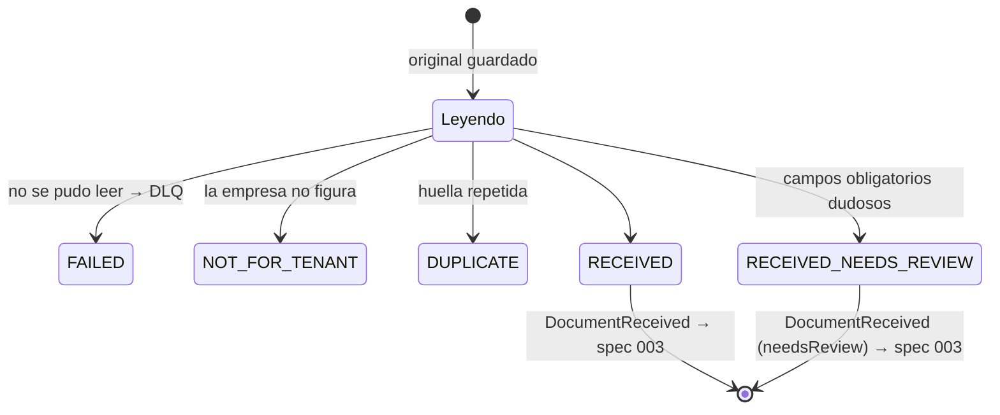

# Data Model: Ingestión Multiformato

**Feature**: 002-ingestion-pipeline · **Base**: `CanonicalDocument` del spec 001 ([data-model §4](../001-motor-plantillas-contables/data-model.md))

Los `@typedef` van en `src/domain/ingestion/intake/types.js`.

## 1. RawPayload (original) — `<tenantId>:rawPayloads` (solo agregado)

```js
/** @typedef {Object} RawPayload
 * @property {string} id
 * @property {string} tenantId
 * @property {string} traceId
 * @property {'UPLOAD'|'SAMPLE'|'MANUAL_FORM'|'ATTACHMENT'} channel
 * @property {string|null} fileName
 * @property {string|null} mimeType
 * @property {number} sizeBytes
 * @property {string} sha256                 // huella del contenido (del formulario: del JSON de valores)
 * @property {{ kind: 'FIXTURE', url: string } | { kind: 'TEXT', text: string } | { kind: 'BASE64', data: string } | { kind: 'FORM', values: Object }} contentRef
 * @property {string} receivedAt
 * @property {string} receivedBy
 * @property {string|null} sampleId          // DOC-01 … DOC-16 cuando channel = SAMPLE
 */
```

## 2. IntakeRecord (resultado de recepción) — `<tenantId>:intakeRecords`

```js
/** @typedef {Object} IntakeRecord
 * @property {string} id
 * @property {string} tenantId
 * @property {string} traceId
 * @property {string} rawPayloadId
 * @property {number|null} rowNumber          // en CSV, la fila de origen (1 = primera fila de datos)
 * @property {string|null} canonicalDocumentId
 * @property {'RECEIVED'|'RECEIVED_NEEDS_REVIEW'|'DUPLICATE'|'NOT_FOR_TENANT'|'FAILED'} status
 * @property {'XML'|'JSON'|'CSV'|'PDF_TEXT'|'PDF_SCANNED'|'IMAGE'|'FORM'} sourceFormat
 * @property {string|null} documentTypeCode
 * @property {string|null} deduplicationHash
 * @property {string|null} duplicateOfIntakeRecordId
 * @property {string[]} lowConfidenceFields   // rutas de fieldProvenance bajo el umbral
 * @property {Array<{ code: 'FUTURE_ISSUE_DATE'|'INVALID_FISCAL_ID'|'FIELD_NOT_FOUND', detail: Object }>} warnings
 * @property {string|null} dlqEntryId
 * @property {'AWAITING_INTERPRETATION'|'NOT_APPLICABLE'} processingStatus  // el spec 003 agrega sus valores
 * @property {string} createdAt
 * @property {string} createdBy
 */
```

## 3. CanonicalDocument — `<tenantId>:canonicalDocuments`

Es la forma del spec 001 §4, con la **revisión 1** producida aquí. Reglas de construcción:

| Campo | Cómo se llena |
|---|---|
| `id` | `idGenerator()` |
| `rawPayloadRef` | `RawPayload.id` (+ `#row=<n>` en CSV) |
| `revision` | `1` |
| `jurisdictionCode` | `empresa.jurisdictionCode` |
| `documentTypeCode` / `documentTypeVersion` | lo asigna el lector con el perfil; la versión es la del esquema vigente al `issueDate` (`getDocumentType`) |
| `perspective` | `null` (lo resuelve el spec 003) |
| `operationTypeCode` | `null`, salvo que el origen lo traiga explícito (JSON `operationTypeCode`, formulario) |
| `parties[].fiscalIdType` | por perfil (UBL `schemeID`, CSV tabla de códigos) |
| importes | enteros en unidades mínimas (`parseDecimalToMinor` para decimales) |
| `extraction.sourceFormat` | el del lector |
| `extraction.extractorId` | `ubl-2.1@PE`, `json-v1`, `csv:PE_BOLETAS_VENTA_V1`, `form`, `simulated-ocr` |
| `extraction.documentTypeConfidence` | 1.0 en estructurados; la del extractor en no estructurados |
| `extraction.fieldProvenance` | estructurados: un registro por campo leído con `confidence: 1`; formulario: `verifiedByHuman: true`; no estructurados: los del extractor |
| `extraction.notFound` | rutas no encontradas (extractor) |
| `extraction.attachments` | ids de `RawPayload` adjuntos (formulario) |
| `deduplicationHash` | research R-08 |
| `receivedAt`, `traceId` | del `RawPayload` |

Rutas de `fieldProvenance`: `series`, `number`, `issueDate`, `dueDate`, `currency`, `documentTypeCode`, `parties[ROLE].fiscalId`, `parties[ROLE].name`, `fields.<clave>`, `lines[i].<campo>`, `taxes[CODE].amountMinor`, `withholdings[CODE].amountMinor`, `references[i].number`, `totals.<campo>`.

## 4. DlqEntry — `<tenantId>:dlq`

```js
/** @typedef {Object} DlqEntry
 * @property {string} id
 * @property {string} tenantId
 * @property {string} traceId
 * @property {string} rawPayloadId
 * @property {number|null} rowNumber
 * @property {'UNSUPPORTED_FORMAT'|'UNREADABLE'|'MALFORMED'|'UNKNOWN_DOCUMENT_TYPE'|'UNKNOWN_CURRENCY'|'CSV_PROFILE_MISMATCH'|'INVALID_ROW'|'NO_JURISDICTION_PACK'} errorType
 * @property {string} errorMessage             // en español, para el usuario
 * @property {Object} errorDetail              // p. ej. { line: 42 } o { missingColumns: [...] }
 * @property {string} readerId
 * @property {number} attempts                 // 1 en esta feature; el spec 007 la incrementa
 * @property {'OPEN'|'REPROCESSED'|'DISCARDED'} status   // esta feature solo crea OPEN
 * @property {string} createdAt
 */
```

## 5. Índice de huellas — `<tenantId>:dedupIndex`

`Record<deduplicationHash, intakeRecordId>`: solo los registros `RECEIVED` o `RECEIVED_NEEDS_REVIEW`. Los duplicados apuntan al original.

## 6. Evento — `<tenantId>:events` (solo agregado)

```js
/** @typedef {{ id: string, tenantId: string, type: string, at: string, traceId: string, actor: { userId: string, role: string }, payload: Object }} DomainEvent */
```

| Evento | Payload |
|---|---|
| `RawPayloadStored` | `rawPayloadId`, `channel`, `sourceFormat`, `sha256` |
| `DocumentReceived` | `intakeRecordId`, `canonicalDocumentId`, `documentTypeCode`, `sourceFormat`, `needsReview`, `lowConfidenceFields` |
| `DocumentDuplicated` | `intakeRecordId`, `duplicateOfIntakeRecordId`, `deduplicationHash` |
| `DocumentParsingFailed` | `dlqEntryId`, `rawPayloadId`, `errorType` |

## 7. Perfiles de lectura — `src/data/jurisdictions/pe/readingProfiles.js`

```js
export const peReadingProfiles = {
  ubl: {
    version: '2.1',
    roots: { Invoice: { lineTag: 'InvoiceLine', qtyTag: 'InvoicedQuantity' },
             CreditNote: { lineTag: 'CreditNoteLine', qtyTag: 'CreditedQuantity' },
             DebitNote: { lineTag: 'DebitNoteLine', qtyTag: 'DebitedQuantity' } },
    documentTypeByOfficialCode: { '01': 'INVOICE', '03': 'SALES_RECEIPT', '07': 'CREDIT_NOTE', '08': 'DEBIT_NOTE' },
    rootDefaultDocumentType: { CreditNote: 'CREDIT_NOTE', DebitNote: 'DEBIT_NOTE' },
    fiscalIdTypeBySchemeId: { '6': 'RUC', '1': 'DNI', '4': 'CE' },
    taxCodeBySchemeId: { '1000': 'VAT', '2000': 'EXCISE', '7152': 'BAG_TAX' },
    adjustmentReasonField: 'creditNoteReason',
    countryCode: 'PE'
  },
  csv: {
    PE_BOLETAS_VENTA_V1: {
      separator: ',', header: true, issuerIsTenant: true,
      columns: {
        tipo_comprobante: { to: 'documentTypeCode', lookup: 'documentTypeByOfficialCode' },
        serie: { to: 'series' }, numero: { to: 'number' }, fecha_emision: { to: 'issueDate' }, moneda: { to: 'currency' },
        tipo_doc_cliente: { to: 'parties[RECEIVER].fiscalIdType', lookup: { '1': 'DNI', '6': 'RUC', '4': 'CE' } },
        num_doc_cliente: { to: 'parties[RECEIVER].fiscalId' }, nombre_cliente: { to: 'parties[RECEIVER].name' },
        descripcion: { to: 'lines[0].description' }, valor_venta: { to: 'lines[0].amountMinor', money: true },
        igv: { to: 'taxes[VAT].amountMinor', money: true, rateBp: 1800 }, importe_total: { to: 'totals.totalMinor', money: true }
      }
    }
  }
};
```

Ampliación de `fiscalIdTypes` del paquete (spec 001): `RUC` → `{ pattern: '^(10|15|17|20)\\d{9}$', checkDigit: { algorithm: 'MOD11', weights: [5,4,3,2,7,6,5,4,3,2], map: { 10: 0, 11: 1 } } }`; `DNI` → `{ pattern: '^\\d{8}$' }`; `CE` → `{ pattern: '^[A-Z0-9]{9,12}$' }`.

La empresa `01` declara `csvProfiles: ['PE_BOLETAS_VENTA_V1']` en `mockEmpresas.js`; `extractionConfidenceThreshold` es opcional en la empresa (por defecto, el del paquete).

## 8. Documentos de prueba — `src/data/fixtures/documentFixtures.js` (generado, no editar)

```js
/** @typedef {Object} DocumentFixture
 * @property {string} id                    // DOC-01 … DOC-16
 * @property {string} title
 * @property {string|null} fileName / url   // url pública: /fixtures/documents/<archivo>
 * @property {string|null} mimeType
 * @property {string} sourceFormat
 * @property {number|null} sizeBytes
 * @property {string|null} sha256
 * @property {{ intake: string, interpretation?: string, template?: string, dlqReason?: string, duplicateOf?: string, note?: string }} expected
 * @property {Object} [manualForm]           // DOC-16
 * @property {{ documentTypeCode, documentTypeConfidence, document, fieldProvenance, notFound }} [simulatedExtraction]
 */
```

Resultado esperado de la ingestión, en orden sobre la semilla:

| Doc | Formato | Resultado |
|---|---|---|
| DOC-01…07 | XML ×5, JSON ×2 | `RECEIVED` |
| DOC-08 | CSV | 3 × `RECEIVED` (filas 1–3) |
| DOC-09 | JPG | `RECEIVED` |
| DOC-10 | JPG | `RECEIVED_NEEDS_REVIEW` (emisor, IGV y total dudosos) |
| DOC-11 | PDF escaneado | `RECEIVED` |
| DOC-12 | PNG | `FAILED` · `UNREADABLE` |
| DOC-13 | XML | `FAILED` · `MALFORMED` |
| DOC-14 | PDF con texto | `DUPLICATE` de DOC-01 |
| DOC-15 | JSON | `RECEIVED` (el esquema lo valida el spec 003) |
| DOC-16 | Formulario | `RECEIVED` (`verifiedByHuman`) |

## 9. Estados de un registro de recepción


