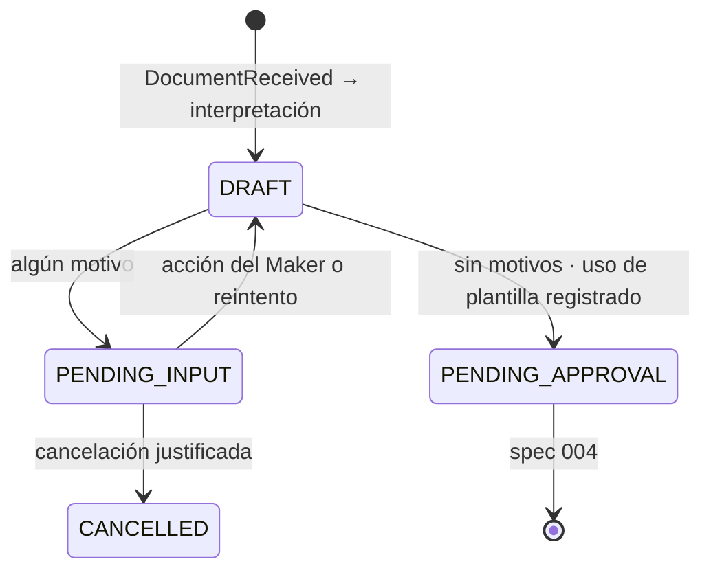

# Data Model: Interpretación Contable, Validación y Bandeja del Maker

**Feature**: 003-traduccion-validacion-staging · **Base**: SDD §13.2 y spec 001 (`EntryLine`, `EvaluationResult`)

`@typedef` en `src/domain/journal/types.js`.

## 1. JournalEntry — `<tenantId>:journalEntries`

```js
/** @typedef {Object} JournalEntry
 * @property {string} id
 * @property {string} tenantId
 * @property {string} traceId
 * @property {string} intakeRecordId
 * @property {{ id: string, revision: number }} canonicalDocRef
 * @property {string} documentTypeCode
 * @property {'RECEIVED'|'ISSUED'|'INTERNAL'|null} perspective        // null si se detuvo antes del paso 2
 * @property {string|null} operationTypeCode
 * @property {string|null} legalBookCode
 * @property {'DRAFT'|'PENDING_INPUT'|'PENDING_APPROVAL'|'POSTED'|'POSTED_PENDING_PUBLISH'|'REJECTED'|'CANCELLED'} state
 * @property {PendingReason[]} pendingReasons
 * @property {'CONFIDENCE'|'REFERENCES'|'SCHEMA'|'PERSPECTIVE'|'CLASSIFICATION'|'FX'|'SELECTION'|'EVALUATION'|'VALIDATION'|null} stoppedAt
 * @property {string|null} templateId
 * @property {number|null} templateVersion
 * @property {{ pack: string, documentTypeVersion: number, accountMappingVersion: number|null, classificationRuleVersions: Record<string, number> }} configVersions
 * @property {EntryLine[]} lines                      // spec 001 data-model §12
 * @property {string|null} glosa
 * @property {string} currency
 * @property {{ rateMilli: number, rateDate: string, rateType: string } | null} fx
 * @property {boolean} provisionalFxRate
 * @property {string} issueDate
 * @property {string|null} accountingDate
 * @property {string|null} accountingPeriod           // 'YYYY-MM'
 * @property {boolean} lateRegistration
 * @property {string|null} lateRegistrationConfirmedBy
 * @property {boolean} manualIntervention
 * @property {string[]} intervenedBy                  // userIds, en orden
 * @property {InterpretationTrace} trace
 * @property {Array<{ from: string, to: string, at: string, by: string, reason: string|null }>} stateHistory
 * @property {string|null} cancellationReason
 * @property {string|null} reversalOfId                // lo usa el spec 006
 * @property {number} entityVersion
 * @property {string} createdBy
 * @property {string} createdAt
 * @property {string} updatedAt
 */
```

## 2. PendingReason

`{ code, message, details, step, resolution }`, donde `resolution` es la acción sugerida del SDD §5.6 (`VERIFY_FIELDS`, `EDIT_FIELDS`, `CLASSIFY`, `SET_DIMENSIONS`, `CONFIRM_LATE_REGISTRATION`, `ESCALATE_TO_ADMIN`, `RETRY`, `CANCEL`).

| Código | Paso | `details` | `resolution` |
|---|---|---|---|
| `LOW_CONFIDENCE_EXTRACTION` | CONFIDENCE | `{ fields: [{ path, confidence, location }] }` | `VERIFY_FIELDS` |
| `REFERENCE_NOT_FOUND` | REFERENCES | `{ references: [{ index, documentTypeCode, series, number, issueDate }] }` | `EDIT_FIELDS` |
| `SCHEMA_INVALID` | SCHEMA | `{ violations: [{ path, rule, message }] }` | `EDIT_FIELDS` |
| `CATALOG_NOT_EFFECTIVE` | SCHEMA | `{ code, date }` | `EDIT_FIELDS` / `ESCALATE_TO_ADMIN` |
| `DOCUMENT_NOT_FOR_TENANT` | PERSPECTIVE | — | `CANCEL` |
| `CLASSIFICATION_REQUIRED` | CLASSIFICATION | `{ allowedOperationTypes, unclassifiedLines: [lineNo] }` | `CLASSIFY` |
| `FX_RATE_UNAVAILABLE` | FX | `{ currency, date }` | `RETRY` |
| `NO_TEMPLATE` / `AMBIGUOUS_TEMPLATE` | SELECTION | `{ documentTypeCode, perspective, operationTypeCode, candidates }` | `ESCALATE_TO_ADMIN` / `CLASSIFY` |
| `MISSING_INPUT`, `ACCOUNT_UNRESOLVED`, `INVALID_AMOUNT` | EVALUATION | los del spec 001 | `SET_DIMENSIONS` / `ESCALATE_TO_ADMIN` |
| `MISSING_DIMENSION` | EVALUATION / VALIDATION | `{ lines: [{ lineNo, sourceLineNos, dimension, accountCode }] }` | `SET_DIMENSIONS` |
| `UNBALANCED` | VALIDATION | `{ debitMinor, creditMinor }` | `EDIT_FIELDS` / `ESCALATE_TO_ADMIN` |
| `PERIOD_CLOSED` / `LATE_REGISTRATION_LIMIT` | VALIDATION | `{ issuePeriod, firstOpenPeriod, months, limit }` | `CONFIRM_LATE_REGISTRATION` / `CANCEL` |

Agregar `FX_RATE_UNAVAILABLE` y `LATE_REGISTRATION_LIMIT` a `PENDING_CODES` del spec 001 (`src/domain/accounting/types.js`).

## 3. InterpretationTrace

```js
/** @typedef {Object} InterpretationTrace
 * @property {number} run                     // número de intento
 * @property {string} at
 * @property {number} documentRevision
 * @property {string|null} changedFromStep     // primer paso cuyo resultado difiere del intento anterior
 * @property {Array<{ step: string, ok: boolean, summary: string, detail: Object }>} steps
 * @property {Array<{ run: number, at: string, by: string, stoppedAt: string|null, reasons: string[] }>} history
 */
```

Los pasos, en orden, son `CONFIDENCE`, `REFERENCES`, `FX` y los pasos del spec 001 (`SCHEMA`, `PERSPECTIVE`, `CLASSIFICATION`, `SELECTION`, `EVALUATION`), más `VALIDATION`. `FX` se resuelve antes de llamar al motor, porque la evaluación necesita la tasa, pero en la UI se muestra en su lugar lógico (paso 5).

## 4. Revisión del documento — `<tenantId>:canonicalDocuments`

Cada revisión es un `CanonicalDocument` completo (spec 001 §4) con: `revision`, `revisedBy`, `revisedAt`, `reason` (acción) y `changes: [{ path, before, after }]`. Unicidad: `(id, revision)`. La vigente es la de mayor revisión.

## 5. Configuración nueva

| Dónde | Campo | Valor semilla |
|---|---|---|
| `mockEmpresas.js` | `functionalCurrency` | `'PEN'` en todas |
| `mockEmpresas.js` | `lateRegistration` | `{ enabled: true }` en `01`; `{ enabled: false }` en `02` |
| `pe/pack.js` | `fxRateType` | `'SELL'` |
| `pe/documentTypes.js` | `lateRegistrationMonths` | 12 en `INVOICE`, `SALES_RECEIPT`, `CREDIT_NOTE`, `DEBIT_NOTE`, `PROFESSIONAL_FEE_RECEIPT`, `UTILITY_RECEIPT`, `TICKET`; `null` en los demás |

## 6. Eventos

| Evento | Payload |
|---|---|
| `DocumentClassified` | `journalEntryId`, `operationTypeCode`, `lineOperationTypes`, `decidedBy` (`RULE:<id>`, `SOURCE`, `SINGLE_OPTION`, `MIXED`, `MAKER:<userId>`) |
| `TemplateSelected` | `journalEntryId`, `templateId`, `templateVersion`, `candidates` |
| `JournalEntryDrafted` | `journalEntryId`, `templateId`, `templateVersion`, `configVersions` |
| `JournalEntrySentToStaging` | `journalEntryId`, `pendingReasons` (códigos) |
| `JournalEntryCancelled` | `journalEntryId`, `cancelledBy`, `reason` |

## 7. Estados en esta feature


