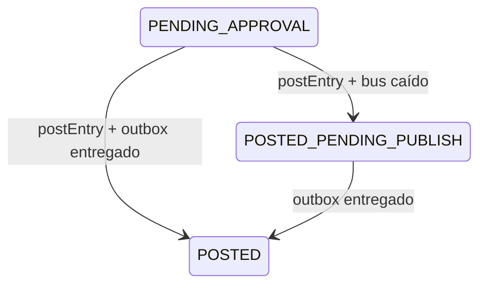

# Data Model: Publicación, Diario y Registros

**Feature**: 005-publicacion-libro-diario · `@typedef` en `src/domain/ledger/types.js`

| Colección (`<tenantId>:…`) | Tipo | Contenido |
|---|---|---|
| `outbox` | versionada | `OutboxEvent { id (= eventId), journalEntryId, type: 'JournalEntryPosted', payload, status: 'PENDING' \| 'DELIVERED', attempts, lastError, createdAt, deliveredAt }` |
| `ledger` | solo agregado | `LedgerEntry` (research R-03) |
| `registers:<legalBookCode>` | proyección | `RegisterRow { id, legalBookCode, period, sign, values: Record<columnKey, any>, journalEntryId, documentId, eventId }` |
| `projectedVouchers` | proyección | voucher del prototipo (research R-05) |
| `projectedInvoices` | proyección | `{ kind: 'PURCHASE' \| 'SALE', ...factura del prototipo, origen: 'MOTOR', journalEntryId }` |
| `appliedEvents:<consumer>` | índice | `Record<eventId, true>` |

`demoSettings.busDown` (booleano, por defecto `false`).

## Payload de `JournalEntryPosted` (SDD §11)

```js
{ eventId, journalEntryId, tenantId, traceId, accountingDate, accountingPeriod, issueDate,
  documentTypeCode, perspective, operationTypeCode, legalBookCode, glosa, currency, fx,
  lines: [{ lineNo, side, accountCode, accountRole, amountMinor, functionalAmountMinor, dimensions, description }],
  sourceDocument: { id, revision, series, number, issueDate, parties, taxes, withholdings, totals, references },
  signature: { id, kind, signerId, level, contentHash, signature, signedAt },
  isReversal, reversalOfId }
```

## Definición de registros del paquete Perú (`src/data/jurisdictions/pe/legalBookRegisters.js`)

| Libro | Columnas (clave · origen) |
|---|---|
| `PE.PURCHASES_REGISTER` (Registro de Compras) | `periodo` · `entry.accountingPeriod`; `fechaEmision` · `issueDate`; `tipoDoc` · código oficial del tipo; `serie`; `numero`; `tipoDocProveedor` · `party('ISSUER').fiscalIdType`; `numDocProveedor`; `proveedor`; `baseImponible` · `totals.netMinor`; `igv` · `taxAmount('VAT')`; `otrosTributos` · `add(taxAmount('EXCISE'), taxAmount('BAG_TAX'))`; `total` · `totals.totalMinor`; `moneda`; `tipoCambio` · `entry.fx.rateMilli`; `docReferencia` · `reference(0).number` |
| `PE.SALES_REGISTER` (Registro de Ventas) | igual, con el cliente (`RECEIVER`) |
| `PE.WITHHOLDINGS_BOOK` (Libro de Retenciones 4.ª cat.) | `periodo`, `fechaEmision`, `serie`, `numero`, `numDocPrestador`, `prestador`, `importeBruto` · `fields.grossAmountMinor`, `retencion` · `withholdingAmount('INCOME_TAX_FEES')`, `neto` · `totals.payableMinor` |
| `PE.CASH_BANKS` (Caja y Bancos) | `periodo`, `fecha`, `cuentaBancaria` · `fields.bankAccountCode`, `descripcion`, `cargo`, `abono` |

`signByDocumentType: { CREDIT_NOTE: -1 }`. Los importes se guardan en unidades mínimas y se muestran formateados. Cada libro tiene además `subdiarioLabel` (`'05 Compras'`, `'14 Ventas'`, `'08 Retenciones'`, `'01 Caja y Bancos'`, `'05 Diario'`) para la proyección de vouchers.

## Estados


