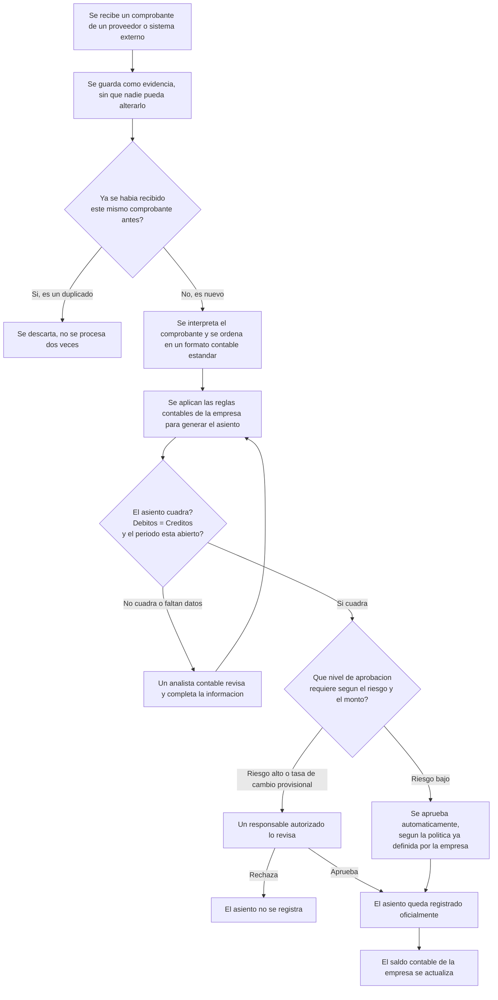
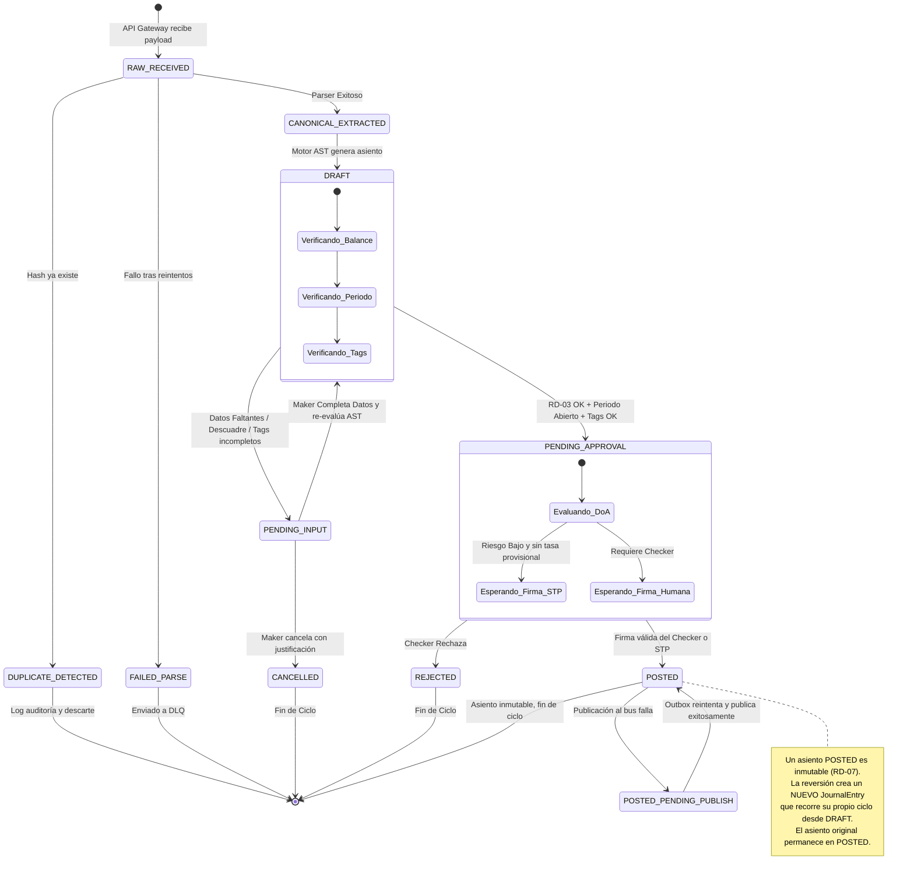
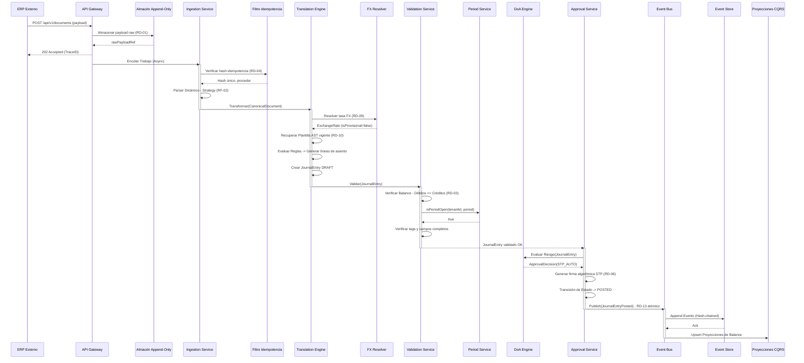

# Documento de Diseño de Software (SDD)
## Subsistema de Ingestión, Traducción Contable y Asentamiento (ACL & Translation Engine)

**Versión:** 2.0 · **Estado:** Borrador para revisión  
**Fecha:** 2026-09-21  
**Basado en:** SDD v1.0 original, con correcciones, adiciones y formalización

---

## Tabla de Contenidos

1. [Objetivo del Sistema](#1-objetivo-del-sistema)
2. [Alcance y Exclusiones](#2-alcance-y-exclusiones)
3. [Glosario](#3-glosario)
4. [Reglas de Dominio (Domain Invariants)](#4-reglas-de-dominio-domain-invariants)
5. [Flujo Maestro Arquitectónico (Técnico)](#5-flujo-maestro-arquitectónico-técnico)
6. [Flujo de Negocio Simplificado](#6-flujo-de-negocio-simplificado-para-stakeholders-no-técnicos)
7. [Especificación de Requerimientos del Sistema](#7-especificación-de-requerimientos-del-sistema)
8. [Casos de Uso](#8-casos-de-uso)
9. [Historias de Usuario (BDD)](#9-historias-de-usuario-bdd)
10. [Diseño Arquitectónico UML](#10-diseño-arquitectónico-uml)
11. [Catálogo de Eventos](#11-catálogo-de-eventos)
12. [Contratos de API (Abstractos)](#12-contratos-de-api-abstractos)
13. [Modelo de Datos Detallado](#13-modelo-de-datos-detallado)
14. [Seguridad](#14-seguridad)
15. [Cumplimiento Normativo](#15-cumplimiento-normativo)
16. [Manejo de Fallos y Resiliencia](#16-manejo-de-fallos-y-resiliencia)
17. [Estrategia de Observabilidad](#17-estrategia-de-observabilidad)
18. [Matriz de Riesgos](#18-matriz-de-riesgos)
19. [Puntos Pendientes de Definición con Negocio](#19-puntos-pendientes-de-definición-con-negocio)

---

## 1. Objetivo del Sistema

Establecer una capa de anticorrupción (ACL) y un motor de traducción determinístico que aísle el núcleo financiero inmutable (Libro Mayor) de la volatilidad estructural de los orígenes de datos externos. El subsistema procesa comprobantes financieros entrantes de cualquier formato, los estandariza en un modelo canónico, aplica reglas de negocio inyectables (AST) para generar asientos contables de partida doble, y gestiona el ciclo de vida de validación bajo estrictas normas de segregación de funciones (Maker-Checker) antes de emitir los eventos al bus transaccional corporativo.

## 2. Alcance y Exclusiones

**Dentro de alcance:** ingestión de documentos sustentatorios, deduplicación, resolución de tipo de cambio, traducción a asiento contable mediante motor AST, validación de ecuación patrimonial, gestión de staging para intervención humana, motor de delegación de autoridad (DoA), firma criptográfica, publicación del evento contable, y proceso formal de reversión.

**Fuera de alcance (de este subsistema):**
- Motor de reportería financiera y estados financieros consolidados.
- Motor de impuestos / declaraciones ante la autoridad tributaria (se asume integración externa).
- Conciliación bancaria.
- Gestión de proveedores / maestros de terceros.
- Gestión de activos fijos y depreciación.
- Nómina y planilla.
- Administración del catálogo de cuentas contables (se asume preexistente como maestro del Core).
- Gestión de períodos contables (apertura/cierre) — este subsistema *consulta* el estado del período pero no lo administra.

Estos módulos se documentan como subsistemas consumidores o proveedores del bus de eventos.

## 3. Glosario

| Término | Significado |
|---|---|
| ACL | Anti-Corruption Layer: capa que traduce formatos externos sin contaminar el dominio contable. |
| AST | Abstract Syntax Tree: árbol de reglas de negocio evaluable en tiempo de ejecución para determinar cuentas contables destino. |
| Circuit Breaker | Patrón de resiliencia que detiene llamadas a un servicio externo que falla repetidamente, evitando cascadas de error. |
| CQRS | Command Query Responsibility Segregation: separación entre modelo de escritura (Event Store) y de lectura (proyecciones de balance). |
| DLQ | Dead Letter Queue: cola de mensajes que fallaron su procesamiento tras reintentos, para revisión manual. |
| DoA | Delegation of Authority: matriz que define quién puede aprobar según riesgo/monto. |
| FX | Foreign Exchange: conversión de moneda extranjera a moneda funcional del tenant. |
| HITL | Human In The Loop: punto del flujo donde se requiere intervención humana (Maker o Checker). |
| HSM / KMS | Hardware Security Module / Key Management Service: infraestructura dedicada a custodia y uso seguro de llaves criptográficas. |
| Maker-Checker | Control de segregación de funciones: quien crea o corrige un asiento no puede ser quien lo aprueba. |
| OCP | Open/Closed Principle: principio de diseño que permite extender funcionalidad sin modificar código existente. |
| RBAC | Role-Based Access Control: control de acceso basado en roles asignados al usuario dentro de un tenant. |
| RPO / RTO | Recovery Point Objective / Recovery Time Objective: pérdida de datos máxima tolerable y tiempo máximo de recuperación del servicio. |
| SoD | Separation of Duties: sinónimo de segregación de funciones. |
| STP | Straight-Through Processing: procesamiento automatizado sin intervención humana. |
| Tenant | Organización o empresa aislada dentro del sistema SaaS; cada tenant tiene sus propios datos, plantillas, usuarios y configuraciones. |
| UBL | Universal Business Language: estándar XML para documentos comerciales electrónicos (facturas, notas de crédito, etc.). |

## 4. Reglas de Dominio (Domain Invariants)

Invariantes matemáticamente inquebrantables. Su violación detiene cualquier proceso transaccional en curso.

- **RD-01 — Inmutabilidad del Origen:** todo payload externo se almacena en estado raw en un almacén append-only al momento de su recepción. El identificador de almacenamiento se vincula criptográficamente a todos los procesos derivados. Ningún proceso posterior puede alterar, eliminar ni sobrescribir el payload original.

- **RD-02 — Aislamiento Estructural Absoluto:** el motor contable carece de dependencias hacia los formatos de entrada; la única entidad que el núcleo reconoce es el `CanonicalDocument`. La adición de un nuevo formato de origen no requiere modificar código compilado del Core (OCP).

- **RD-03 — Ecuación Patrimonial Rígida:** un asiento en estado `DRAFT` no transiciona a `PENDING_APPROVAL` si $\sum Débitos - \sum Créditos \neq 0$, evaluado en la moneda funcional del tenant tras aplicar RD-09. La verificación es atómica y se ejecuta sobre todas las líneas del asiento antes de cambiar estado.

- **RD-04 — Idempotencia en Ingestión:** $N$ recepciones del mismo documento de origen producen exactamente 1 evento de negocio procesado. La unicidad se determina mediante un hash criptográfico compuesto por: `TenantId + FiscalID_Emisor + Tipo_Documento + Numero_Documento + Fecha_Emision`. Los payloads duplicados se almacenan por trazabilidad (RD-01) pero no avanzan más allá del filtro de deduplicación. Todo intento duplicado queda registrado en el log de auditoría.

- **RD-05 — Segregación de Funciones (SoD):** el Maker no puede coincidir con el Checker dentro del mismo flujo de aprobación, salvo excepción explícita registrada y auditada en la Matriz DoA. Toda excepción requiere justificación documentada y es revisable por el rol Auditor.

- **RD-06 — Transición Criptográfica:** el paso `PENDING_APPROVAL → POSTED` exige una firma criptográfica asimétrica válida del Checker o del agente STP delegado. La firma incluye el timestamp del acto de aprobación y el hash del contenido del asiento, garantizando no-repudio.

- **RD-07 — Inmutabilidad Post-Asentamiento:** todo asiento en estado `POSTED` es de solo lectura; ni su contenido financiero ni su estado pueden ser alterados. Su corrección exige la creación de un nuevo `JournalEntry` inverso vinculado al ID original (ver RD-11). Para determinar si un asiento ha sido revertido, se consulta la existencia de un asiento inverso que lo referencie.

- **RD-08 — Aislamiento Multi-Tenant:** ningún dato, plantilla, credencial o matriz DoA es accesible entre tenants, ni siquiera bajo fallo. El `tenantId` es obligatorio y validado en cada capa (ingestión, traducción, aprobación, persistencia). No existe operación cross-tenant en este subsistema.

- **RD-09 — Consistencia de Moneda y Redondeo:** toda conversión de moneda usa la tasa vigente al `issueDate`, con precisión decimal fija por moneda (ISO 4217), y el redondeo se aplica una sola vez, al final del cálculo de cada línea — nunca de forma acumulativa. Cuando la tasa vigente no está disponible por fallo del servicio externo, se aplica la tasa más reciente cacheada, marcando el asiento con el indicador `provisionalFxRate = true`. Un asiento con tasa provisional genera una alerta para revisión y no puede alcanzar el estado `POSTED` vía STP; requiere aprobación humana obligatoria.

- **RD-10 — Versionado Inmutable de Plantillas:** una plantilla AST activa y ya utilizada en al menos un asiento no puede modificarse; los cambios generan una nueva versión (`v2`, `v3`…) sin afectar retroactivamente asientos ya traducidos. Cada asiento registra la versión exacta de plantilla con la que fue generado.

- **RD-11 — Proceso Formal de Reversión:** la corrección de un `JournalEntry POSTED` se realiza mediante la creación de un nuevo `JournalEntry` con montos de signo invertido que referencia el ID del asiento original. Este asiento inverso sigue el mismo ciclo completo Maker-Checker que cualquier asiento nuevo. No puede ejecutarse sobre asientos cuyo período contable esté cerrado, salvo autorización de nivel máximo en la Matriz DoA. El asiento original permanece inmutable en estado `POSTED` (RD-07).

- **RD-12 — Integridad de Período Contable:** todo asiento debe corresponder a un período contable abierto. Un asiento cuyo `issueDate` corresponda a un período cerrado no puede transicionar a `POSTED`, a menos que exista una autorización de reapertura emitida por el nivel máximo de la Matriz DoA. Los documentos en estado `PENDING_INPUT` o `PENDING_APPROVAL` al momento del cierre de un período generan una alerta de escalamiento al supervisor y permanecen en su estado actual hasta resolución.

- **RD-13 — Atomicidad Evento-Persistencia:** la transición de estado a `POSTED` y la publicación del evento al bus son una operación atómica (o ambas ocurren, o ninguna). Si la publicación al bus falla tras la firma, el asiento se marca como `POSTED_PENDING_PUBLISH` y un proceso de reconciliación (outbox) garantiza la entrega eventual sin duplicar el evento.

## 5. Flujo Maestro Arquitectónico (Técnico)

```mermaid
flowchart TD
    classDef external fill:#f2f2f2,stroke:#666,stroke-width:2px,stroke-dasharray: 5 5
    classDef infra fill:#e1f5fe,stroke:#0277bd,stroke-width:2px
    classDef domain fill:#e8f5e9,stroke:#2e7d32,stroke-width:2px
    classDef template fill:#fff3e0,stroke:#ef6c00,stroke-width:2px
    classDef human fill:#fce4ec,stroke:#c2185b,stroke-width:2px
    classDef store fill:#f3e5f5,stroke:#7b1fa2,stroke-width:2px
    classDef security fill:#fff9c4,stroke:#fbc02d,stroke-width:2px

    subgraph S0["0. Motor de Plantillas - OCP"]
        UIBuilder["UI Builder"]
        Compiler["Compilador AST"]
        RepoPlantillas[("DB Plantillas<br/>Versionadas - RD-10")]
        UIBuilder --> Compiler --> RepoPlantillas
    end

    subgraph S1["1. Capa Anti-Corrupcion e Ingestion"]
        Input(["Webhooks / API / ERP"])
        Gateway{"API Gateway<br/>Auth + Rate Limiting"}
        Lake[("Almacen Append-Only<br/>Payload Raw")]
        Dedup{"Filtro Idempotencia<br/>RD-04"}
        Registry{"Parser Registry"}
        ParserXML["Parser UBL"]
        ParserJSON["Parser API"]
        DLQ1[("DLQ Ingestion")]

        Input --> Gateway --> Dedup
        Gateway -->|RD-01| Lake
        Dedup -->|Hash Duplicado| Drop["Drop Silencioso<br/>con log de auditoria"]
        Dedup -->|Hash Unico| Registry
        Registry --> ParserXML
        Registry --> ParserJSON
        ParserXML -->|Fallo de parseo| DLQ1
        ParserJSON -->|Fallo de parseo| DLQ1
        ParserXML --> DocCanonico(("Canonical<br/>Document"))
        ParserJSON --> DocCanonico
    end

    subgraph S2["2. Resolucion FX y Motor de Traduccion"]
        FX{"Requiere conversion<br/>de moneda?"}
        FXApi["API Tasa de Cambio<br/>con Circuit Breaker"]
        TenantContext{"Resolver Tenant<br/>y Tipo Documento"}
        MotorAST["Ejecutor de Reglas AST"]

        DocCanonico --> FX
        FX -->|Si| FXApi -->|RD-09| TenantContext
        FX -->|No| TenantContext
        TenantContext --> MotorAST
        RepoPlantillas -.->|Inyecta Reglas Activas y Version| MotorAST
    end

    subgraph S3["3. Maquina de Estados: Validacion y HITL"]
        Borrador["Generar JournalEntry<br/>Estado: DRAFT"]
        Validador{"RD-03 Ecuacion = 0?<br/>Periodo Abierto?<br/>Tags Completos?"}
        Bandeja[("Work Tray / Staging<br/>Estado: PENDING_INPUT")]
        UIGrid["Grid UI / Maker"]

        MotorAST --> Borrador --> Validador
        Validador -->|Excepcion / Faltan Datos| Bandeja --> UIGrid
        UIGrid -->|Maker completa datos| MotorAST2["Re-evaluar AST<br/>si datos afectan cuentas"]
        MotorAST2 --> Validador
    end

    subgraph S4["4. Motor DoA y Firmas"]
        STP["Pre-Aprobado<br/>Estado: PENDING_APPROVAL"]
        MatrizDoA{"Motor DoA<br/>Evaluar Riesgo / Monto"}
        FirmaBot["Firma Algoritmica<br/>STP Agent"]
        BandejaAprobacion[("Bandeja Aprobacion")]
        UIFirma["Checker UI / Nivel 1-2"]
        Rechazado(["Estado: REJECTED"])
        EstadoFinal(["Estado: POSTED"])

        Validador -->|Validacion Exitosa| STP --> MatrizDoA
        MatrizDoA -->|Riesgo Bajo + Sin Tasa Provisional| FirmaBot --> EstadoFinal
        MatrizDoA -->|Requiere Checker o Tasa Provisional| BandejaAprobacion --> UIFirma
        UIFirma -->|Rechaza| Rechazado
        UIFirma -->|Aprueba y Firma| EstadoFinal
    end

    subgraph S5["5. Persistencia y Proyeccion"]
        Bus[["Event Bus"]]
        Ledger[("Event Store<br/>Libro Diario<br/>Hash-chained")]
        ReadDB[("Proyecciones CQRS<br/>Balances")]

        EstadoFinal -->|Publish JournalEntryPosted<br/>RD-13 Atomico| Bus
        Bus -->|Append| Ledger
        Bus -->|Upsert| ReadDB
    end

    subgraph S6["6. Reversion - RD-11"]
        Reversion["Solicitud de Reversion<br/>Genera nuevo JournalEntry inverso"]
    end
    Ledger -.->|Referencia ID original| Reversion
    Reversion -.-> Borrador

    class UIBuilder,UIGrid,UIFirma,Reversion human
    class Compiler,DocCanonico,Borrador,STP,EstadoFinal,Rechazado,MotorAST2 domain
    class RepoPlantillas,Lake,Bandeja,BandejaAprobacion,Ledger,ReadDB store
    class Gateway,Dedup,Registry,ParserXML,ParserJSON,FX,FXApi,Bus infra
    class TenantContext,MotorAST template
    class MatrizDoA,FirmaBot,DLQ1 security
    class Input,Drop external
```

**Cambios respecto al diagrama original:**
- Se eliminaron referencias a tecnologías específicas (Kafka → Event Bus, Data Lake → Almacén Append-Only).
- Se añadió autenticación al API Gateway.
- Se añadió la re-evaluación AST en el bucle del Maker (consistencia con flujo de negocio).
- Se incluyó la validación de período abierto (RD-12) en el Validador.
- Se explicitó que asientos con tasa provisional no pasan por STP.
- Se añadió la nota de atomicidad RD-13 en la publicación.

## 6. Flujo de Negocio Simplificado (para stakeholders no técnicos)

**Reglas de negocio detrás de este flujo** (sin tecnicismos):
- Nadie puede alterar un comprobante recibido; siempre queda como evidencia original.
- La persona que corrige un asiento no puede ser la misma que lo aprueba (doble control).
- Un asiento nunca queda registrado oficialmente si los débitos y créditos no cuadran.
- No se puede registrar un asiento en un mes contable que ya fue cerrado, salvo autorización especial de máximo nivel.
- Si el tipo de cambio usado es provisional (porque el servicio de cambio estaba caído), el asiento no se aprueba automáticamente: siempre pasa por revisión humana.
- Una vez registrado oficialmente, un asiento no se borra ni se edita: para corregirlo se crea uno nuevo que lo anula, siguiendo el mismo doble control.

## 7. Especificación de Requerimientos del Sistema

### 7.1 Requerimientos Funcionales (RF)

- **RF-01 (Endpoint de Ingestión):** API que actúa como puerto de entrada universal, devolviendo un acuse de recibo asíncrono (ej. `202 Accepted`) tras asegurar el payload original en el almacén append-only. El API debe soportar autenticación por credenciales del tenant y versionado de endpoint.

- **RF-02 (Resolución Dinámica de Parsers):** Registro de Parsers (patrón Strategy) que asigna el procesador adecuado según tipo de contenido y metadatos del proveedor, sin modificar la lógica central. La adición de un nuevo parser es una operación de configuración, no de recompilación.

- **RF-03 (Evaluación AST):** intérprete de Árbol de Sintaxis Abstracta capaz de leer lógica condicional, aritmética y basada en fechas desde objetos serializados (ej. JSON) para determinar la cuenta contable destino, el centro de costo y las etiquetas analíticas.

- **RF-04 (Manejo de Excepciones - Staging):** los asientos incompletos o descuadrados se almacenan en una base temporal (staging), con API de lectura paginada, filtrado por estado/fecha/tenant, y actualización individual o en lote. Soporta control de concurrencia optimista para evitar conflictos entre Makers.

- **RF-05 (Motor DoA):** cálculo del nivel de autorización requerido evaluando variables del documento (monto, tipo, moneda, proveedor, indicador de tasa provisional) contra la matriz de delegación de autoridad del tenant activo.

- **RF-06 (Manejo de Fallos de Parseo):** todo payload que falle el parseo tras los reintentos configurados se envía a una DLQ con notificación al equipo de soporte, sin bloquear el resto del flujo.

- **RF-07 (Reversión de Asientos):** endpoint y flujo de UI para solicitar la reversión de un asiento `POSTED`, generando un nuevo asiento inverso que recorre el ciclo completo Maker-Checker (RD-11).

- **RF-08 (Auditoría de Plantillas):** toda versión de plantilla AST queda registrada con autor, fecha, diff respecto a la versión anterior, y la versión queda vinculada a cada asiento que la utilizó.

- **RF-09 (Re-procesamiento desde DLQ):** el Operador de Soporte puede inspeccionar documentos en la DLQ, diagnosticar el error, y re-enrolar el documento para su procesamiento (reiniciando desde el paso de parseo), dejando registro en auditoría.

- **RF-10 (Cancelación Pre-Asentamiento):** un Maker puede cancelar un documento en estado `PENDING_INPUT` con justificación documentada, transicionándolo a un estado terminal `CANCELLED`. Un Checker puede rechazar un asiento en `PENDING_APPROVAL`, transicionándolo a `REJECTED`.

- **RF-11 (Consulta de Estado del Período Contable):** el subsistema consulta al servicio de períodos contables si el período correspondiente al `issueDate` del documento está abierto antes de permitir la transición a `POSTED`. No gestiona la apertura/cierre de períodos.

- **RF-12 (Importación Masiva):** endpoint para carga masiva de documentos (ej. migración desde sistemas legacy), que respeta todos los invariantes de dominio pero permite enviar lotes con control de progreso y reporte de errores por documento individual.

### 7.2 Requerimientos No Funcionales (RNF)

- **RNF-01 (OCP Estricto):** añadir un nuevo formato de documento o regla fiscal requiere 0 modificaciones en el código base compilado del Core.

- **RNF-02 (Rendimiento de Ingestión):** el API Gateway asegura el payload en el almacén append-only en <50ms (p95), delegando el cómputo AST a workers en background.

- **RNF-03 (Trazabilidad Distribuida):** un mismo identificador de traza (según estándar W3C Trace Context) recorre todo el flujo, desde la recepción inicial hasta la publicación del evento al bus, incluyendo las intervenciones humanas.

- **RNF-04 (Consistencia Eventual):** el sistema de lectura (proyecciones CQRS) tolera un lag máximo de 2 segundos respecto al Event Store bajo carga sostenida nominal. El lag máximo bajo pico se define como punto pendiente de negocio.

- **RNF-05 (Seguridad - Cifrado):** cifrado en tránsito y en reposo para el almacén append-only, staging y Event Store. Los estándares criptográficos mínimos se definen en la Sección 14.

- **RNF-06 (Control de Acceso):** RBAC por tenant y por rol (Maker, Checker, Admin de Plantillas, Auditor de solo lectura, Operador de Soporte). Ningún rol combina Maker y Checker sobre el mismo tenant salvo excepción documentada en la Matriz DoA (RD-05). Revisión periódica de accesos obligatoria.

- **RNF-07 (Resiliencia):** circuit breaker en la API de FX y en cualquier dependencia externa; política de reintentos con backoff exponencial (máx. 3 intentos) antes de enviar a DLQ. Patrón outbox para garantizar entrega de eventos al bus (RD-13).

- **RNF-08 (Continuidad de Negocio):** RPO ≤ 5 minutos y RTO ≤ 1 hora para el Event Store; backups incrementales cada 15 minutos con prueba de restauración trimestral.

- **RNF-09 (Retención Normativa):** los asientos contables y su evidencia raw se retienen un mínimo de 5 años (ajustable por jurisdicción del tenant), con integridad verificable mediante hash-chaining del Event Store (ledger append-only).

- **RNF-10 (SLA de Staging):** todo documento en `PENDING_INPUT` genera una alerta si supera 48 horas sin intervención, escalando al supervisor del Maker. El tiempo de SLA es configurable por tenant.

- **RNF-11 (Estrategia de Pruebas):** cobertura obligatoria de pruebas unitarias para cada regla AST publicada, pruebas de contrato entre `IDocumentParser` e `IngestionService`, y pruebas de reconciliación automatizadas que verifiquen RD-03 sobre una muestra diaria de asientos `POSTED`.

- **RNF-12 (Escalabilidad):** el subsistema soporta escalamiento horizontal de workers de parseo y traducción de forma independiente. El particionado se realiza por tenant para garantizar aislamiento de carga.

- **RNF-13 (Control de Concurrencia):** las operaciones de actualización en staging utilizan control de concurrencia optimista (versionado de entidad) para evitar conflictos entre Makers concurrentes sobre el mismo documento.

- **RNF-14 (Versionado de API):** los endpoints públicos del subsistema siguen una estrategia de versionado explícito (ej. `/api/v1/...`) que permite evolucionar contratos sin romper integraciones existentes.

## 8. Casos de Uso

### CU-01: Procesamiento Híbrido de Documento Sustentatorio

| Atributo | Descripción |
|---|---|
| Actor Principal | Sistema Externo (ERP, Pasarela). |
| Actores Secundarios | Analista Contable (Maker), Director Financiero (Checker). |
| Precondiciones | El Tenant tiene plantillas AST configuradas, la matriz DoA activa, y el período contable correspondiente abierto. |
| Flujo Principal (STP) | 1. Se recibe el payload. 2. Se almacena en el almacén append-only (RD-01). 3. Se verifica idempotencia (RD-04). 4. Se extrae el Documento Canónico. 5. Se resuelve FX si aplica (RD-09). 6. El Motor AST traduce a Asiento Borrador. 7. El Validador verifica la ecuación patrimonial (RD-03) y el período abierto (RD-12). 8. El Motor DoA clasifica como "Bajo Riesgo" y sin tasa provisional. 9. Se inyecta la firma algorítmica (RD-06). 10. El asiento pasa a `POSTED` y se publica el evento atómicamente (RD-13). |
| Flujos Alternativos | **Alt 1 (Campos Faltantes):** en el paso 7 faltan etiquetas analíticas; transiciona a `PENDING_INPUT`; el Maker completa, se re-evalúa AST y se reenvía al Validador. **Alt 2 (Alto Riesgo):** en el paso 8 se requiere Checker nivel 2; transiciona a `PENDING_APPROVAL`; el Checker firma criptográficamente y avanza al paso 10. **Alt 3 (Tasa Provisional):** en el paso 5 la API de FX falla; se usa tasa cacheada con indicador provisional; en paso 8 se fuerza aprobación humana independientemente del riesgo. |
| Postcondiciones | El Event Store recibe `JournalEntryPosted` y las proyecciones de lectura reflejan el nuevo saldo. |

### CU-02: Documento Duplicado

Un ERP reenvía por error el mismo comprobante (mismo hash de idempotencia según RD-04). El sistema lo almacena en el almacén append-only por trazabilidad (RD-01), pero el Deduplicador detiene su avance antes de generar un segundo asiento, dejando registro en el log de auditoría del intento duplicado con el identificador de traza completo.

### CU-03: Reversión de Asiento Contable

El Director Financiero detecta un error en un asiento `POSTED`. Solicita la reversión referenciando el ID original. El sistema genera un **nuevo** `JournalEntry` con montos de signo invertido, que pasa por el mismo ciclo completo Maker-Checker (RD-11) antes de publicarse como `JournalEntryPosted` (con metadato de tipo `REVERSAL`), vinculado al asiento original. El asiento original permanece inmutable en estado `POSTED` (RD-07). Para determinar que fue revertido, se consulta la existencia del asiento inverso.

### CU-04: Fallo de Parseo

Un proveedor envía un XML UBL malformado. Tras los reintentos definidos en RNF-07, el documento se envía a la DLQ de Ingestión y se notifica al equipo de soporte, sin afectar el procesamiento de otros documentos en curso.

### CU-05: Re-procesamiento desde DLQ

El Operador de Soporte detecta en la DLQ un lote de documentos que falló por un error en el parser UBL. Tras corregir o añadir el parser necesario (RF-02), re-enrola los documentos para procesamiento. Cada documento reinicia desde el paso de parseo, manteniendo el mismo identificador de traza y vínculo al payload original en el almacén.

### CU-06: Procesamiento Multi-Moneda

Un tenant con moneda funcional PEN recibe una factura en USD. El sistema consulta la tasa de cambio vigente al `issueDate`. Si la API responde, aplica la tasa y genera las líneas del asiento en PEN con redondeo según ISO 4217 (RD-09). Si la API falla, aplica la tasa cacheada más reciente, marca el asiento como `provisionalFxRate = true` y lo dirige a aprobación humana obligatoria.

### CU-07: Cancelación de Documento en Staging

Un Analista Contable determina que un documento en `PENDING_INPUT` corresponde a un comprobante anulado por el proveedor. Cancela el documento con justificación, transicionándolo a `CANCELLED`. El documento y su justificación quedan registrados para auditoría.

### CU-08: Interacción con Cierre de Período

El equipo contable cierra el período de septiembre. Tres documentos permanecen en `PENDING_INPUT` y uno en `PENDING_APPROVAL` con `issueDate` en septiembre. El sistema genera alertas de escalamiento (RNF-10) para cada uno. Los Makers y Checkers deben resolverlos antes de que el período quede completamente sellado; de lo contrario, requieren autorización de nivel máximo (RD-12) para asentarlos post-cierre.

## 9. Historias de Usuario (BDD)

**Epic: Configuración Contable Agnóstica**

- **HU-01 — Creación de Plantilla de Traducción.** Como Administrador del Sistema, quiero mapear campos condicionales por interfaz visual sin código, para clasificar automáticamente gastos por centro de costo.
  *Given* estoy en el UI Builder. *When* defino "Si tag == TI, entonces cuenta 5105" y guardo. *Then* el sistema compila la regla a AST serializado, la guarda como `v1`, la asocia al Tenant, y la somete a las pruebas unitarias obligatorias antes de activarla.

- **HU-02 — Intervención en Bandeja Staging (Maker).** Como Analista Contable, quiero ver una grilla de documentos no procesados automáticamente, para asignarles el proyecto correcto de forma masiva.
  *Given* 50 documentos en `PENDING_INPUT`. *When* selecciono todos, aplico el tag "Proyecto Alpha" y proceso. *Then* los 50 asientos pasan a re-evaluación AST y validación matemática, y la bandeja refleja su nuevo estado.

- **HU-03 — Aprobación de Alto Riesgo (Checker).** Como Director Financiero, quiero ver el detalle completo, el historial del documento y el payload original antes de firmar, para tomar una decisión informada.
  *Given* un asiento en `PENDING_APPROVAL` nivel 2. *When* reviso el detalle, verifico el comprobante original y firmo criptográficamente. *Then* el asiento pasa a `POSTED` y queda mi firma vinculada de forma inmutable, con el timestamp del acto de aprobación.

- **HU-04 — Reversión Controlada.** Como Director Financiero, quiero solicitar la reversión de un asiento erróneo, para corregir el libro sin borrar el historial.
  *Given* un asiento `POSTED` con error detectado y período abierto. *When* solicito su reversión con motivo documentado. *Then* se genera un nuevo asiento inverso vinculado, sujeto a la aprobación de un tercero (Maker-Checker), y el asiento original permanece intacto en `POSTED`.

- **HU-05 — Gestión de DLQ (Operador de Soporte).** Como Operador de Soporte, quiero ver los documentos fallidos en la DLQ con su motivo de error, para diagnosticar y re-enrolar los que ya tienen parser corregido.
  *Given* 5 documentos en la DLQ por error de parseo. *When* selecciono los que corresponden al parser ya corregido y solicito re-procesamiento. *Then* los documentos reinician su ciclo desde parseo, manteniendo la trazabilidad al payload original.

- **HU-06 — Consulta de Trazabilidad (Auditor).** Como Auditor, quiero consultar el historial completo de un asiento POSTED, desde el comprobante original hasta el evento publicado, en una sola vista.
  *Given* el ID de un asiento `POSTED`. *When* consulto su trazabilidad. *Then* veo el payload raw original, el documento canónico, la versión de plantilla AST usada, las intervenciones del Maker (si hubo), la firma del Checker o STP, y el evento publicado, con timestamps y hashes en cada paso.

- **HU-07 — Cancelación de Documento.** Como Analista Contable, quiero poder cancelar un documento en PENDING_INPUT que ya no es relevante, para mantener limpia mi bandeja de trabajo.
  *Given* un documento en `PENDING_INPUT` que el proveedor anuló. *When* lo selecciono y cancelo con justificación. *Then* el documento pasa a estado `CANCELLED` con la justificación registrada en auditoría, y no puede reactivarse.

## 10. Diseño Arquitectónico UML

### 10.1 Diagrama de Clases

```mermaid
classDiagram
    class CanonicalDocument {
        +String tenantId
        +String rawPayloadRef
        +String type
        +String currency
        +Date issueDate
        +String fiscalIdEmitter
        +String documentNumber
        +List~FinancialLine~ lines
        +String deduplicationHash
    }

    class FinancialLine {
        +String description
        +Decimal amount
        +String currency
        +String taxCode
        +Map~String,String~ tags
    }

    class JournalEntry {
        +String id
        +String tenantId
        +String canonicalDocRef
        +JournalState state
        +String templateVersionRef
        +List~EntryLine~ debits
        +List~EntryLine~ credits
        +String reversalOfId
        +Boolean provisionalFxRate
        +Date issueDate
        +String accountingPeriod
        +Long entityVersion
        +verifyBalance() Boolean
    }

    class EntryLine {
        +String accountCode
        +Decimal amount
        +String currency
        +Decimal fxRate
        +Decimal functionalAmount
        +String costCenter
        +Map~String,String~ analyticTags
    }

    class JournalState {
        <<enumeration>>
        DRAFT
        PENDING_INPUT
        PENDING_APPROVAL
        POSTED
        POSTED_PENDING_PUBLISH
        REJECTED
        CANCELLED
    }

    class ASTTemplate {
        +String id
        +String tenantId
        +String documentType
        +Int version
        +Object rules
        +String createdBy
        +DateTime createdAt
        +Boolean isActive
    }

    class ExchangeRate {
        +String fromCurrency
        +String toCurrency
        +Decimal rate
        +Date effectiveDate
        +Boolean isProvisional
    }

    class ApprovalDecision {
        +ApprovalLevel level
        +Boolean requiresHumanReview
        +String reason
    }

    class ApprovalLevel {
        <<enumeration>>
        STP_AUTO
        CHECKER_L1
        CHECKER_L2
        CHECKER_MAX
    }

    class IParserRegistry {
        <<interface>>
        +getParser(metadata) IDocumentParser
    }

    class IDocumentParser {
        <<interface>>
        +parse(rawPayload) CanonicalDocument
    }

    class ITemplateRepository {
        <<interface>>
        +getActiveTemplate(tenantId, docType) ASTTemplate
        +getTemplateByVersion(tenantId, docType, version) ASTTemplate
    }

    class IFxResolver {
        <<interface>>
        +resolveRate(fromCurrency, toCurrency, date) ExchangeRate
    }

    class IEventPublisher {
        <<interface>>
        +publish(JournalEntryEvent) void
    }

    class IPeriodService {
        <<interface>>
        +isPeriodOpen(tenantId, period) Boolean
    }

    class IngestionService {
        -IParserRegistry registry
        -DeduplicationFilter dedup
        +ingest(rawPayload, metadata) void
    }

    class TranslationEngine {
        -ITemplateRepository templateRepo
        -IFxResolver fxResolver
        -ASTEvaluator evaluator
        +translate(CanonicalDocument) JournalEntry
    }

    class ASTEvaluator {
        +evaluate(ASTTemplate, CanonicalDocument) List~EntryLine~
    }

    class ValidationService {
        -IPeriodService periodService
        +validate(JournalEntry) ValidationResult
    }

    class DoAEngine {
        -RiskMatrix matrix
        +evaluateRisk(JournalEntry) ApprovalDecision
    }

    class ApprovalService {
        -DoAEngine doaEngine
        -IEventPublisher publisher
        +submitForApproval(JournalEntry) void
        +approve(JournalEntry, Signature) void
        +reject(JournalEntry, reason) void
    }

    IngestionService --> IParserRegistry
    IParserRegistry ..> IDocumentParser
    IDocumentParser ..> CanonicalDocument : Creates

    TranslationEngine --> ITemplateRepository
    TranslationEngine --> IFxResolver
    TranslationEngine --> ASTEvaluator
    TranslationEngine ..> CanonicalDocument : Consumes
    TranslationEngine ..> JournalEntry : Creates

    ValidationService --> IPeriodService
    ValidationService ..> JournalEntry : Validates

    ApprovalService --> DoAEngine
    ApprovalService --> IEventPublisher
    DoAEngine ..> ApprovalDecision : Returns

    JournalEntry --> JournalState
    JournalEntry *-- EntryLine
    CanonicalDocument *-- FinancialLine
    IFxResolver ..> ExchangeRate : Returns
    ITemplateRepository ..> ASTTemplate : Returns
```

**Cambios respecto al diagrama original:**
- Se añadieron todas las clases referenciadas: `EntryLine`, `FinancialLine`, `ASTTemplate`, `ASTEvaluator`, `ExchangeRate`, `ApprovalDecision`, `ApprovalLevel`.
- Se añadió `tenantId` a `JournalEntry` (exigido por RD-08).
- Se añadieron `provisionalFxRate`, `entityVersion`, `accountingPeriod` a `JournalEntry`.
- Se añadieron los estados `POSTED_PENDING_PUBLISH` (RD-13) y `CANCELLED` (RF-10) al enum.
- Se **eliminó** el estado `REVERSED` del enum (resolución del error lógico crítico).
- Se añadió `ValidationService` con dependencia a `IPeriodService` (RD-12).
- Se añadió `ApprovalService` que orquesta DoA, firma y publicación.
- Se conectó `IEventPublisher` correctamente a `ApprovalService`.

### 10.2 Diagrama de Estados

**Cambios respecto al diagrama original:**
- Se eliminó la transición `POSTED → REVERSED` (resolución del error lógico crítico).
- Se añadió nota explicativa sobre reversión.
- Se añadió el estado `CANCELLED` (desde `PENDING_INPUT`).
- Se añadió `POSTED_PENDING_PUBLISH` (RD-13).
- Se añadió `DUPLICATE_DETECTED` como estado transitorio.
- Se detalló el sub-estado de DRAFT con las tres verificaciones.
- Se detalló el sub-estado de PENDING_APPROVAL con las dos rutas.

### 10.3 Diagrama de Secuencia (Camino Crítico — STP)

**Cambios respecto al diagrama original:**
- Se añadió el paso de almacenamiento en append-only (RD-01).
- Se añadió el paso de verificación de idempotencia (RD-04).
- Se separaron las responsabilidades: `Engine`, `Validator`, `Approval` como servicios distintos.
- Se añadió la consulta al servicio de períodos contables.
- Se reemplazó "Kafka" con "Event Bus".
- Se añadieron las proyecciones CQRS como participante explícito.
- El `ApprovalService` (no el DoA) es quien publica al bus.

## 11. Catálogo de Eventos

Eventos publicados por este subsistema al bus de eventos. Cada evento es inmutable, incluye el `tenantId`, el `traceId`, y un hash de integridad.

| Evento | Trigger | Payload Principal | Consumidores Esperados |
|---|---|---|---|
| `RawPayloadStored` | Almacenamiento exitoso del payload original | `rawPayloadRef`, `tenantId`, `receivedAt` | Auditoría, trazabilidad |
| `DocumentDuplicated` | Intento de ingestión duplicada | `deduplicationHash`, `originalTraceId` | Auditoría |
| `DocumentParsingFailed` | Fallo de parseo tras reintentos | `rawPayloadRef`, `errorDetail`, `retryCount` | Soporte (DLQ) |
| `JournalEntryDrafted` | Asiento generado en estado DRAFT | `journalEntryId`, `templateVersion` | Auditoría interna |
| `JournalEntrySentToStaging` | Asiento requiere intervención Maker | `journalEntryId`, `pendingReason` | Notificaciones al Maker |
| `JournalEntryPosted` | Asiento firmado y asentado | `journalEntryId`, `debits`, `credits`, `signature`, `fxRate`, `isReversal`, `reversalOfId` | Libro Mayor, CQRS, Reportería, Impuestos |
| `JournalEntryRejected` | Checker rechaza el asiento | `journalEntryId`, `rejectedBy`, `reason` | Notificaciones al Maker |
| `JournalEntryCancelled` | Maker cancela documento en staging | `journalEntryId`, `cancelledBy`, `reason` | Auditoría |
| `StagingAlertEscalated` | Documento supera SLA en staging | `journalEntryId`, `hoursInStaging` | Supervisor del Maker |

## 12. Contratos de API (Abstractos)

Definición funcional de los endpoints sin acoplar a protocolo específico.

### 12.1 Ingestión de Documento

| Atributo | Valor |
|---|---|
| Operación | `IngestDocument` |
| Entrada | `rawPayload` (binario/texto), `metadata` (tipo de contenido, proveedor, tenant) |
| Salida (síncrona) | `traceId`, `rawPayloadRef`, código de aceptación asíncrono |
| Autenticación | Credenciales del tenant (token o certificado) |
| Idempotencia | El cliente puede reenviar con el mismo payload; el sistema lo deduplicará (RD-04) |

### 12.2 Consulta de Staging

| Atributo | Valor |
|---|---|
| Operación | `QueryStagingDocuments` |
| Entrada | `tenantId`, filtros (estado, rango de fechas, tipo), paginación |
| Salida | Lista paginada de `JournalEntry` en estados `PENDING_INPUT` |
| Autenticación | Rol Maker del tenant |

### 12.3 Actualización en Lote (Staging)

| Atributo | Valor |
|---|---|
| Operación | `BatchUpdateStaging` |
| Entrada | Lista de `{ journalEntryId, entityVersion, updates: { tags, costCenter, ... } }` |
| Salida | Resultado por documento: `OK`, `CONFLICT` (versión desactualizada), `VALIDATION_ERROR` |
| Autenticación | Rol Maker del tenant |
| Concurrencia | Optimistic locking via `entityVersion` |

### 12.4 Aprobación / Rechazo

| Atributo | Valor |
|---|---|
| Operación | `ApproveJournalEntry` / `RejectJournalEntry` |
| Entrada | `journalEntryId`, `signature` (para aprobación) o `reason` (para rechazo) |
| Salida | Estado resultante del asiento |
| Autenticación | Rol Checker del tenant; se valida SoD (RD-05) |

### 12.5 Solicitud de Reversión

| Atributo | Valor |
|---|---|
| Operación | `RequestReversal` |
| Entrada | `originalJournalEntryId`, `reason` |
| Salida | `newJournalEntryId` (del asiento inverso en estado DRAFT) |
| Autenticación | Rol Checker o nivel autorizado según DoA |
| Validaciones | El asiento original debe estar `POSTED`; el período debe estar abierto o tener autorización de nivel máximo |

### 12.6 Consulta de DLQ

| Atributo | Valor |
|---|---|
| Operación | `QueryDLQ` / `ReprocessFromDLQ` |
| Entrada | Filtros (rango de fechas, tipo de error), paginación; para re-proceso: lista de `rawPayloadRef` |
| Salida | Lista de documentos fallidos con detalle de error; resultado del re-enrolamiento |
| Autenticación | Rol Operador de Soporte |

### 12.7 Importación Masiva

| Atributo | Valor |
|---|---|
| Operación | `BulkImport` |
| Entrada | Lote de payloads con metadatos, `batchId` para rastreo |
| Salida | `batchId`, estado inicial del lote, endpoint de consulta de progreso |
| Autenticación | Rol Admin del tenant |

## 13. Modelo de Datos Detallado

### 13.1 CanonicalDocument

| Campo | Tipo | Restricción | Descripción |
|---|---|---|---|
| `id` | String (UUID) | PK, inmutable | Identificador único del documento canónico |
| `tenantId` | String | NOT NULL, FK | Tenant propietario |
| `rawPayloadRef` | String | NOT NULL | Referencia al payload en el almacén append-only |
| `deduplicationHash` | String | NOT NULL, UNIQUE por tenant | Hash de idempotencia (RD-04) |
| `type` | String | NOT NULL | Tipo de documento (FACTURA, NOTA_CREDITO, etc.) |
| `fiscalIdEmitter` | String | NOT NULL | Identificador fiscal del emisor |
| `documentNumber` | String | NOT NULL | Número del documento |
| `currency` | String (ISO 4217) | NOT NULL | Moneda del documento |
| `issueDate` | Date | NOT NULL | Fecha de emisión |
| `receivedAt` | DateTime | NOT NULL | Timestamp de recepción |
| `traceId` | String | NOT NULL | Identificador de traza W3C |
| `lines` | List | NOT NULL, ≥1 | Líneas financieras del documento |

### 13.2 JournalEntry

| Campo | Tipo | Restricción | Descripción |
|---|---|---|---|
| `id` | String (UUID) | PK, inmutable | Identificador único del asiento |
| `tenantId` | String | NOT NULL, FK | Tenant propietario |
| `canonicalDocRef` | String | NOT NULL, FK | Referencia al documento canónico origen |
| `state` | Enum | NOT NULL | Estado actual del asiento |
| `templateVersionRef` | String | NOT NULL | Referencia a la versión de plantilla AST usada |
| `debits` | List | NOT NULL | Líneas de débito |
| `credits` | List | NOT NULL | Líneas de crédito |
| `reversalOfId` | String | NULL | Si es un asiento de reversión, apunta al ID del original |
| `provisionalFxRate` | Boolean | NOT NULL, default false | Indica si se usó tasa provisional |
| `issueDate` | Date | NOT NULL | Fecha del comprobante |
| `accountingPeriod` | String | NOT NULL | Período contable (ej. "2026-09") |
| `entityVersion` | Long | NOT NULL | Versión para control de concurrencia optimista |
| `createdBy` | String | NOT NULL | ID del usuario o sistema que generó el borrador |
| `approvedBy` | String | NULL | ID del Checker o agente STP que firmó |
| `signatureRef` | String | NULL | Referencia a la firma criptográfica |
| `signedAt` | DateTime | NULL | Timestamp de la firma |
| `createdAt` | DateTime | NOT NULL | Timestamp de creación |
| `updatedAt` | DateTime | NOT NULL | Timestamp de última actualización |
| `traceId` | String | NOT NULL | Identificador de traza W3C |

### 13.3 ASTTemplate

| Campo | Tipo | Restricción | Descripción |
|---|---|---|---|
| `id` | String (UUID) | PK | Identificador de la plantilla |
| `tenantId` | String | NOT NULL, FK | Tenant propietario |
| `documentType` | String | NOT NULL | Tipo de documento al que aplica |
| `version` | Int | NOT NULL | Número de versión (incremental) |
| `rules` | Object (serializado) | NOT NULL | Árbol de reglas AST |
| `isActive` | Boolean | NOT NULL | Si es la versión activa |
| `createdBy` | String | NOT NULL | Autor de la versión |
| `createdAt` | DateTime | NOT NULL | Fecha de creación |
| `diffFromPrevious` | Text | NULL | Diferencias respecto a la versión anterior |
| `usageCount` | Long | NOT NULL, default 0 | Cantidad de asientos generados con esta versión |
| UNIQUE | | `(tenantId, documentType, version)` | |

## 14. Seguridad

- **Cifrado en tránsito:** protocolo TLS 1.3 (o superior) para toda comunicación entre componentes y con clientes externos.
- **Cifrado en reposo:** algoritmo AES-256 (o equivalente) para el almacén append-only, staging y Event Store.
- **Gestión de llaves:** las llaves de firma criptográfica del Checker y del agente STP residen en un HSM o KMS gestionado; nunca se exponen en logs, variables de entorno ni código fuente.
- **Autenticación de API:** toda solicitud al endpoint de ingestión requiere autenticación del tenant (token de sesión, certificado de cliente, o mecanismo equivalente). Las integraciones máquina-a-máquina utilizan credenciales rotables.
- **RBAC:** roles mínimos:
  - **Maker:** crea, edita y completa asientos en staging; cancela documentos; no puede aprobar.
  - **Checker:** aprueba o rechaza asientos; solicita reversiones; no puede editar staging.
  - **Admin de Plantillas:** crea y versiona plantillas AST; no puede aprobar ni editar asientos.
  - **Auditor:** solo lectura sobre todo el historial del subsistema; no puede modificar nada.
  - **Operador de Soporte:** acceso solo a la DLQ; puede re-enrolar documentos; no accede a staging ni aprobación.
  - Ningún rol combina Maker y Checker sobre el mismo tenant salvo excepción documentada en la Matriz DoA (RD-05).
- **Aislamiento multi-tenant:** validación de `tenantId` en cada capa; pruebas de penetración específicas para fuga entre tenants antes de cada release mayor.
- **Validación de entrada:** todo payload entrante se somete a validación de esquema, sanitización contra inyección, y límites de tamaño antes de alcanzar la lógica de negocio.
- **Auditoría de accesos:** todo acceso de lectura a datos raw, plantillas o asientos queda registrado con timestamp, usuario, rol e IP, y es consultable por el rol Auditor.
- **Intentos fallidos:** los intentos de autenticación fallidos se registran y activan bloqueo temporal tras un umbral configurable.

## 15. Cumplimiento Normativo

- **Retención:** cumplimiento del plazo legal de conservación de libros y comprobantes contables según la jurisdicción del tenant (normativa tributaria local que exige conservar documentación de sustento por múltiples años). El plazo es configurable por tenant.
- **Trazabilidad ante fiscalización:** el vínculo criptográfico entre el payload raw (RD-01) y el asiento `POSTED` permite reconstruir el origen de cualquier registro ante una auditoría externa, con cadena de custodia verificable.
- **Formato de comprobantes electrónicos:** el Parser UBL debe mantenerse alineado a la versión del estándar de facturación electrónica vigente en cada país donde opere un tenant; los cambios de esquema se gestionan vía RF-02 sin tocar el Core (RNF-01).
- **Principios contables:** el subsistema respeta los principios de partida doble, no retroactividad (RD-07, RD-10), y período contable (RD-12), alineándose con las Normas Internacionales de Información Financiera (NIIF/IFRS) y las normativas locales de cada jurisdicción.
- **Protección de datos personales:** si los comprobantes contienen datos personales (nombres, direcciones), el almacenamiento cumple con la legislación de protección de datos vigente del tenant. La retención obligatoria de documentos contables prevalece sobre el derecho de supresión durante el período de retención legal.

## 16. Manejo de Fallos y Resiliencia

| Escenario | Mitigación |
|---|---|
| Parser falla con payload malformado | Reintento con backoff exponencial (máx. 3); tras agotar reintentos, envío a DLQ y alerta a soporte (RF-06, RF-09). |
| API de FX no responde | Circuit breaker; se usa la última tasa válida cacheada marcando el asiento como `provisionalFxRate = true`; el asiento se fuerza a aprobación humana y no puede pasar por STP (RD-09). |
| Documento queda "atascado" en Staging | Alerta automática a las 48h (RNF-10) escalando al supervisor del Maker. El SLA es configurable por tenant. |
| Pico de carga sobre el API Gateway | Rate limiting con cola de absorción; el SLA de <50ms (RNF-02) se protege desacoplando el cómputo AST a workers async. |
| Fallo de escritura al Event Store después de firmar | El asiento transiciona a `POSTED_PENDING_PUBLISH` (RD-13); un proceso outbox reintenta la publicación con idempotencia garantizada. No se pierde la firma ni el asiento. |
| HSM/KMS no disponible | El agente STP no puede firmar; los asientos elegibles para STP se encolan en estado `PENDING_APPROVAL` hasta que el servicio de firmas se recupere; se genera alerta operacional. |
| Modificación concurrente en staging | Control de concurrencia optimista via `entityVersion` (NNF-13); el segundo Maker recibe un error de conflicto y debe refrescar antes de reintentar. |
| Fallo del bus de eventos | Patrón outbox (RD-13) garantiza entrega eventual; los eventos pendientes se publican una vez el bus se recupera, con deduplicación en el consumidor. |
| Pérdida de sincronía entre Event Store y proyecciones CQRS | Proceso de reconciliación periódico que reconstruye las proyecciones desde el Event Store; alerta si el drift supera el umbral definido en RNF-04. |

## 17. Estrategia de Observabilidad

### 17.1 Métricas Clave

| Métrica | Tipo | Descripción |
|---|---|---|
| `ingestion.latency.p95` | Técnica | Latencia de almacenamiento del payload (SLA: <50ms) |
| `ingestion.throughput` | Técnica | Documentos ingestados por segundo |
| `translation.success_rate` | Negocio | Porcentaje de documentos que completan traducción sin staging |
| `staging.documents.count` | Negocio | Documentos actualmente en `PENDING_INPUT` |
| `staging.documents.age.max` | Negocio | Tiempo máximo de un documento en staging (SLA: <48h) |
| `approval.pending.count` | Negocio | Asientos pendientes de aprobación |
| `stp.rate` | Negocio | Porcentaje de asientos aprobados automáticamente |
| `posting.latency.p95` | Técnica | Tiempo desde ingestión hasta `POSTED` (solo STP) |
| `cqrs.lag.seconds` | Técnica | Desfase entre Event Store y proyecciones |
| `dlq.depth` | Operacional | Documentos en DLQ pendientes de resolución |
| `fx.circuit_breaker.state` | Operacional | Estado del circuit breaker de FX (open/closed/half-open) |
| `outbox.pending.count` | Operacional | Eventos pendientes de publicación |

### 17.2 Alertas

| Alerta | Condición | Destinatario |
|---|---|---|
| Staging SLA breach | Documento >48h en `PENDING_INPUT` | Supervisor del Maker |
| DLQ growth | DLQ supera umbral configurable | Equipo de Soporte |
| CQRS lag | Desfase > 2 segundos sostenido por >5 min | Equipo de Infraestructura |
| FX circuit breaker open | Circuit breaker abierto por >10 min | Equipo de Infraestructura |
| Outbox stuck | Eventos sin publicar por >5 min | Equipo de Infraestructura |
| Auth failures spike | >10 intentos fallidos en <1 min por tenant | Equipo de Seguridad |
| Period closing conflict | Documentos en tránsito al cerrar período | Equipo Contable |

## 18. Matriz de Riesgos

| Riesgo | Impacto | Probabilidad | Mitigación |
|---|---|---|---|
| Fuga de datos entre tenants | Crítico | Baja | RD-08, pruebas de penetración, RBAC estricto, validación de tenantId en cada capa. |
| Corrupción o pérdida del Event Store | Crítico | Muy Baja | RNF-08 (RPO/RTO), backups incrementales, hash-chaining para detectar manipulación, pruebas de restauración trimestrales. |
| Regla AST mal configurada genera asientos incorrectos en masa | Alto | Media | RNF-11 (pruebas obligatorias por regla), versionado inmutable (RD-10), staging previo a producción, rollback a versión anterior de plantilla. |
| Segregación de funciones burlada por excepción mal justificada en DoA | Alto | Baja | Auditoría periódica de excepciones registradas en la Matriz DoA, alertas al rol Auditor. |
| Dependencia externa de FX cae en horario pico | Medio | Media | Circuit breaker + tasa provisional documentada (RD-09), aprobación humana obligatoria para tasas provisionales. |
| Error humano en configuración de Matriz DoA | Alto | Media | Validación de reglas antes de activación, auditoría de cambios, principio de cuatro ojos para cambios en DoA. |
| Indisponibilidad del HSM/KMS | Alto | Baja | Encolamiento de asientos pendientes de firma, alerta operacional, proceso de failover documentado. |
| Drift entre Event Store y proyecciones CQRS | Medio | Media | Proceso de reconciliación periódico, alertas de lag, capacidad de reconstrucción desde Event Store. |
| Evolución de esquema del Event Store rompe hash-chaining | Crítico | Baja | Versionado de esquema de eventos, migraciones con validación de integridad, no-delete policy. |
| Importación masiva sobrecarga el sistema | Medio | Media | Rate limiting para imports, workers dedicados, cola separada para lotes de migración. |

## 19. Puntos Pendientes de Definición con Negocio

1. Política exacta de plazos de retención por jurisdicción/tenant.
2. Umbrales monetarios y de riesgo que alimentan la Matriz DoA inicial.
3. SLA definitivo de la Bandeja de Staging (se propuso 48h como punto de partida).
4. Alcance de la excepción Maker=Checker (¿bajo qué monto o rol se permite?).
5. Carga sostenida nominal esperada (TPS) para dimensionar infraestructura y definir SLAs de rendimiento.
6. Política de tasa de cambio provisional: ¿cuánto tiempo puede permanecer un asiento con tasa provisional antes de escalamiento?
7. Reglas de negocio para documentos en tránsito al momento de cierre de período: ¿plazo máximo de gracia?
8. Definición del catálogo de cuentas contables maestro (fuera de alcance de este subsistema, pero es prerrequisito).
9. Formato y frecuencia de exportación para auditoría externa.
10. Integración con módulo de impuestos: ¿eventos específicos que debe publicar este subsistema?

---

> [!NOTE]
> **Convención sobre tecnologías:** Este documento describe la arquitectura y el diseño del subsistema sin comprometerse con tecnologías específicas de implementación. Las referencias a estándares criptográficos (AES-256, TLS 1.3, firma asimétrica) y a patrones de diseño (circuit breaker, outbox, CQRS) son requisitos de diseño o estándares mínimos de seguridad, no decisiones de producto o proveedor.
