# Documento de Diseño de Software (SDD)
## Subsistema de Ingestión, Traducción Contable y Asentamiento (ACL & Translation Engine)

**Versión:** 3.0 · **Estado:** Borrador para revisión · **Fecha:** 2026-09-22

> [!IMPORTANT]
> Leer primero la **§20 (Modelo Conceptual del Dominio Contable)**: define qué es un documento sustentatorio, qué datos se extraen de él, cómo se clasifica la operación y cómo una plantilla lo convierte en asiento. La **§21** describe el Paquete de Jurisdicción Perú, primera implementación de referencia; nada del núcleo depende de él.

**Historial de versiones**

| Versión | Fecha | Resumen |
|---|---|---|
| 1.0 | — | Versión inicial. |
| 2.0 | 2026-09-21 | Formalización: invariantes RD-01 a RD-13, máquina de estados sin `REVERSED`, reversión por asiento inverso, outbox, contratos y modelo de datos. |
| 3.0 | 2026-09-22 | Modelo contable real y agnosticismo jurisdiccional: plantillas por tipo de documento y tipo de operación (ya no "compra/venta"), clasificación de la operación, tratamiento tributario, Paquete de Jurisdicción, roles y mapa de cuentas, ingestión multiformato con extracción por confianza, documentos laborales e internos, libro destino (RD-14 a RD-18, RF-13 a RF-20, §20, §21). |

---

## Tabla de Contenidos

1. [Objetivo del Sistema](#1-objetivo-del-sistema)
2. [Alcance y Exclusiones](#2-alcance-y-exclusiones)
3. [Glosario](#3-glosario)
4. [Reglas de Dominio (Domain Invariants)](#4-reglas-de-dominio-domain-invariants)
5. [Flujo Maestro Arquitectónico (Técnico)](#5-flujo-maestro-arquitectónico-técnico)
6. [Flujo de Negocio Simplificado](#6-flujo-de-negocio-simplificado-para-stakeholders-no-técnicos)
7. [Especificación de Requerimientos del Sistema](#7-especificación-de-requerimientos-del-sistema)
8. [Casos de Uso](#8-casos-de-uso)
9. [Historias de Usuario (BDD)](#9-historias-de-usuario-bdd)
10. [Diseño Arquitectónico UML](#10-diseño-arquitectónico-uml)
11. [Catálogo de Eventos](#11-catálogo-de-eventos)
12. [Contratos de API (Abstractos)](#12-contratos-de-api-abstractos)
13. [Modelo de Datos Detallado](#13-modelo-de-datos-detallado)
14. [Seguridad](#14-seguridad)
15. [Cumplimiento Normativo](#15-cumplimiento-normativo)
16. [Manejo de Fallos y Resiliencia](#16-manejo-de-fallos-y-resiliencia)
17. [Estrategia de Observabilidad](#17-estrategia-de-observabilidad)
18. [Matriz de Riesgos](#18-matriz-de-riesgos)
19. [Puntos Pendientes de Definición con Negocio](#19-puntos-pendientes-de-definición-con-negocio)
20. [Modelo Conceptual del Dominio Contable](#20-modelo-conceptual-del-dominio-contable)
21. [Paquete de Jurisdicción Perú (Referencia)](#21-paquete-de-jurisdicción-perú-referencia)

---

## 1. Objetivo del Sistema

Automatizar, con los mismos criterios y controles de un contador, el registro contable de los **documentos sustentatorios** de una empresa: recibir el documento, identificar su tipo, extraer sus datos, verificar que sea válido y no esté duplicado, clasificar la operación económica que respalda, determinar su tratamiento tributario, imputarla a las cuentas del plan contable de la empresa y registrar el asiento de partida doble en el Libro Diario y en el registro legal que corresponda.

Para lograrlo, el subsistema establece una capa de anticorrupción (ACL) y un motor de traducción determinístico que aísla el núcleo financiero inmutable (Libro Mayor) de la volatilidad de los orígenes externos. Los documentos de cualquier formato se estandarizan en un modelo canónico; las reglas contables (plantillas por tipo de documento y tipo de operación) y las reglas propias de cada país (impuestos, tipos de documento, planes de cuentas, libros legales) se inyectan como configuración versionada, nunca como código. El ciclo de validación se gestiona bajo estrictas normas de segregación de funciones (Maker-Checker) antes de emitir los eventos al bus transaccional corporativo.

El núcleo es **agnóstico de jurisdicción** (RD-14): servir a una empresa de otro país significa cargar su Paquete de Jurisdicción (§20.7), no modificar el motor.

## 2. Alcance y Exclusiones

**Dentro de alcance:**
- Ingestión de documentos sustentatorios por cualquier canal (API, ERP, carga de archivo, registro manual) y deduplicación.
- **Catálogo de tipos de documento sustentatorio** con su esquema de extracción y sus validaciones de coherencia (§20.2).
- **Paquetes de Jurisdicción** como catálogos versionados de consulta: tipos de documento, impuestos y retenciones con sus tasas por vigencia, planes de cuentas de referencia, roles de cuenta, libros y registros legales, y plantillas base (§20.7).
- **Clasificación de la operación** (hecho económico) a nivel de documento y de línea, por reglas o por decisión del Maker (§20.4).
- Determinación del **tratamiento tributario** a partir de los impuestos y retenciones del documento (§20.5).
- **Mapa de cuentas por tenant** (roles de cuenta → cuentas de detalle del plan de la empresa) (§20.6).
- Traducción a asiento contable mediante plantillas versionadas que declaran todas sus líneas (§20.8), resolución de tipo de cambio y validación de la ecuación patrimonial.
- Contabilización de **documentos laborales** (resumen de planilla) y **documentos internos** (provisiones, depreciación calculada externamente, ajustes, diferencia de cambio) que la empresa genera sin un tercero.
- Gestión de staging para intervención humana, motor de delegación de autoridad (DoA), firma criptográfica, publicación del evento contable con su **libro o registro destino**, y proceso formal de reversión.

**Fuera de alcance (de este subsistema):**
- Motor de reportería financiera y estados financieros consolidados.
- Cálculo y presentación de declaraciones ante la autoridad tributaria, y generación de libros electrónicos oficiales. El subsistema sí **identifica** impuestos y retenciones, **registra** sus importes y **etiqueta** cada asiento con su registro legal, para que esos módulos lo consuman.
- Conciliación bancaria (el extracto bancario sí puede contabilizarse como documento, pero el emparejamiento con movimientos es de otro módulo).
- Gestión de proveedores / maestros de terceros. El subsistema puede *consultar* un perfil contable del tercero como insumo de clasificación, pero no lo administra.
- **Cálculo** de nómina y de depreciación. Se contabiliza su **resultado** (resumen de planilla, cuadro de depreciación) recibido como documento.
- Administración del catálogo de cuentas contables (se asume preexistente como maestro del Core). El subsistema lo consulta para validar imputaciones.
- Gestión de períodos contables (apertura/cierre) — este subsistema *consulta* el estado del período pero no lo administra.
- Tesorería (pagos y cobros). La cancelación de una obligación se contabiliza cuando llega su propio documento sustentatorio (voucher, extracto), por el mismo flujo.

Estos módulos se documentan como subsistemas consumidores o proveedores del bus de eventos.

## 3. Glosario

| Término | Significado |
|---|---|
| ACL | Anti-Corruption Layer: capa que traduce formatos externos sin contaminar el dominio contable. |
| AST | Abstract Syntax Tree: árbol de expresiones (condiciones, aritmética, fechas, búsquedas) serializado en JSON que la plantilla usa para decidir si aplica, cuánto vale cada línea y a qué cuenta va. |
| Circuit Breaker | Patrón de resiliencia que detiene llamadas a un servicio externo que falla repetidamente, evitando cascadas de error. |
| Clasificación de la operación | Decisión de qué hecho económico respalda el documento (o cada una de sus líneas): compra de mercadería, activo fijo, gasto de servicio, remuneración, etc. La toma una regla de clasificación o el Maker. |
| CQRS | Command Query Responsibility Segregation: separación entre modelo de escritura (Event Store) y de lectura (proyecciones de balance). |
| Dimensión analítica | Eje de análisis independiente de la cuenta: centro de costo, proyecto, sucursal, destino. En Perú el "destino" del gasto también se registra con cuentas de la clase 9 (§21). |
| DLQ | Dead Letter Queue: cola de mensajes que fallaron su procesamiento tras reintentos, para revisión manual. |
| DoA | Delegation of Authority: matriz que define quién puede aprobar según riesgo/monto. |
| Documento interno | Documento sustentatorio generado por la propia empresa sin un tercero: provisión, cuadro de depreciación, ajuste por diferencia de cambio, asiento de cierre. |
| Documento sustentatorio | Documento que prueba un hecho económico y sustenta su registro contable: factura, boleta, recibo por honorarios, nota de crédito o débito, DUA, resumen de planilla, extracto bancario, contrato, documento interno. |
| Esquema de extracción | Definición, por tipo de documento, de los campos que se extraen (cabecera, partes, líneas, impuestos, retenciones, referencias), su tipo de dato, si son obligatorios y las reglas de coherencia entre ellos. |
| FX | Foreign Exchange: conversión de moneda extranjera a moneda funcional del tenant. |
| HITL | Human In The Loop: punto del flujo donde se requiere intervención humana (Maker o Checker). |
| HSM / KMS | Hardware Security Module / Key Management Service: infraestructura dedicada a custodia y uso seguro de llaves criptográficas. |
| Libro / registro destino | Registro legal donde se anota el asiento según la jurisdicción (Registro de Compras, Registro de Ventas, Libro Diario, Libro de Remuneraciones…). |
| Maker-Checker | Control de segregación de funciones: quien crea o corrige un asiento no puede ser quien lo aprueba. |
| Mapa de cuentas | Configuración del tenant que asigna a cada rol de cuenta una cuenta de detalle de su plan contable. |
| Moneda funcional | Moneda en que el tenant lleva su contabilidad; los importes en otra moneda se convierten a ella (RD-09). |
| OCP | Open/Closed Principle: principio de diseño que permite extender funcionalidad sin modificar código existente. |
| Paquete de Jurisdicción | Conjunto versionado de catálogos de un país: tipos de documento, impuestos y retenciones con tasas por vigencia, tipos de identificador fiscal, plan de cuentas de referencia, roles de cuenta, libros legales, tipos de operación y plantillas base. |
| Perspectiva | Posición del tenant frente al documento: `RECEIVED` (lo recibió de un tercero), `ISSUED` (lo emitió) o `INTERNAL` (documento interno). Se deduce comparando las partes con el identificador fiscal del tenant. |
| Plantilla contable | Regla versionada que, para un tipo de documento, una perspectiva y un tipo de operación, declara todas las líneas del asiento: lado, cuenta (literal, por rol o por clasificación), importe (expresión) y dimensiones. En el modelo de datos se llama `ASTTemplate`. |
| RBAC | Role-Based Access Control: control de acceso basado en roles asignados al usuario dentro de un tenant. |
| Rol de cuenta | Nombre funcional de una cuenta ("proveedores – facturas por pagar", "IVA crédito fiscal", "retención de renta por pagar") que las plantillas usan en lugar de un código fijo. |
| RPO / RTO | Recovery Point Objective / Recovery Time Objective: pérdida de datos máxima tolerable y tiempo máximo de recuperación del servicio. |
| SoD | Separation of Duties: sinónimo de segregación de funciones. |
| STP | Straight-Through Processing: procesamiento automatizado sin intervención humana. |
| Tenant | Organización o empresa aislada dentro del sistema SaaS; cada tenant tiene sus propios datos, plantillas, usuarios y configuraciones. |
| Tipo de operación | Catálogo de hechos económicos (compra de mercadería, adquisición de activo fijo, gasto de servicio, remuneraciones, honorarios, importación, venta de bienes, venta de servicios, devolución…) con el que se clasifica un documento o una línea. |
| Tratamiento tributario | Efecto de cada impuesto o retención del documento: si el impuesto es recuperable (crédito fiscal) o se suma al costo, si el tenant debe retener, si existe una obligación derivada (detracción, percepción). |
| UBL | Universal Business Language: estándar XML para documentos comerciales electrónicos (facturas, notas de crédito, etc.). |

## 4. Reglas de Dominio (Domain Invariants)

Invariantes matemáticamente inquebrantables. Su violación detiene cualquier proceso transaccional en curso.

- **RD-01 — Inmutabilidad del Origen:** todo payload externo se almacena en estado raw en un almacén append-only al momento de su recepción. El identificador de almacenamiento se vincula criptográficamente a todos los procesos derivados. Ningún proceso posterior puede alterar, eliminar ni sobrescribir el payload original.

- **RD-02 — Aislamiento Estructural Absoluto:** el motor contable carece de dependencias hacia los formatos de entrada; la única entidad que el núcleo reconoce es el `CanonicalDocument`. La adición de un nuevo formato de origen no requiere modificar código compilado del Core (OCP). Del mismo modo, el motor no conoce ningún tipo de documento, impuesto ni cuenta concretos: los obtiene de catálogos (RD-14).

- **RD-03 — Ecuación Patrimonial Rígida:** un asiento en estado `DRAFT` no transiciona a `PENDING_APPROVAL` si $\sum Débitos - \sum Créditos \neq 0$, evaluado en la moneda funcional del tenant tras aplicar RD-09. La verificación es atómica y se ejecuta sobre todas las líneas del asiento antes de cambiar estado.

- **RD-04 — Idempotencia en Ingestión:** $N$ recepciones del mismo documento de origen producen exactamente 1 evento de negocio procesado. La unicidad se determina mediante un hash criptográfico compuesto por: `TenantId + FiscalID_Emisor + Tipo_Documento + Numero_Documento + Fecha_Emision`, donde `FiscalID_Emisor` es el identificador fiscal de la parte con rol emisor, sea cual sea el tipo de identificador de su jurisdicción (en documentos internos el emisor es el propio tenant). Los payloads duplicados se almacenan por trazabilidad (RD-01) pero no avanzan más allá del filtro de deduplicación. Todo intento duplicado queda registrado en el log de auditoría.

- **RD-05 — Segregación de Funciones (SoD):** el Maker no puede coincidir con el Checker dentro del mismo flujo de aprobación, salvo excepción explícita registrada y auditada en la Matriz DoA. Toda excepción requiere justificación documentada y es revisable por el rol Auditor.

- **RD-06 — Transición Criptográfica:** el paso `PENDING_APPROVAL → POSTED` exige una firma criptográfica asimétrica válida del Checker o del agente STP delegado. La firma incluye el timestamp del acto de aprobación y el hash del contenido del asiento, garantizando no-repudio.

- **RD-07 — Inmutabilidad Post-Asentamiento:** todo asiento en estado `POSTED` es de solo lectura; ni su contenido financiero ni su estado pueden ser alterados. Su corrección exige la creación de un nuevo `JournalEntry` inverso vinculado al ID original (ver RD-11). Para determinar si un asiento ha sido revertido, se consulta la existencia de un asiento inverso que lo referencie.

- **RD-08 — Aislamiento Multi-Tenant:** ningún dato, plantilla, credencial o matriz DoA es accesible entre tenants, ni siquiera bajo fallo. El `tenantId` es obligatorio y validado en cada capa (ingestión, traducción, aprobación, persistencia). No existe operación cross-tenant en este subsistema.

- **RD-09 — Consistencia de Moneda y Redondeo:** toda conversión de moneda usa la tasa vigente al `issueDate`, del tipo que indique el Paquete de Jurisdicción (p. ej. compra, venta o promedio publicado por la autoridad), con precisión decimal fija por moneda (ISO 4217), y el redondeo se aplica una sola vez, al final del cálculo de cada línea — nunca de forma acumulativa. Cuando la tasa vigente no está disponible por fallo del servicio externo, se aplica la tasa más reciente cacheada, marcando el asiento con el indicador `provisionalFxRate = true`. Un asiento con tasa provisional genera una alerta para revisión y no puede alcanzar el estado `POSTED` vía STP; requiere aprobación humana obligatoria.

- **RD-10 — Versionado Inmutable de Plantillas:** una plantilla activa y ya utilizada en al menos un asiento no puede modificarse; los cambios generan una nueva versión (`v2`, `v3`…) sin afectar retroactivamente asientos ya traducidos. Cada asiento registra la versión exacta de plantilla con la que fue generado. La misma regla aplica a las versiones de los Paquetes de Jurisdicción, de los esquemas de tipo de documento y de los mapas de cuentas: cada asiento registra las versiones que usó.

- **RD-11 — Proceso Formal de Reversión:** la corrección de un `JournalEntry POSTED` se realiza mediante la creación de un nuevo `JournalEntry` con montos de signo invertido que referencia el ID del asiento original. Este asiento inverso sigue el mismo ciclo completo Maker-Checker que cualquier asiento nuevo. No puede ejecutarse sobre asientos cuyo período contable esté cerrado, salvo autorización de nivel máximo en la Matriz DoA. El asiento original permanece inmutable en estado `POSTED` (RD-07).

- **RD-12 — Integridad de Período Contable:** todo asiento se registra en un período contable abierto según su **fecha contable** (`accountingDate`), que puede diferir de la fecha de emisión del documento. Por defecto `accountingDate = issueDate`; si el período del `issueDate` ya está cerrado (documento recibido tarde), la política del tenant asigna la fecha contable al primer período abierto (**registro tardío**), dentro del plazo máximo que fije el Paquete de Jurisdicción para ese tipo de documento (p. ej. para conservar el crédito fiscal); fuera de ese plazo, el documento va a `PENDING_INPUT` (`LATE_REGISTRATION_LIMIT`). Ningún asiento transiciona a `POSTED` en un período cerrado, a menos que exista una autorización de reapertura emitida por el nivel máximo de la Matriz DoA. El `issueDate` sigue rigiendo el tipo de cambio (RD-09) y la vigencia de catálogos (RD-18). Los documentos en estado `PENDING_INPUT` o `PENDING_APPROVAL` al momento del cierre de un período generan una alerta de escalamiento al supervisor y permanecen en su estado actual hasta resolución.

- **RD-13 — Atomicidad Evento-Persistencia:** la transición de estado a `POSTED` y la publicación del evento al bus son una operación atómica (o ambas ocurren, o ninguna). Si la publicación al bus falla tras la firma, el asiento se marca como `POSTED_PENDING_PUBLISH` y un proceso de reconciliación (outbox) garantiza la entrega eventual sin duplicar el evento.

- **RD-14 — Agnosticismo Jurisdiccional:** el núcleo (ingestión, clasificación, traducción, validación, aprobación, publicación) no contiene tipos de documento, impuestos, tasas, identificadores fiscales, códigos de cuenta ni libros legales de ningún país. Todo eso proviene del Paquete de Jurisdicción asignado al tenant (§20.7) y del mapa de cuentas del tenant (§20.6). Incorporar un país, un impuesto o un tipo de documento nuevo es un cambio de catálogo versionado, no de código (RNF-01).

- **RD-15 — Conformidad con el Esquema del Tipo de Documento:** todo `CanonicalDocument` declara un tipo de documento del catálogo de su jurisdicción y se valida contra su esquema de extracción (§20.2): campos obligatorios presentes, tipos de dato correctos, referencias exigidas (p. ej., la nota de crédito referencia el documento que modifica) y coherencia aritmética (Σ bases de línea + Σ impuestos − Σ retenciones = total del documento, con la tolerancia de redondeo que fije el esquema). Un tipo de documento desconocido o un documento que no puede leerse va a la DLQ; un documento legible que incumple su esquema va a `PENDING_INPUT` con el motivo exacto y nunca se traduce con datos incompletos.

- **RD-16 — Determinismo en la Clasificación y la Selección de Plantilla:** para un mismo documento canónico, las mismas versiones de reglas y el mismo contexto de tenant, la clasificación de la operación y la plantilla seleccionada son siempre las mismas. Si no hay ninguna plantilla aplicable, o hay más de una con la misma prioridad, el documento va a `PENDING_INPUT` (`NO_TEMPLATE` o `AMBIGUOUS_TEMPLATE`); el sistema nunca elige de forma arbitraria. Si la operación no puede clasificarse por reglas, el motivo es `CLASSIFICATION_REQUIRED` y la decide el Maker.

- **RD-17 — Imputación a Cuentas Válidas:** toda línea de asiento se imputa a una cuenta que existe en el plan de cuentas del tenant, es de detalle (imputable, último nivel) y está activa. Una plantilla que referencia un rol de cuenta sin mapear en el tenant, o una cuenta inexistente o de agrupación, deja el asiento en `PENDING_INPUT` (`ACCOUNT_UNRESOLVED`) y bloquea la activación de la plantilla para ese tenant (§20.8.4). Las dimensiones analíticas que la cuenta exige (p. ej., centro de costo) deben estar informadas.

- **RD-18 — Vigencia por Fecha del Documento:** las tasas de impuestos y retenciones, los tipos de documento y demás entradas de catálogo se resuelven según la vigencia al `issueDate` del documento, no a la fecha de procesamiento. Si ninguna entrada está vigente a esa fecha (p. ej., un código de impuesto derogado), el documento va a `PENDING_INPUT` (`CATALOG_NOT_EFFECTIVE`). La plantilla es la excepción: se usa la versión activa al momento de traducir y queda registrada (RD-10).

## 5. Flujo Maestro Arquitectónico (Técnico)

**Cómo leer esta sección:** §5.1 muestra el recorrido completo de un documento. §5.2 a §5.5 amplían cada tramo, con el mismo código de colores, el punto de entrada y salida del tramo, la configuración que consulta cada paso y el motivo con el que un documento se detiene. §5.6 resume qué hace el Maker con cada motivo.

| Color | Significado |
|---|---|
| 🟩 Verde | Paso automático del dominio |
| 🟧 Naranja | Configuración contable (S0) consultada |
| 🟦 Azul | Infraestructura (almacenes, registro de parsers, servicios externos) |
| 🟪 Rosa | Intervención humana (Maker, Checker, Admin) |
| ⬜ Gris | Salida terminal (descarte, DLQ, rechazo) |

### 5.1 Vista general

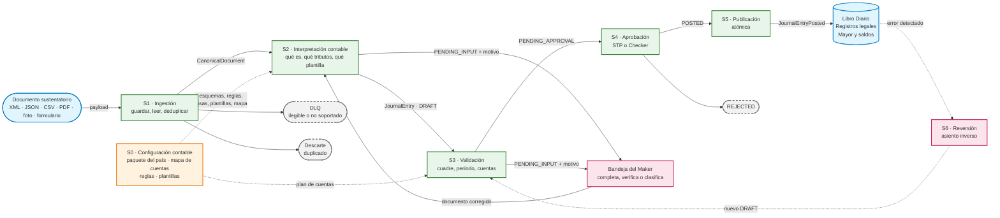

| Etapa | Responsabilidad | Entrada → salida | Invariantes |
|---|---|---|---|
| **S0** Configuración contable | Catálogos del país, mapa de cuentas de cada empresa, reglas de clasificación y plantillas probadas y versionadas | — → configuración activa por tenant | RD-10, RD-14, RD-17 |
| **S1** Ingestión | Recibir por cualquier canal y formato, guardar el original intacto, convertirlo en documento canónico y descartar duplicados | Payload → `CanonicalDocument` | RD-01, RD-02, RD-04, RD-08 |
| **S2** Interpretación contable | Lo que hace el contador antes de escribir el asiento: validar el documento, decidir qué operación respalda, resolver tributos y moneda, elegir y evaluar la plantilla | `CanonicalDocument` → `JournalEntry` `DRAFT` | RD-09, RD-15, RD-16, RD-18 |
| **S3** Validación | Cuadre, período abierto según la fecha contable, cuentas de detalle con sus dimensiones | `DRAFT` → `PENDING_APPROVAL` | RD-03, RD-12, RD-17 |
| **S4** Aprobación | Nivel de aprobación y firma (STP o Checker) | `PENDING_APPROVAL` → `POSTED` / `REJECTED` | RD-05, RD-06, RD-09 |
| **S5** Publicación | Publicar de forma atómica y anotar en el Diario, en el registro legal y en el Mayor | `POSTED` → `JournalEntryPosted` | RD-07, RD-13 |
| **S6** Reversión | Corregir un asiento publicado con un asiento inverso que repite todo el control | `POSTED` → nuevo `DRAFT` | RD-07, RD-11 |

### 5.2 S0 · Configuración contable

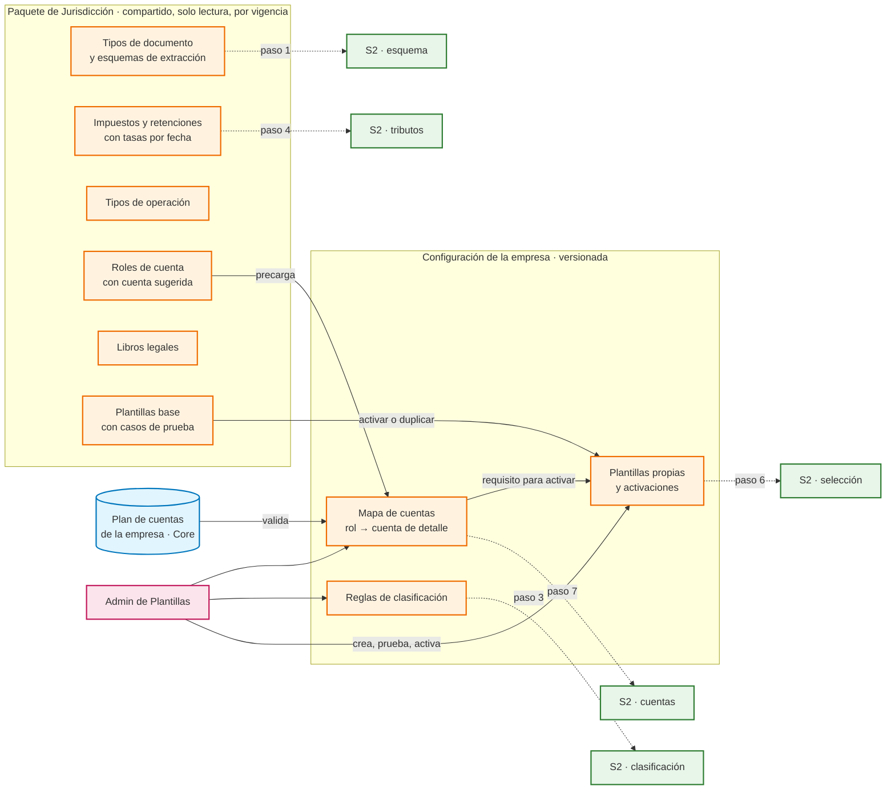

Una plantilla solo se activa para una empresa si todos sus casos de prueba pasan y todos sus roles están mapeados a cuentas de detalle válidas del plan de esa empresa (§20.8.4). Cada asiento guarda las versiones de configuración que usó (RD-10).

### 5.3 S1 · Ingestión

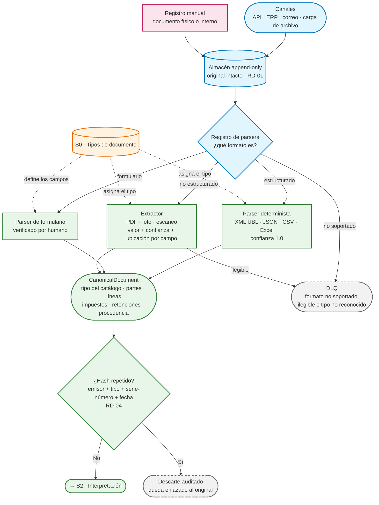

- La deduplicación ocurre **después** de construir el canónico, porque el hash usa datos del documento. Así, la misma factura recibida en XML y en PDF se detecta como duplicada.
- Los campos que el extractor leyó con confianza baja **no** detienen la ingestión: viajan con su confianza y el paso 1 de S2 los envía al Maker (`LOW_CONFIDENCE_EXTRACTION`).

### 5.4 S2 · Interpretación contable

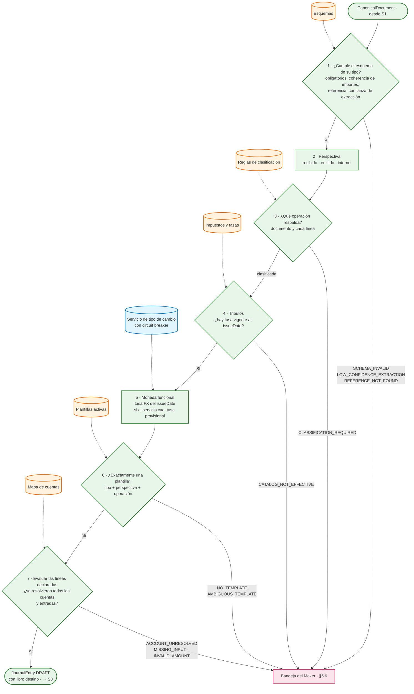

- El orden reproduce el razonamiento del contador: **primero** se verifica el documento y se decide qué operación es, y **solo después** se elige cómo contabilizarla. Por eso una corrección del Maker vuelve al paso que corresponde (§5.6) y no solo a la evaluación de la plantilla.
- La tasa provisional (paso 5) no detiene el flujo, pero marca el asiento: en S4 obliga a la firma de un Checker (RD-09).

### 5.5 S3 · Validación, S4 · Aprobación, S5 · Publicación y S6 · Reversión

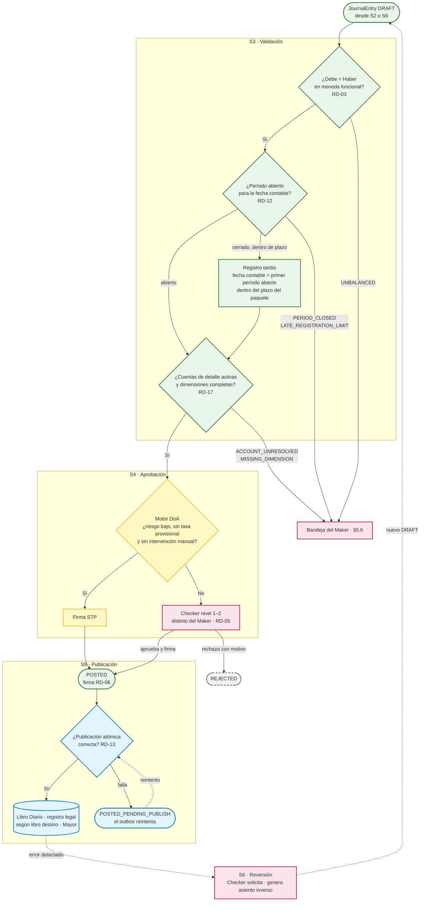

- Entre S3 y S4 el asiento está en `PENDING_APPROVAL`. `POSTED` es inmutable (RD-07): el asiento inverso de S6 es un borrador nuevo que vuelve a pasar por validación, DoA y Checker, y el original sigue `POSTED`.
- El registro tardío aplica solo si la política del tenant lo permite y el tipo de documento está dentro de su plazo; en otro caso el Maker decide o escala.

### 5.6 Retornos a la bandeja del Maker

Todo retorno lleva un motivo explícito (`pendingReasons`). El Maker corrige y el documento se re-ejecuta **desde el paso indicado**, porque un cambio en la clasificación puede cambiar la plantilla.

| Motivo | Detectado en | Qué hace el Maker | Se re-ejecuta desde |
|---|---|---|---|
| `SCHEMA_INVALID` | S2 · paso 1 | Completa o corrige campos del documento | Paso 1 |
| `LOW_CONFIDENCE_EXTRACTION` | S2 · paso 1 | Verifica los campos dudosos contra el original (foto o PDF) | Paso 1 |
| `REFERENCE_NOT_FOUND` | S2 · paso 1 | Confirma o corrige el documento referenciado | Paso 1 |
| `CLASSIFICATION_REQUIRED` | S2 · paso 3 | Elige el tipo de operación del documento o de cada línea | Paso 4 |
| `CATALOG_NOT_EFFECTIVE` | S2 · paso 4 | Corrige la fecha o el código de impuesto; si el paquete está desactualizado, escala al Admin | Paso 1 |
| `NO_TEMPLATE` / `AMBIGUOUS_TEMPLATE` | S2 · paso 6 | Reclasifica, o espera a que el Admin active o ajuste una plantilla | Paso 6 |
| `ACCOUNT_UNRESOLVED` | S2 · paso 7 / S3 | Escala al Admin para completar el mapa de cuentas | Paso 7 |
| `MISSING_DIMENSION` / `MISSING_INPUT` | S2 · paso 7 / S3 | Informa el centro de costo u otro dato que exige la plantilla o la cuenta | Paso 7 |
| `INVALID_AMOUNT` | S2 · paso 7 | Escala al Admin: la plantilla produjo un importe negativo | Paso 6 |
| `UNBALANCED` | S3 | Revisa importes del documento; si es error de plantilla, escala al Admin | Paso 1 |
| `PERIOD_CLOSED` / `LATE_REGISTRATION_LIMIT` | S3 | Confirma el registro tardío en el período abierto, escala para autorización de nivel máximo, o cancela | S3 |

Toda intervención marca `manualIntervention = true`, y ese asiento no puede aprobarse por STP (RF-05). El Maker también puede cancelar el documento con justificación (`CANCELLED`).

## 6. Flujo de Negocio Simplificado (para stakeholders no técnicos)

Así trabaja un contador con cada documento, y así trabaja el sistema:

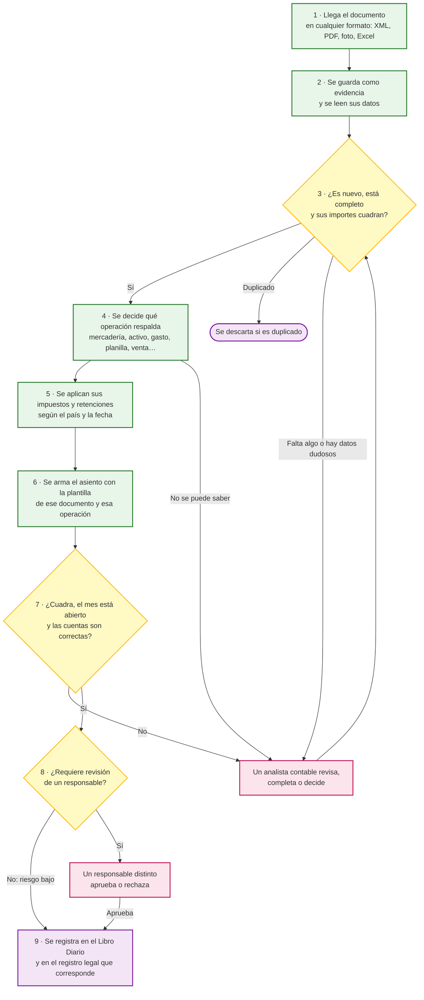

**Reglas de negocio detrás de este flujo:**

1. **Todo asiento nace de un documento que lo sustenta.** Si no hay documento de un tercero (una provisión, la depreciación del mes, la planilla), se registra un documento interno.
2. **El documento original nunca se altera**, sea XML, PDF o foto; queda siempre como evidencia.
3. **Cada tipo de documento tiene sus propios datos obligatorios**: una planilla no se lee como una factura, y una nota de crédito siempre dice qué factura modifica.
4. **Primero se decide qué es la operación.** Una misma factura puede ser mercadería, un activo fijo o un gasto, y cada caso va a cuentas distintas. Si el sistema no puede decidirlo con seguridad, lo decide una persona.
5. **Los impuestos siguen las reglas del país de la empresa y la fecha del documento.** El sistema no tiene ninguna regla de país escrita en su código.
6. **Doble control:** quien corrige o clasifica un asiento no puede ser quien lo aprueba. Si hubo intervención humana, el tipo de cambio fue provisional o el dato se leyó de una foto con dudas, siempre revisa un responsable.
7. **Nunca se registra** un asiento que no cuadra, que usa cuentas que no existen en el plan de la empresa o que cae en un mes cerrado (salvo autorización especial de máximo nivel).
8. **Lo registrado no se borra ni se edita**: se corrige con un asiento que lo anula, con el mismo doble control.
9. **El pago o cobro posterior** llega como otro documento (voucher, extracto) y sigue este mismo flujo.

## 7. Especificación de Requerimientos del Sistema

### 7.1 Requerimientos Funcionales (RF)

- **RF-01 (Endpoint de Ingestión):** API que actúa como puerto de entrada universal, devolviendo un acuse de recibo asíncrono (ej. `202 Accepted`) tras asegurar el payload original en el almacén append-only. El API debe soportar autenticación por credenciales del tenant y versionado de endpoint.

- **RF-02 (Resolución Dinámica de Parsers):** Registro de Parsers y Extractores (patrón Strategy) que asigna el procesador adecuado según tipo de contenido (MIME), firma del archivo, esquema detectado y metadatos del proveedor, sin modificar la lógica central. La adición de un nuevo parser o extractor es una operación de configuración, no de recompilación.

- **RF-03 (Evaluación de Plantillas):** intérprete de expresiones AST serializadas (JSON) con lógica condicional, aritmética entera sobre importes, funciones de fecha y búsquedas en el documento canónico (campos de cabecera, líneas, impuestos por código, retenciones por código, referencias). La plantilla **declara cada línea del asiento** (lado, cuenta, importe, dimensiones, descripción, condición de emisión, iteración por línea del documento); el evaluador no infiere lados ni cuentas según la perspectiva ni según ningún tipo de documento concreto (§20.8).

- **RF-04 (Manejo de Excepciones - Staging):** los asientos incompletos o descuadrados se almacenan en una base temporal (staging), con API de lectura paginada, filtrado por estado/fecha/tenant, y actualización individual o en lote. Soporta control de concurrencia optimista para evitar conflictos entre Makers.

- **RF-05 (Motor DoA):** cálculo del nivel de autorización requerido evaluando variables del documento (monto, tipo de documento, tipo de operación, moneda, tercero, indicador de tasa provisional, indicador de intervención manual) contra la matriz de delegación de autoridad del tenant activo. Todo asiento con intervención del Maker (datos completados, clasificación manual) requiere firma de un Checker distinto (RD-05) y no puede aprobarse por STP.

- **RF-06 (Manejo de Fallos de Parseo):** todo payload que falle el parseo tras los reintentos configurados se envía a una DLQ con notificación al equipo de soporte, sin bloquear el resto del flujo.

- **RF-07 (Reversión de Asientos):** endpoint y flujo de UI para solicitar la reversión de un asiento `POSTED`, generando un nuevo asiento inverso que recorre el ciclo completo Maker-Checker (RD-11).

- **RF-08 (Auditoría de Configuración Contable):** toda versión de plantilla, de esquema de tipo de documento, de regla de clasificación, de mapa de cuentas y de Paquete de Jurisdicción queda registrada con autor, fecha y diff respecto a la versión anterior; cada asiento queda vinculado a las versiones exactas que utilizó.

- **RF-09 (Re-procesamiento desde DLQ):** el Operador de Soporte puede inspeccionar documentos en la DLQ, diagnosticar el error, y re-enrolar el documento para su procesamiento (reiniciando desde el paso de parseo), dejando registro en auditoría.

- **RF-10 (Cancelación Pre-Asentamiento):** un Maker puede cancelar un documento en estado `PENDING_INPUT` con justificación documentada, transicionándolo a un estado terminal `CANCELLED`. Un Checker puede rechazar un asiento en `PENDING_APPROVAL`, transicionándolo a `REJECTED`.

- **RF-11 (Consulta de Estado del Período Contable):** el subsistema consulta al servicio de períodos contables si el período correspondiente al `issueDate` del documento está abierto antes de permitir la transición a `POSTED`. No gestiona la apertura/cierre de períodos.

- **RF-12 (Importación Masiva):** endpoint para carga masiva de documentos (ej. migración desde sistemas legacy), que respeta todos los invariantes de dominio pero permite enviar lotes con control de progreso y reporte de errores por documento individual.

- **RF-13 (Catálogo de Tipos de Documento Sustentatorio):** catálogo versionado, por jurisdicción, de los tipos de documento que el sistema puede contabilizar. Cada tipo define su familia (§20.2), su esquema de extracción (campos de cabecera y de línea con tipo de dato y obligatoriedad, roles de parte esperados, impuestos y retenciones admitidos, referencias exigidas), sus reglas de coherencia y su equivalencia con los códigos oficiales de la jurisdicción. Los parsers asignan el tipo de documento del catálogo; el motor valida contra el esquema (RD-15).

- **RF-14 (Paquetes de Jurisdicción):** carga y consulta de Paquetes de Jurisdicción versionados por vigencia (§20.7). Cada tenant tiene asignado exactamente un paquete, que determina los catálogos que el subsistema usa para ese tenant. El subsistema no calcula declaraciones; solo consulta el paquete.

- **RF-15 (Clasificación de la Operación):** asignación de un tipo de operación al documento y, cuando corresponda, a cada línea, mediante reglas de clasificación del tenant evaluadas en orden de prioridad (por tercero, por código o descripción de producto, por cuenta sugerida en el origen, por campos del documento). Si ninguna regla decide, el documento va a `PENDING_INPUT` (`CLASSIFICATION_REQUIRED`) y el Maker elige el tipo de operación; su decisión queda auditada y puede, opcionalmente, guardarse como nueva regla (sujeta a aprobación del Admin).

- **RF-16 (Selección de Plantilla):** selección determinista (RD-16) de la plantilla activa del tenant que corresponde a `(tipo de documento, perspectiva, tipo de operación)` y cuyas condiciones de aplicabilidad se cumplen, por prioridad. Expone la traza de la decisión: candidatas evaluadas, condiciones cumplidas o no, plantilla y versión elegidas.

- **RF-17 (Mapa de Cuentas por Tenant):** mantenimiento del mapa que asigna a cada rol de cuenta del paquete una cuenta de detalle del plan del tenant, con validación contra el catálogo de cuentas (existe, imputable, activa, dimensiones exigidas). Se versiona igual que las plantillas (RD-10).

- **RF-18 (Registro Manual y Documentos Internos):** formulario para registrar documentos sin origen electrónico (comprobantes físicos) y documentos internos (provisiones, cuadros de depreciación, ajustes, resúmenes de planilla) según el esquema de su tipo. El formulario produce un `CanonicalDocument` por el mismo registro de parsers y sigue el flujo completo, incluidos RD-04 y Maker-Checker.

- **RF-19 (Libro o Registro Destino):** cada plantilla declara el libro o registro legal del paquete en el que se anota el asiento; el evento `JournalEntryPosted` lo incluye para que el Core lo proyecte en el registro correspondiente con los datos del documento que ese registro exige.

- **RF-20 (Ingestión Multiformato y Extracción con Confianza):** el subsistema acepta, como mínimo: XML de facturación electrónica (UBL 2.1 y otros estándares nacionales), JSON de API, CSV y hojas de cálculo, PDF con texto, y PDF escaneado o imagen (JPG, PNG, HEIC, TIFF) de un documento físico o fotografiado. Los formatos estructurados se parsean de forma determinista. Los no estructurados pasan por un extractor (OCR e interpretación del documento) que: (a) propone el tipo de documento del catálogo, (b) devuelve cada campo con su valor, su confianza (0–1) y su ubicación en el original, y (c) nunca inventa un dato ausente. Todo campo obligatorio con confianza bajo el umbral del tenant, o todo tipo de documento propuesto con baja confianza, deja el documento en `PENDING_INPUT` (`LOW_CONFIDENCE_EXTRACTION`) para que el Maker lo verifique contra el original, que se muestra junto a los datos extraídos. La corrección del Maker queda auditada campo por campo. Un archivo ilegible o de formato no soportado va a la DLQ. Un mismo documento recibido en dos formatos (XML y PDF) se deduplica por RD-04.

### 7.2 Requerimientos No Funcionales (RNF)

- **RNF-01 (OCP Estricto):** añadir un nuevo formato de origen, tipo de documento, impuesto, tasa, tipo de operación, plantilla o jurisdicción completa requiere 0 modificaciones en el código base compilado del Core; son cambios de configuración versionada (RD-14).

- **RNF-02 (Rendimiento de Ingestión):** el API Gateway asegura el payload en el almacén append-only en <50ms (p95), delegando el cómputo AST a workers en background.

- **RNF-03 (Trazabilidad Distribuida):** un mismo identificador de traza (según estándar W3C Trace Context) recorre todo el flujo, desde la recepción inicial hasta la publicación del evento al bus, incluyendo las intervenciones humanas.

- **RNF-04 (Consistencia Eventual):** el sistema de lectura (proyecciones CQRS) tolera un lag máximo de 2 segundos respecto al Event Store bajo carga sostenida nominal. El lag máximo bajo pico se define como punto pendiente de negocio.

- **RNF-05 (Seguridad - Cifrado):** cifrado en tránsito y en reposo para el almacén append-only, staging y Event Store. Los estándares criptográficos mínimos se definen en la Sección 14.

- **RNF-06 (Control de Acceso):** RBAC por tenant y por rol (Maker, Checker, Admin de Plantillas y Configuración Contable, Auditor de solo lectura, Operador de Soporte). Ningún rol combina Maker y Checker sobre el mismo tenant salvo excepción documentada en la Matriz DoA (RD-05). Revisión periódica de accesos obligatoria.

- **RNF-07 (Resiliencia):** circuit breaker en la API de FX y en cualquier dependencia externa; política de reintentos con backoff exponencial (máx. 3 intentos) antes de enviar a DLQ. Patrón outbox para garantizar entrega de eventos al bus (RD-13).

- **RNF-08 (Continuidad de Negocio):** RPO ≤ 5 minutos y RTO ≤ 1 hora para el Event Store; backups incrementales cada 15 minutos con prueba de restauración trimestral.

- **RNF-09 (Retención Normativa):** los asientos contables y su evidencia raw se retienen un mínimo de 5 años (ajustable por jurisdicción del tenant), con integridad verificable mediante hash-chaining del Event Store (ledger append-only).

- **RNF-10 (SLA de Staging):** todo documento en `PENDING_INPUT` genera una alerta si supera 48 horas sin intervención, escalando al supervisor del Maker. El tiempo de SLA es configurable por tenant.

- **RNF-11 (Estrategia de Pruebas):** cobertura obligatoria de al menos un caso de prueba (documento canónico de entrada y asiento esperado) por cada plantilla antes de activarla, y por cada plantilla base del Paquete de Jurisdicción, pruebas de contrato entre `IDocumentParser` e `IngestionService`, y pruebas de reconciliación automatizadas que verifiquen RD-03 sobre una muestra diaria de asientos `POSTED`.

- **RNF-12 (Escalabilidad):** el subsistema soporta escalamiento horizontal de workers de parseo y traducción de forma independiente. El particionado se realiza por tenant para garantizar aislamiento de carga.

- **RNF-13 (Control de Concurrencia):** las operaciones de actualización en staging utilizan control de concurrencia optimista (versionado de entidad) para evitar conflictos entre Makers concurrentes sobre el mismo documento.

- **RNF-14 (Versionado de API):** los endpoints públicos del subsistema siguen una estrategia de versionado explícito (ej. `/api/v1/...`) que permite evolucionar contratos sin romper integraciones existentes.

## 8. Casos de Uso

### CU-01: Procesamiento Híbrido de Documento Sustentatorio

| Atributo | Descripción |
|---|---|
| Actor Principal | Sistema Externo (ERP, Pasarela). |
| Actores Secundarios | Analista Contable (Maker), Director Financiero (Checker). |
| Precondiciones | El Tenant tiene un Paquete de Jurisdicción asignado, su mapa de cuentas completo para los roles que usan sus plantillas activas, plantillas activas para los tipos de documento que recibe, la matriz DoA activa y el período contable correspondiente abierto. |
| Flujo Principal (STP) | 1. Se recibe el payload. 2. Se almacena en el almacén append-only (RD-01). 3. El parser extrae el Documento Canónico y le asigna un tipo de documento del catálogo. 4. Se verifica idempotencia (RD-04). 5. Se valida el documento contra el esquema de su tipo (RD-15). 6. Se determina la perspectiva (`RECEIVED`, `ISSUED`, `INTERNAL`). 7. Las reglas de clasificación asignan el tipo de operación al documento y a sus líneas (RD-16). 8. Se resuelven los impuestos y retenciones con las tasas vigentes al `issueDate` (RD-18). 9. Se resuelve FX si aplica (RD-09). 10. Se selecciona exactamente una plantilla (RD-16) y se evalúa, resolviendo roles de cuenta con el mapa del tenant, para generar el asiento borrador con su libro destino. 11. El Validador verifica la ecuación patrimonial (RD-03), el período abierto (RD-12) y las cuentas y dimensiones (RD-17). 12. El Motor DoA clasifica como "Bajo Riesgo", sin tasa provisional y sin intervención manual. 13. Se inyecta la firma algorítmica (RD-06). 14. El asiento pasa a `POSTED` y se publica el evento atómicamente (RD-13). |
| Flujos Alternativos | **Alt 1 (Campos Faltantes):** en el paso 5 u 11 falta un dato obligatorio o una dimensión; transiciona a `PENDING_INPUT`; el Maker completa y se re-ejecuta desde el paso 7. **Alt 2 (Clasificación Manual):** en el paso 7 ninguna regla decide; `PENDING_INPUT` (`CLASSIFICATION_REQUIRED`); el Maker elige el tipo de operación y se re-ejecuta desde el paso 8; en el paso 12 se exige Checker. **Alt 3 (Sin Plantilla):** en el paso 10 no hay plantilla o hay empate; `PENDING_INPUT` (`NO_TEMPLATE` / `AMBIGUOUS_TEMPLATE`) hasta que el Admin active o ajuste una plantilla, o el Maker reclasifique. **Alt 4 (Alto Riesgo):** en el paso 12 se requiere Checker nivel 2; transiciona a `PENDING_APPROVAL`; el Checker firma y avanza al paso 14. **Alt 5 (Tasa Provisional):** en el paso 9 la API de FX falla; se usa tasa cacheada con indicador provisional; en el paso 12 se fuerza aprobación humana. |
| Postcondiciones | El Event Store recibe `JournalEntryPosted` con su libro destino, el registro legal correspondiente lo anota y las proyecciones de lectura reflejan el nuevo saldo. |

### CU-02: Documento Duplicado

Un ERP reenvía por error el mismo comprobante (mismo hash de idempotencia según RD-04). El sistema lo almacena en el almacén append-only por trazabilidad (RD-01), pero el Deduplicador detiene su avance antes de generar un segundo asiento, dejando registro en el log de auditoría del intento duplicado con el identificador de traza completo.

### CU-03: Reversión de Asiento Contable

El Director Financiero detecta un error en un asiento `POSTED`. Solicita la reversión referenciando el ID original. El sistema genera un **nuevo** `JournalEntry` con montos de signo invertido, que pasa por el mismo ciclo completo Maker-Checker (RD-11) antes de publicarse como `JournalEntryPosted` (con metadato de tipo `REVERSAL`), vinculado al asiento original. El asiento original permanece inmutable en estado `POSTED` (RD-07). Para determinar que fue revertido, se consulta la existencia del asiento inverso.

### CU-04: Fallo de Parseo

Un proveedor envía un XML UBL malformado. Tras los reintentos definidos en RNF-07, el documento se envía a la DLQ de Ingestión y se notifica al equipo de soporte, sin afectar el procesamiento de otros documentos en curso.

### CU-05: Re-procesamiento desde DLQ

El Operador de Soporte detecta en la DLQ un lote de documentos que falló por un error en el parser UBL. Tras corregir o añadir el parser necesario (RF-02), re-enrola los documentos para procesamiento. Cada documento reinicia desde el paso de parseo, manteniendo el mismo identificador de traza y vínculo al payload original en el almacén.

### CU-06: Procesamiento Multi-Moneda

Un tenant con moneda funcional PEN recibe una factura en USD. El sistema consulta la tasa de cambio vigente al `issueDate`. Si la API responde, aplica la tasa y genera las líneas del asiento en PEN con redondeo según ISO 4217 (RD-09). Si la API falla, aplica la tasa cacheada más reciente, marca el asiento como `provisionalFxRate = true` y lo dirige a aprobación humana obligatoria.

### CU-07: Cancelación de Documento en Staging

Un Analista Contable determina que un documento en `PENDING_INPUT` corresponde a un comprobante anulado por el proveedor. Cancela el documento con justificación, transicionándolo a `CANCELLED`. El documento y su justificación quedan registrados para auditoría.

### CU-08: Interacción con Cierre de Período

El equipo contable cierra el período de septiembre. Tres documentos permanecen en `PENDING_INPUT` y uno en `PENDING_APPROVAL` con `issueDate` en septiembre. El sistema genera alertas de escalamiento (RNF-10) para cada uno. Los Makers y Checkers deben resolverlos antes de que el período quede completamente sellado; de lo contrario, requieren autorización de nivel máximo (RD-12) para asentarlos post-cierre.

### CU-09: Contabilización del Resumen de Planilla

El área de personal (o el sistema de nómina externo) entrega el resumen de planilla del mes como documento de tipo `PAYROLL_SUMMARY`, familia `LABOR`, perspectiva `INTERNAL`. Su esquema exige el periodo, la moneda y, por trabajador o por concepto, los importes de remuneración bruta, aportes del trabajador (pensiones, retención de renta) y aportes del empleador (seguridad social). La plantilla de remuneraciones del paquete declara: Debe gasto de remuneraciones por la remuneración bruta, Debe gasto de seguridad social por el aporte del empleador; Haber cada aporte por pagar a su entidad y Haber remuneraciones por pagar por el neto. El asiento cuadra por construcción (bruto + aporte empleador = aportes + retenciones + neto), se valida y sigue el ciclo Maker-Checker. El *cálculo* de la planilla no lo hace este subsistema.

### CU-10: Recibo por Honorarios con Retención

Un profesional independiente emite al tenant un recibo por honorarios de 1 000.00 con retención de impuesto a la renta. El documento trae la retención en `withholdings[]`. El tratamiento tributario indica que el tenant es agente de retención y que el documento no genera crédito fiscal. La plantilla declara: Debe gasto de honorarios por el importe bruto, Haber retención de renta por pagar por el importe retenido, Haber honorarios por pagar por el neto. El asiento se anota en el registro legal que el paquete asigna a ese tipo de documento.

### CU-11: Factura Recibida con Líneas de Distinta Naturaleza

Un proveedor factura en un mismo documento mercadería para la venta y un servicio de transporte. Las reglas de clasificación asignan un tipo de operación por línea (`MERCHANDISE_PURCHASE` y `SERVICE_EXPENSE`). La plantilla de factura recibida itera por línea y resuelve la cuenta de cada una según su clasificación; el impuesto recuperable va a una sola línea de crédito fiscal y el total a proveedores. Si una línea no puede clasificarse, todo el documento va a `PENDING_INPUT` y el Maker clasifica solo esa línea.

### CU-12: Nota de Crédito Recibida

Un proveedor emite una nota de crédito por devolución parcial de mercadería. El esquema de `CREDIT_NOTE` exige la referencia al documento modificado; si falta, `PENDING_INPUT`. La plantilla declara las líneas con los lados que corresponden a una disminución (Debe proveedores, Haber mercadería y crédito fiscal); no se "invierte" automáticamente otra plantilla. Si el documento referenciado no existe en el tenant, el asiento queda en `PENDING_INPUT` (`REFERENCE_NOT_FOUND`) para que el Maker confirme.

### CU-13: Operación no Clasificable por Reglas

Llega una factura de un proveedor nuevo por "equipos de cómputo". Ninguna regla decide si es un activo fijo o un gasto (depende del valor y de la política de la empresa). El documento va a `PENDING_INPUT` (`CLASSIFICATION_REQUIRED`); el Maker lo clasifica como `FIXED_ASSET_ACQUISITION`, el sistema selecciona la plantilla de adquisición de activo y genera el asiento, y el Checker lo aprueba. El Maker puede proponer una regla para ese proveedor, que el Admin revisa antes de activarla.

### CU-14: Tenant de Otra Jurisdicción

El estudio incorpora una empresa de otro país. El Admin le asigna el Paquete de Jurisdicción de ese país (tipos de documento, IVA y retenciones locales, plan de cuentas de referencia, libros legales, plantillas base), carga su plan de cuentas y completa su mapa de cuentas. Las facturas de la empresa se procesan con el mismo motor sin ningún cambio de código (RD-14, RNF-01). Ningún catálogo de un tenant es visible para otro salvo el paquete compartido, que es de solo lectura (RD-08).

## 9. Historias de Usuario (BDD)

**Epic: Configuración Contable Agnóstica**

- **HU-01 — Creación de Plantilla Contable por Tipo de Documento.** Como Administrador de Plantillas, quiero definir sin código cómo se contabiliza un tipo de documento para un tipo de operación, declarando cada línea del asiento, para que el sistema registre esos documentos igual que lo haría un contador.
  *Given* estoy en el editor de plantillas con el tipo de documento "Recibo por honorarios", perspectiva `RECEIVED` y tipo de operación "Honorarios profesionales". *When* declaro "Debe rol `PROFESSIONAL_FEES_EXPENSE` por el importe bruto; Haber rol `INCOME_TAX_WITHHELD_PAYABLE_4TH` por la retención; Haber rol `PROFESSIONAL_FEES_PAYABLE` por el neto", agrego un caso de prueba y guardo. *Then* el sistema valida las expresiones contra el esquema del tipo de documento, guarda la plantilla como `v1`, ejecuta el caso de prueba y solo permite activarla si el caso pasa y el asiento cuadra.

- **HU-08 — Catálogo de Tipos de Documento.** Como Administrador de Plantillas, quiero consultar y, si mi jurisdicción lo requiere, ampliar los tipos de documento con los datos que se extraen de cada uno, para que el sistema sepa qué esperar de una planilla, una DUA o un recibo por honorarios.
  *Given* el Paquete de Jurisdicción de mi empresa. *When* abro el tipo "Nota de crédito". *Then* veo sus campos obligatorios y opcionales, los roles de parte, los impuestos admitidos, la referencia obligatoria al documento modificado y su código oficial en la jurisdicción.

- **HU-09 — Clasificación Manual de la Operación (Maker).** Como Analista Contable, quiero ver los documentos que el sistema no pudo clasificar y decidir qué operación respaldan, para que se contabilicen con la plantilla correcta.
  *Given* una factura en `PENDING_INPUT` con motivo `CLASSIFICATION_REQUIRED`. *When* la clasifico como "Adquisición de activo fijo". *Then* el sistema selecciona la plantilla correspondiente, genera el asiento, registra mi decisión en auditoría y lo envía a aprobación de un Checker.

- **HU-10 — Mapa de Cuentas de la Empresa.** Como Administrador de Plantillas, quiero asignar a cada rol de cuenta del paquete una cuenta de detalle del plan contable de la empresa, para que las plantillas base funcionen con su plan de cuentas.
  *Given* la empresa usa las plantillas base del paquete. *When* asigno el rol "Proveedores – facturas por pagar" a una cuenta de agrupación. *Then* el sistema rechaza la asignación indicando que la cuenta no es imputable, y marca como no activables las plantillas que usan ese rol hasta que se corrija.

- **HU-11 — Registro de Documento Interno.** Como Analista Contable, quiero registrar un documento interno (provisión, depreciación del mes, resumen de planilla) desde un formulario, para contabilizarlo con el mismo control que un documento de un tercero.
  *Given* el cuadro de depreciación del mes calculado fuera del sistema. *When* lo registro como documento interno de tipo "Depreciación" con su importe por clase de activo. *Then* se genera el asiento con la plantilla de depreciación, pasa por el Validador y requiere la aprobación de un Checker distinto de mí.

- **HU-02 — Intervención en Bandeja Staging (Maker).** Como Analista Contable, quiero ver una grilla de documentos no procesados automáticamente, para asignarles el proyecto correcto de forma masiva.
  *Given* 50 documentos en `PENDING_INPUT`. *When* selecciono todos, aplico el tag "Proyecto Alpha" y proceso. *Then* los 50 asientos pasan a re-evaluación AST y validación matemática, y la bandeja refleja su nuevo estado.

- **HU-03 — Aprobación de Alto Riesgo (Checker).** Como Director Financiero, quiero ver el detalle completo, el historial del documento y el payload original antes de firmar, para tomar una decisión informada.
  *Given* un asiento en `PENDING_APPROVAL` nivel 2. *When* reviso el detalle, verifico el comprobante original y firmo criptográficamente. *Then* el asiento pasa a `POSTED` y queda mi firma vinculada de forma inmutable, con el timestamp del acto de aprobación.

- **HU-04 — Reversión Controlada.** Como Director Financiero, quiero solicitar la reversión de un asiento erróneo, para corregir el libro sin borrar el historial.
  *Given* un asiento `POSTED` con error detectado y período abierto. *When* solicito su reversión con motivo documentado. *Then* se genera un nuevo asiento inverso vinculado, sujeto a la aprobación de un tercero (Maker-Checker), y el asiento original permanece intacto en `POSTED`.

- **HU-05 — Gestión de DLQ (Operador de Soporte).** Como Operador de Soporte, quiero ver los documentos fallidos en la DLQ con su motivo de error, para diagnosticar y re-enrolar los que ya tienen parser corregido.
  *Given* 5 documentos en la DLQ por error de parseo. *When* selecciono los que corresponden al parser ya corregido y solicito re-procesamiento. *Then* los documentos reinician su ciclo desde parseo, manteniendo la trazabilidad al payload original.

- **HU-06 — Consulta de Trazabilidad (Auditor).** Como Auditor, quiero consultar el historial completo de un asiento POSTED, desde el comprobante original hasta el evento publicado, en una sola vista.
  *Given* el ID de un asiento `POSTED`. *When* consulto su trazabilidad. *Then* veo el payload raw original, el documento canónico, la versión de plantilla AST usada, las intervenciones del Maker (si hubo), la firma del Checker o STP, y el evento publicado, con timestamps y hashes en cada paso.

- **HU-07 — Cancelación de Documento.** Como Analista Contable, quiero poder cancelar un documento en PENDING_INPUT que ya no es relevante, para mantener limpia mi bandeja de trabajo.
  *Given* un documento en `PENDING_INPUT` que el proveedor anuló. *When* lo selecciono y cancelo con justificación. *Then* el documento pasa a estado `CANCELLED` con la justificación registrada en auditoría, y no puede reactivarse.

## 10. Diseño Arquitectónico UML

### 10.1 Diagrama de Clases

El diagrama se divide en tres vistas para que sea legible: (a) documento canónico, (b) configuración contable, (c) asiento y servicios.

#### 10.1.a Documento canónico

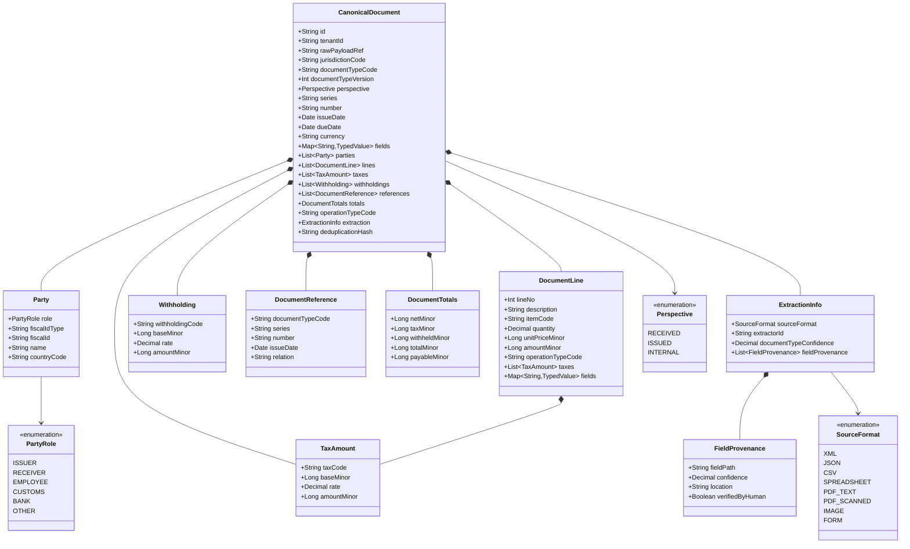

#### 10.1.b Configuración contable

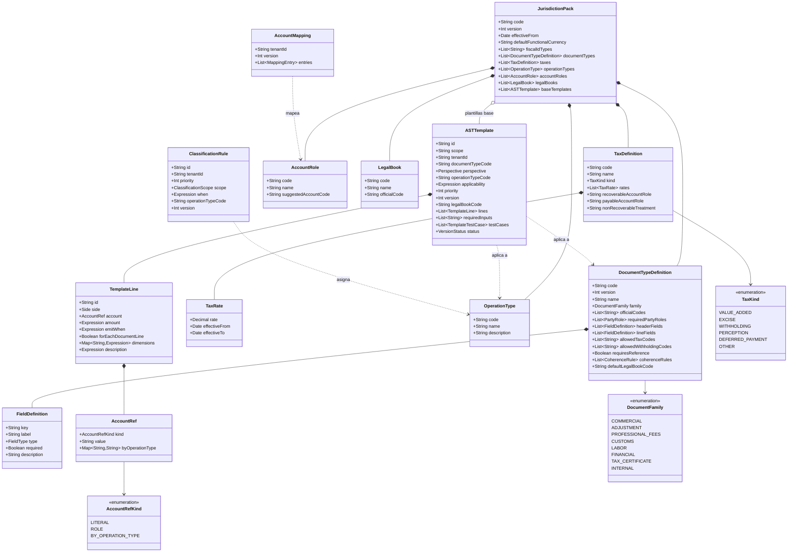

#### 10.1.c Asiento y servicios

```mermaid
classDiagram
    class JournalEntry {
        +String id
        +String tenantId
        +String canonicalDocRef
        +String documentTypeCode
        +Perspective perspective
        +String operationTypeCode
        +String legalBookCode
        +JournalState state
        +List~PendingReason~ pendingReasons
        +String templateId
        +Int templateVersion
        +ConfigVersions configVersions
        +List~EntryLine~ lines
        +String reversalOfId
        +Boolean provisionalFxRate
        +Boolean manualIntervention
        +Date issueDate
        +Date accountingDate
        +String accountingPeriod
        +Long entityVersion
        +verifyBalance() Boolean
    }

    class EntryLine {
        +Int lineNo
        +Side side
        +String accountCode
        +String accountRole
        +Long amountMinor
        +String currency
        +Decimal fxRate
        +Long functionalAmountMinor
        +Map~String,String~ dimensions
        +String description
        +String templateLineId
        +List~Int~ sourceLineNos
    }

    class JournalState {
        <<enumeration>>
        DRAFT
        PENDING_INPUT
        PENDING_APPROVAL
        POSTED
        POSTED_PENDING_PUBLISH
        REJECTED
        CANCELLED
    }

    class Side {
        <<enumeration>>
        DEBIT
        CREDIT
    }

    class ExchangeRate {
        +String fromCurrency
        +String toCurrency
        +Decimal rate
        +Date effectiveDate
        +Boolean isProvisional
    }

    class ApprovalDecision {
        +ApprovalLevel level
        +Boolean requiresHumanReview
        +String reason
    }

    class ApprovalLevel {
        <<enumeration>>
        STP_AUTO
        CHECKER_L1
        CHECKER_L2
        CHECKER_MAX
    }

    class IParserRegistry {
        <<interface>>
        +getParser(metadata) IDocumentParser
    }

    class IDocumentParser {
        <<interface>>
        +canHandle(metadata) Boolean
        +parse(rawPayload, catalog) CanonicalDocument
    }

    class IJurisdictionCatalog {
        <<interface>>
        +getPack(tenantId) JurisdictionPack
        +getDocumentType(tenantId, code, date) DocumentTypeDefinition
        +getTaxRate(tenantId, taxCode, date) TaxRate
    }

    class IClassifier {
        <<interface>>
        +classify(CanonicalDocument, rules) ClassificationResult
    }

    class ITemplateRepository {
        <<interface>>
        +findCandidates(tenantId, documentTypeCode, perspective, operationTypeCode) List~ASTTemplate~
        +getTemplateByVersion(tenantId, templateId, version) ASTTemplate
    }

    class IAccountMappingRepository {
        <<interface>>
        +getActiveMapping(tenantId) AccountMapping
    }

    class IFxResolver {
        <<interface>>
        +resolveRate(fromCurrency, toCurrency, date) ExchangeRate
    }

    class IEventPublisher {
        <<interface>>
        +publish(JournalEntryEvent) void
    }

    class IPeriodService {
        <<interface>>
        +isPeriodOpen(tenantId, period) Boolean
    }

    class IngestionService {
        -IParserRegistry registry
        -DeduplicationFilter dedup
        +ingest(rawPayload, metadata) void
    }

    class DocumentValidator {
        -IJurisdictionCatalog catalog
        +validateAgainstSchema(CanonicalDocument) SchemaResult
    }

    class TemplateSelector {
        -ITemplateRepository templateRepo
        +select(CanonicalDocument) SelectionResult
    }

    class TranslationEngine {
        -DocumentValidator docValidator
        -IClassifier classifier
        -TemplateSelector selector
        -IFxResolver fxResolver
        -ASTEvaluator evaluator
        -IAccountMappingRepository mappingRepo
        +translate(CanonicalDocument) JournalEntry
    }

    class ASTEvaluator {
        +evaluate(ASTTemplate, CanonicalDocument, AccountMapping) List~EntryLine~
    }

    class ValidationService {
        -IPeriodService periodService
        +validate(JournalEntry, ChartOfAccounts) ValidationResult
    }

    class DoAEngine {
        -RiskMatrix matrix
        +evaluateRisk(JournalEntry) ApprovalDecision
    }

    class ApprovalService {
        -DoAEngine doaEngine
        -IEventPublisher publisher
        +submitForApproval(JournalEntry) void
        +approve(JournalEntry, Signature) void
        +reject(JournalEntry, reason) void
    }

    IngestionService --> IParserRegistry
    IParserRegistry ..> IDocumentParser
    IDocumentParser ..> IJurisdictionCatalog : tipo de documento

    TranslationEngine --> DocumentValidator
    TranslationEngine --> IClassifier
    TranslationEngine --> TemplateSelector
    TranslationEngine --> IFxResolver
    TranslationEngine --> ASTEvaluator
    TranslationEngine --> IAccountMappingRepository
    DocumentValidator --> IJurisdictionCatalog
    TemplateSelector --> ITemplateRepository
    TranslationEngine ..> JournalEntry : Creates

    ValidationService --> IPeriodService
    ValidationService ..> JournalEntry : Validates

    ApprovalService --> DoAEngine
    ApprovalService --> IEventPublisher
    DoAEngine ..> ApprovalDecision : Returns

    JournalEntry --> JournalState
    JournalEntry *-- EntryLine
    EntryLine --> Side
    IFxResolver ..> ExchangeRate : Returns
```

### 10.2 Diagrama de Estados

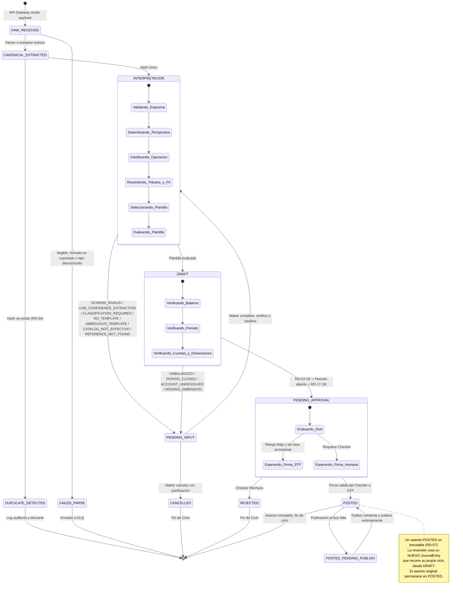

**Motivos de `PENDING_INPUT`** (`pendingReasons`, un documento puede tener varios): `SCHEMA_INVALID` (RD-15), `LOW_CONFIDENCE_EXTRACTION` (RF-20), `REFERENCE_NOT_FOUND` (CU-12), `CLASSIFICATION_REQUIRED` (RD-16), `NO_TEMPLATE` y `AMBIGUOUS_TEMPLATE` (RD-16), `CATALOG_NOT_EFFECTIVE` (RD-18), `MISSING_INPUT` (entrada requerida por la plantilla), `ACCOUNT_UNRESOLVED` y `MISSING_DIMENSION` (RD-17), `INVALID_AMOUNT` (importe negativo: error de plantilla), `UNBALANCED` (RD-03), `PERIOD_CLOSED` y `LATE_REGISTRATION_LIMIT` (RD-12). Dos resultados no van a la bandeja porque no son corregibles por el Maker: `DOCUMENT_NOT_FOR_TENANT` (se rechaza, RD-08) y `DOCUMENT_TYPE_NOT_ACCOUNTABLE` (se archiva como referencia, §20.2). Un documento en `PENDING_INPUT` antes de tener asiento se muestra en la bandeja con sus datos canónicos y, si vino de una imagen o PDF, junto al original.

### 10.3 Diagrama de Secuencia (Camino Crítico — STP)

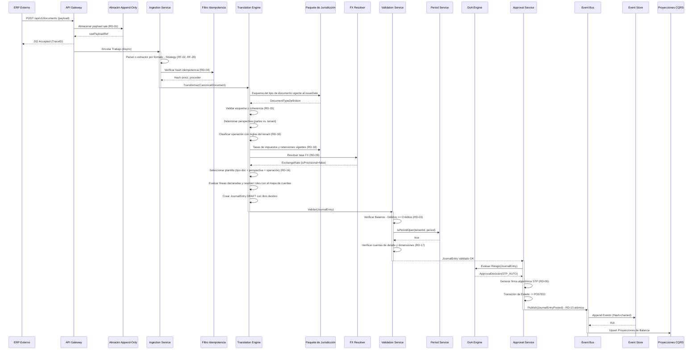

## 11. Catálogo de Eventos

Eventos publicados por este subsistema al bus de eventos. Cada evento es inmutable, incluye el `tenantId`, el `traceId`, y un hash de integridad.

| Evento | Trigger | Payload Principal | Consumidores Esperados |
|---|---|---|---|
| `RawPayloadStored` | Almacenamiento exitoso del payload original | `rawPayloadRef`, `tenantId`, `receivedAt` | Auditoría, trazabilidad |
| `DocumentDuplicated` | Intento de ingestión duplicada | `deduplicationHash`, `originalTraceId` | Auditoría |
| `DocumentParsingFailed` | Fallo de parseo tras reintentos | `rawPayloadRef`, `errorDetail`, `retryCount` | Soporte (DLQ) |
| `DocumentExtracted` | Parser o extractor produce el documento canónico | `canonicalDocRef`, `documentTypeCode`, `sourceFormat`, `lowConfidenceFields` | Auditoría |
| `DocumentClassified` | Se asigna tipo de operación (por regla o por Maker) | `canonicalDocRef`, `operationTypeCode`, `lineClassifications`, `classifiedBy` (`RULE:<id>` o usuario) | Auditoría |
| `TemplateSelected` | Selector elige plantilla | `canonicalDocRef`, `templateId`, `templateVersion`, `candidatesEvaluated` | Auditoría |
| `JournalEntryDrafted` | Asiento generado en estado DRAFT | `journalEntryId`, `templateId`, `templateVersion`, `configVersions` | Auditoría interna |
| `JournalEntrySentToStaging` | Asiento requiere intervención Maker | `journalEntryId`, `pendingReason` | Notificaciones al Maker |
| `JournalEntryPosted` | Asiento firmado y asentado | `journalEntryId`, `lines` (con `side`), `documentTypeCode`, `operationTypeCode`, `legalBookCode`, `sourceDocument` (tipo, serie, número, fecha, partes, impuestos, retenciones), `signature`, `fxRate`, `isReversal`, `reversalOfId` | Libro Mayor, Registros legales, CQRS, Reportería, Impuestos |
| `JournalEntryRejected` | Checker rechaza el asiento | `journalEntryId`, `rejectedBy`, `reason` | Notificaciones al Maker |
| `JournalEntryCancelled` | Maker cancela documento en staging | `journalEntryId`, `cancelledBy`, `reason` | Auditoría |
| `StagingAlertEscalated` | Documento supera SLA en staging | `journalEntryId`, `hoursInStaging` | Supervisor del Maker |
| `TemplateVersionActivated` | Se activa una versión de plantilla para un tenant | `templateId`, `version`, `tenantId`, `activatedBy`, `testRunId` | Auditoría |
| `AccountMappingChanged` | Cambia el mapa de cuentas de un tenant | `tenantId`, `version`, `changedRoles` | Auditoría |
| `JurisdictionPackPublished` | Se publica una versión de paquete | `jurisdictionCode`, `version`, `effectiveFrom` | Auditoría, Admin de Plantillas |

## 12. Contratos de API (Abstractos)

Definición funcional de los endpoints sin acoplar a protocolo específico.

### 12.1 Ingestión de Documento

| Atributo | Valor |
|---|---|
| Operación | `IngestDocument` |
| Entrada | `rawPayload` (binario o texto: XML, JSON, CSV, hoja de cálculo, PDF, imagen), `metadata` (tipo de contenido MIME, nombre de archivo, canal, proveedor, tenant, tipo de documento sugerido opcional) |
| Salida (síncrona) | `traceId`, `rawPayloadRef`, código de aceptación asíncrono |
| Autenticación | Credenciales del tenant (token o certificado) |
| Idempotencia | El cliente puede reenviar con el mismo payload; el sistema lo deduplicará (RD-04) |

### 12.2 Consulta de Staging

| Atributo | Valor |
|---|---|
| Operación | `QueryStagingDocuments` |
| Entrada | `tenantId`, filtros (estado, rango de fechas, tipo), paginación |
| Salida | Lista paginada de documentos y `JournalEntry` en `PENDING_INPUT`, con sus `pendingReasons`, datos canónicos, confianza por campo y referencia al original para visualizarlo |
| Autenticación | Rol Maker del tenant |

### 12.3 Actualización en Lote (Staging)

| Atributo | Valor |
|---|---|
| Operación | `BatchUpdateStaging` |
| Entrada | Lista de `{ journalEntryId, entityVersion, updates: { fields, lineFields, operationTypeCode, lineOperationTypes, dimensions, verifiedFields } }` |
| Salida | Resultado por documento: `OK`, `CONFLICT` (versión desactualizada), `VALIDATION_ERROR` |
| Autenticación | Rol Maker del tenant |
| Concurrencia | Optimistic locking via `entityVersion` |

### 12.4 Aprobación / Rechazo

| Atributo | Valor |
|---|---|
| Operación | `ApproveJournalEntry` / `RejectJournalEntry` |
| Entrada | `journalEntryId`, `signature` (para aprobación) o `reason` (para rechazo) |
| Salida | Estado resultante del asiento |
| Autenticación | Rol Checker del tenant; se valida SoD (RD-05) |

### 12.5 Solicitud de Reversión

| Atributo | Valor |
|---|---|
| Operación | `RequestReversal` |
| Entrada | `originalJournalEntryId`, `reason` |
| Salida | `newJournalEntryId` (del asiento inverso en estado DRAFT) |
| Autenticación | Rol Checker o nivel autorizado según DoA |
| Validaciones | El asiento original debe estar `POSTED`; el período debe estar abierto o tener autorización de nivel máximo |

### 12.6 Consulta de DLQ

| Atributo | Valor |
|---|---|
| Operación | `QueryDLQ` / `ReprocessFromDLQ` |
| Entrada | Filtros (rango de fechas, tipo de error), paginación; para re-proceso: lista de `rawPayloadRef` |
| Salida | Lista de documentos fallidos con detalle de error; resultado del re-enrolamiento |
| Autenticación | Rol Operador de Soporte |

### 12.7 Importación Masiva

| Atributo | Valor |
|---|---|
| Operación | `BulkImport` |
| Entrada | Lote de payloads con metadatos, `batchId` para rastreo |
| Salida | `batchId`, estado inicial del lote, endpoint de consulta de progreso |
| Autenticación | Rol Admin del tenant |

### 12.8 Registro Manual de Documento

| Atributo | Valor |
|---|---|
| Operación | `RegisterManualDocument` |
| Entrada | `documentTypeCode`, valores de campos según el esquema del tipo, adjunto opcional (foto o PDF del físico) |
| Salida | `traceId`, `canonicalDocRef` |
| Autenticación | Rol Maker del tenant |
| Validaciones | Esquema del tipo (RD-15); sigue el flujo completo, con RD-04 y Maker-Checker |

### 12.9 Gestión de Plantillas

| Atributo | Valor |
|---|---|
| Operaciones | `ListTemplates`, `GetTemplate`, `CreateTemplate`, `SaveTemplateDraft`, `CreateTemplateVersion`, `RunTemplateTests`, `ActivateTemplateVersion`, `DeactivateTemplate`, `PreviewTemplate` (evaluar contra un documento sin persistir) |
| Entrada | Definición de plantilla (§13.3), casos de prueba, `tenantId` para activación |
| Salida | Plantilla con versión, resultado de pruebas por caso, advertencias de cuentas y roles |
| Autenticación | Rol Admin de Plantillas (escritura); Auditor (lectura) |
| Validaciones | Expresiones válidas contra el esquema del tipo de documento; RD-10; RNF-11; RD-17 al activar para un tenant |

### 12.10 Catálogos y Configuración Contable

| Atributo | Valor |
|---|---|
| Operaciones | `GetJurisdictionPack`, `ListDocumentTypes`, `GetDocumentTypeSchema`, `ListOperationTypes`, `ListAccountRoles`, `GetAccountMapping`, `SaveAccountMapping`, `ListClassificationRules`, `SaveClassificationRule` |
| Entrada | `tenantId`, código y fecha de vigencia cuando aplique |
| Salida | Entradas de catálogo vigentes; mapa y reglas versionados con validación contra el plan de cuentas |
| Autenticación | Admin de Plantillas (escritura de mapa y reglas); todos los roles del tenant (lectura) |

### 12.11 Clasificación de Documento (Maker)

| Atributo | Valor |
|---|---|
| Operación | `ClassifyDocument` |
| Entrada | `journalEntryId` o `canonicalDocRef`, `entityVersion`, `operationTypeCode` y/o clasificación por línea, `proposeRule` opcional |
| Salida | Nuevo asiento borrador o nuevos motivos de pendiente |
| Autenticación | Rol Maker del tenant; marca `manualIntervention = true` |

## 13. Modelo de Datos Detallado

Convención de importes: todo importe se expresa en **unidades mínimas enteras** de su moneda (sufijo `Minor`, p. ej. céntimos), con la precisión que fija ISO 4217. Las tasas (`rate`) se expresan como enteros escalados con precisión fija (en el prototipo: impuestos en puntos básicos, 18 % = 1800; tipos de cambio en milésimas). El redondeo se aplica una sola vez por línea (RD-09).

### 13.1 CanonicalDocument

| Campo | Tipo | Restricción | Descripción |
|---|---|---|---|
| `id` | String (UUID) | PK, inmutable | Identificador único del documento canónico |
| `tenantId` | String | NOT NULL, FK | Tenant propietario |
| `rawPayloadRef` | String | NOT NULL | Referencia al payload original en el almacén append-only (incluida la imagen o el PDF) |
| `jurisdictionCode` | String | NOT NULL | Jurisdicción del paquete con el que se interpretó (p. ej. `PE`) |
| `documentTypeCode` | String | NOT NULL, FK catálogo | Tipo de documento del catálogo (p. ej. `INVOICE`, `PROFESSIONAL_FEE_RECEIPT`, `PAYROLL_SUMMARY`) |
| `documentTypeVersion` | Int | NOT NULL | Versión del esquema del tipo usada para validar |
| `perspective` | Enum | NULL hasta interpretarse | `RECEIVED`, `ISSUED`, `INTERNAL` |
| `series` | String | NULL | Serie del documento, si la jurisdicción la usa |
| `number` | String | NOT NULL | Número del documento |
| `issueDate` | Date | NOT NULL | Fecha de emisión; rige vigencias (RD-18), FX (RD-09) y período (RD-12) |
| `dueDate` | Date | NULL | Fecha de vencimiento |
| `currency` | String (ISO 4217) | NOT NULL | Moneda del documento |
| `parties` | List<Party> | NOT NULL, ≥1 | Partes con rol (`ISSUER`, `RECEIVER`, `EMPLOYEE`, `CUSTOMS`, `BANK`, `OTHER`), tipo y número de identificador fiscal, nombre y país |
| `fields` | Map<String, TypedValue> | NOT NULL | Campos de cabecera definidos por el esquema del tipo (p. ej. periodo de planilla, número de DUA, condición de pago) |
| `lines` | List<DocumentLine> | NOT NULL (puede estar vacía si el esquema lo permite) | Líneas con descripción, código de ítem, cantidad, precio, importe, impuestos de línea, campos de línea y tipo de operación asignado |
| `taxes` | List<TaxAmount> | NOT NULL | Resumen por código de impuesto: base, tasa, importe |
| `withholdings` | List<Withholding> | NOT NULL | Retenciones por código: base, tasa, importe |
| `references` | List<DocumentReference> | NOT NULL | Documentos relacionados (el que modifica una nota de crédito, la guía, la orden de compra) |
| `totals` | DocumentTotals | NOT NULL | Neto, impuestos, retenido, total y neto a pagar/cobrar |
| `operationTypeCode` | String | NULL hasta clasificarse | Tipo de operación del documento (RD-16) |
| `extraction` | ExtractionInfo | NOT NULL | Formato de origen, parser o extractor usado, confianza del tipo de documento y procedencia por campo (confianza, ubicación en el original, verificado por humano) |
| `deduplicationHash` | String | NOT NULL, UNIQUE por tenant | Hash de idempotencia (RD-04) sobre emisor (`ISSUER`), tipo, serie+número y fecha |
| `receivedAt` | DateTime | NOT NULL | Timestamp de recepción |
| `traceId` | String | NOT NULL | Identificador de traza W3C |

**Reglas:** el canónico nunca contiene campos con nombre de un país (no hay `ruc`, `igv`, `cuit`, `rfc`): esos conceptos son valores de `fiscalIdType`, `taxCode` o `withholdingCode` del catálogo. Los datos que el Maker corrige se guardan como nueva revisión del canónico; la revisión original y el payload raw se conservan (RD-01).

### 13.2 JournalEntry

| Campo | Tipo | Restricción | Descripción |
|---|---|---|---|
| `id` | String (UUID) | PK, inmutable | Identificador único del asiento |
| `tenantId` | String | NOT NULL, FK | Tenant propietario |
| `canonicalDocRef` | String | NOT NULL, FK | Referencia al documento canónico origen (y su revisión) |
| `documentTypeCode` | String | NOT NULL | Tipo de documento sustentatorio |
| `perspective` | Enum | NOT NULL | `RECEIVED`, `ISSUED`, `INTERNAL` |
| `operationTypeCode` | String | NOT NULL | Tipo de operación con que se contabilizó |
| `legalBookCode` | String | NOT NULL | Libro o registro legal destino (RF-19) |
| `state` | Enum | NOT NULL | Estado actual del asiento |
| `pendingReasons` | List | NOT NULL | Motivos de `PENDING_INPUT` vigentes (§10.2) |
| `templateId` | String | NOT NULL | Plantilla usada |
| `templateVersion` | Int | NOT NULL | Versión exacta de plantilla usada (RD-10) |
| `configVersions` | Object | NOT NULL | Versiones de paquete, esquema, mapa de cuentas y reglas de clasificación usadas |
| `lines` | List<EntryLine> | NOT NULL, ≥2 | Líneas del asiento con lado explícito |
| `reversalOfId` | String | NULL | Si es un asiento de reversión, apunta al ID del original |
| `provisionalFxRate` | Boolean | NOT NULL, default false | Indica si se usó tasa provisional |
| `manualIntervention` | Boolean | NOT NULL, default false | El Maker completó, verificó o clasificó datos; obliga a Checker (RF-05) |
| `issueDate` | Date | NOT NULL | Fecha de emisión del documento (rige FX y vigencias) |
| `accountingDate` | Date | NOT NULL | Fecha contable del registro (RD-12); por defecto igual a `issueDate` |
| `accountingPeriod` | String | NOT NULL | Período contable derivado de `accountingDate` (ej. "2026-09") |
| `glosa` | String | NOT NULL | Descripción del asiento generada por la plantilla |
| `entityVersion` | Long | NOT NULL | Versión para control de concurrencia optimista |
| `createdBy` | String | NOT NULL | ID del usuario o sistema que generó el borrador |
| `approvedBy` | String | NULL | ID del Checker o agente STP que firmó |
| `signatureRef` | String | NULL | Referencia a la firma criptográfica |
| `signedAt` | DateTime | NULL | Timestamp de la firma |
| `createdAt` | DateTime | NOT NULL | Timestamp de creación |
| `updatedAt` | DateTime | NOT NULL | Timestamp de última actualización |
| `traceId` | String | NOT NULL | Identificador de traza W3C |

#### 13.2.1 EntryLine

| Campo | Tipo | Restricción | Descripción |
|---|---|---|---|
| `lineNo` | Int | NOT NULL | Orden de la línea |
| `side` | Enum | NOT NULL | `DEBIT` o `CREDIT` |
| `accountCode` | String | NOT NULL | Cuenta de detalle del plan del tenant (RD-17) |
| `accountRole` | String | NULL | Rol del que se resolvió la cuenta, si aplica |
| `amountMinor` | Long | NOT NULL, > 0 | Importe en moneda del documento |
| `currency` | String | NOT NULL | Moneda del documento |
| `fxRate` | Decimal | NULL | Tasa aplicada si la moneda difiere de la funcional |
| `functionalAmountMinor` | Long | NOT NULL, > 0 | Importe en moneda funcional; base de RD-03 |
| `dimensions` | Map<String,String> | NOT NULL | Centro de costo, proyecto, destino y otras dimensiones |
| `description` | String | NULL | Glosa de la línea |
| `templateLineId` | String | NOT NULL | Línea de plantilla que la generó |
| `sourceLineNos` | List<Int> | NOT NULL | Líneas del documento que la originan |

### 13.3 ASTTemplate (Plantilla Contable)

| Campo | Tipo | Restricción | Descripción |
|---|---|---|---|
| `id` | String (UUID) | PK | Identificador estable de la plantilla (común a todas sus versiones) |
| `code` | String | NOT NULL | Código legible (p. ej. `PE.RECEIVED.INVOICE.MERCHANDISE`) |
| `name` | String | NOT NULL | Nombre para el usuario |
| `scope` | Enum | NOT NULL | `PACK` (plantilla base del paquete, solo lectura para el tenant) o `TENANT` |
| `jurisdictionCode` | String | NOT NULL | Paquete al que pertenece o cuyo catálogo usa |
| `tenantId` | String | NULL si `scope = PACK` | Tenant propietario de una plantilla propia |
| `documentTypeCode` | String | NOT NULL | Tipo de documento al que aplica |
| `perspective` | Enum | NOT NULL | `RECEIVED`, `ISSUED` o `INTERNAL` |
| `operationTypeCode` | String | NOT NULL | Tipo de operación al que aplica |
| `applicability` | Expression | NULL | Condición adicional (p. ej. moneda, existencia de retención) |
| `priority` | Int | NOT NULL | Desempate entre candidatas; empate = ambigüedad (RD-16) |
| `version` | Int | NOT NULL | Versión incremental (RD-10) |
| `status` | Enum | NOT NULL | Estado de la versión: `DRAFT` (editable) o `PUBLISHED` (congelada: probada, activada o usada). El estado por empresa (`ACTIVE`, `SUPERSEDED`, `INACTIVE`) vive en `TemplateActivation`; el retiro de la plantilla completa se marca con `retiredAt` |
| `legalBookCode` | String | NOT NULL | Registro legal destino (RF-19) |
| `glosa` | Expression | NOT NULL | Expresión para la descripción del asiento |
| `lines` | List<TemplateLine> | NOT NULL, ≥2 | Líneas declaradas del asiento (§20.8) |
| `requiredInputs` | List<String> | NOT NULL | Campos o dimensiones que deben existir antes de evaluar; si faltan, `PENDING_INPUT` |
| `testCases` | List<TemplateTestCase> | NOT NULL | Casos de prueba (entrada canónica + asiento esperado) |
| `createdBy` | String | NOT NULL | Autor de la versión |
| `createdAt` | DateTime | NOT NULL | Fecha de creación |
| `diffFromPrevious` | Text | NULL | Diferencias respecto a la versión anterior |
| `usageCount` | Long | NOT NULL, default 0 | Asientos generados con esta versión |
| UNIQUE | | `(id, version)` | |

La activación por tenant se guarda aparte (`TemplateActivation`: `tenantId`, `templateId`, `version`, `activatedBy`, `activatedAt`, `testRunId`), de modo que una plantilla de paquete puede estar activa en unos tenants y no en otros.

#### 13.3.1 TemplateLine

| Campo | Tipo | Restricción | Descripción |
|---|---|---|---|
| `id` | String | NOT NULL, único en la plantilla | Identificador de la línea |
| `side` | Enum | NOT NULL | `DEBIT` o `CREDIT`, declarado explícitamente |
| `account` | AccountRef | NOT NULL | `{ kind: LITERAL, value }` (solo plantillas `TENANT`), `{ kind: ROLE, value, qualifierFrom? }` o `{ kind: BY_OPERATION_TYPE, byOperationType: { <op>: <rol o cuenta> }, fallback }` |
| `amount` | Expression | NOT NULL | Importe en unidades mínimas (p. ej. `taxAmount('VAT')`, `withholdingAmount('INCOME_TAX_FEES')`, `line.amountMinor`, `totals.payableMinor`) |
| `emitWhen` | Expression | NULL | Si evalúa a falso o el importe es 0, la línea no se emite |
| `forEachDocumentLine` | Boolean | NOT NULL, default false | Emite una línea por cada línea del documento (con `line` en el contexto) |
| `groupBy` | List<String> | NULL | Agrupa las líneas emitidas por cuenta y dimensiones |
| `dimensions` | Map<String, Expression> | NULL | Centro de costo, proyecto, destino… |
| `description` | Expression | NULL | Glosa de la línea |
| `balancingLine` | Boolean | NOT NULL, default false | A lo sumo una por plantilla; absorbe la diferencia de redondeo FX dentro de la tolerancia (§20.8.3) |

#### 13.3.2 TemplateTestCase

| Campo | Tipo | Descripción |
|---|---|---|
| `id` | String | Identificador |
| `name` | String | Descripción del escenario |
| `input` | CanonicalDocument (ya clasificado) | Documento de entrada completo |
| `mappingSource` / `accountMapping` | Enum / List | `TENANT` (usa el mapa activo de la empresa donde se prueba) o `INLINE` (usa las entradas del caso) |
| `fxRateMilli` | Int | Tipo de cambio a usar si la moneda no es la funcional |
| `expectedLines` | List<{ side, accountCode, amountMinor, dimensions }> | Asiento esperado |
| `expectedPending` | List<String> | Alternativa: motivos de pendiente esperados (prueba negativa) |

### 13.4 DocumentTypeDefinition y FieldDefinition

| Campo | Tipo | Descripción |
|---|---|---|
| `code` / `version` | String / Int | Identificación y versión del esquema |
| `jurisdictionCode` | String | Paquete al que pertenece |
| `name` | String | Nombre (p. ej. "Recibo por honorarios") |
| `family` | Enum | `COMMERCIAL`, `ADJUSTMENT`, `PROFESSIONAL_FEES`, `CUSTOMS`, `LABOR`, `FINANCIAL`, `TAX_CERTIFICATE`, `INTERNAL` |
| `officialCodes` | List<String> | Códigos oficiales de la jurisdicción (p. ej. tabla de la autoridad tributaria) |
| `allowedPerspectives` | List<Enum> | Perspectivas posibles |
| `requiredPartyRoles` | List<Enum> | Partes obligatorias |
| `headerFields` / `lineFields` | List<FieldDefinition> | `key`, `label`, `type` (`STRING`, `DATE`, `MONEY`, `QUANTITY`, `PERCENT`, `CODE`, `BOOLEAN`), `required`, `description`, `catalogRef` opcional |
| `linesRequired` | Boolean | Si el documento debe tener ≥1 línea |
| `allowedTaxCodes` / `allowedWithholdingCodes` | List<String> | Impuestos y retenciones admitidos |
| `requiresReference` | Boolean + tipos | Referencia obligatoria (notas de crédito y débito) |
| `coherenceRules` | List<Expression> | Reglas aritméticas y de negocio (RD-15), con tolerancia de redondeo |
| `defaultLegalBookCode` | String | Registro legal sugerido |
| `generatesEntry` | Boolean | `false` para documentos solo de referencia (guía de remisión, orden de compra) |
| `fixedPerspective` | Enum | Perspectiva fija del tipo (p. ej. `INTERNAL` en el resumen de planilla); `null` si se deduce de las partes |
| `operationTypesByPerspective` | Map | Tipos de operación admitidos por perspectiva; si hay uno solo, la clasificación es directa (§20.4) |
| `lateRegistrationMonths` | Int | Plazo máximo de registro tardío (RD-12); `null` = sin límite |
| `effectiveFrom` / `effectiveTo` | Date | Vigencia (RD-18) |

### 13.5 JurisdictionPack y sus catálogos

| Entidad | Campos principales |
|---|---|
| `JurisdictionPack` | `code`, `version`, `name`, `effectiveFrom`, `defaultFunctionalCurrency`, `referenceChartOfAccounts`, `roundingTolerance`, `extractionConfidenceThreshold` (valor por defecto; el tenant puede ajustarlo), `status` |
| `FiscalIdType` | `code`, `name`, `validationPattern` (p. ej. dígito verificador) |
| `TaxDefinition` | `code`, `name`, `kind` (`VALUE_ADDED`, `EXCISE`, `WITHHOLDING`, `PERCEPTION`, `DEFERRED_PAYMENT`, `OTHER`), `rates[] {rate, effectiveFrom, effectiveTo}`, `recoverableAccountRole`, `payableAccountRole`, `nonRecoverableTreatment` (`ADD_TO_COST` / `EXPENSE`) |
| `OperationType` | `code`, `name`, `description`, `allowedPerspectives` |
| `AccountRole` | `code`, `name`, `description`, `suggestedAccountCode` (en el plan de referencia del paquete) |
| `LegalBook` | `code`, `name`, `officialCode`, `documentTypeCodes` |

Los catálogos del paquete son **compartidos y de solo lectura** para los tenants que lo usan; un tenant puede agregar tipos de operación, reglas y plantillas propias (`scope = TENANT`), nunca modificar el paquete.

### 13.6 AccountMapping

| Campo | Tipo | Descripción |
|---|---|---|
| `tenantId` | String | Tenant |
| `version` | Int | Versión (RD-10) |
| `entries` | List<{ roleCode, qualifier?, accountCode, defaultDimensions }> | Rol (y calificador opcional, p. ej. centro de costo o cuenta bancaria) → cuenta de detalle del plan del tenant |
| `updatedBy` / `updatedAt` | String / DateTime | Autoría |

### 13.7 ClassificationRule

| Campo | Tipo | Descripción |
|---|---|---|
| `id` / `version` | String / Int | Identificación y versión |
| `tenantId` | String | Tenant propietario |
| `scope` | Enum | `DOCUMENT` o `LINE` |
| `priority` | Int | Orden de evaluación; gana la primera que se cumple |
| `when` | Expression | Condición sobre el documento o la línea (tercero, código de ítem, palabras clave, tipo de documento, importe) |
| `operationTypeCode` | String | Tipo de operación asignado |
| `status` | Enum | `PROPOSED` (sugerida por Maker), `ACTIVE`, `RETIRED` |

## 14. Seguridad

- **Cifrado en tránsito:** protocolo TLS 1.3 (o superior) para toda comunicación entre componentes y con clientes externos.
- **Cifrado en reposo:** algoritmo AES-256 (o equivalente) para el almacén append-only, staging y Event Store.
- **Gestión de llaves:** las llaves de firma criptográfica del Checker y del agente STP residen en un HSM o KMS gestionado; nunca se exponen en logs, variables de entorno ni código fuente.
- **Autenticación de API:** toda solicitud al endpoint de ingestión requiere autenticación del tenant (token de sesión, certificado de cliente, o mecanismo equivalente). Las integraciones máquina-a-máquina utilizan credenciales rotables.
- **RBAC:** roles mínimos:
  - **Maker:** registra documentos manuales e internos; completa, verifica (contra el original) y clasifica documentos en staging; propone reglas de clasificación; cancela documentos; no puede aprobar.
  - **Checker:** aprueba o rechaza asientos; solicita reversiones; no puede editar staging.
  - **Admin de Plantillas y Configuración Contable:** crea, prueba, versiona y activa plantillas; mantiene el mapa de cuentas y las reglas de clasificación del tenant; aprueba reglas propuestas por el Maker; consulta el Paquete de Jurisdicción (su publicación es una tarea de plataforma, fuera del tenant); no puede aprobar ni editar asientos.
  - **Auditor:** solo lectura sobre todo el historial del subsistema; no puede modificar nada.
  - **Operador de Soporte:** acceso solo a la DLQ; puede re-enrolar documentos; no accede a staging ni aprobación.
  - Ningún rol combina Maker y Checker sobre el mismo tenant salvo excepción documentada en la Matriz DoA (RD-05).
- **Aislamiento multi-tenant:** validación de `tenantId` en cada capa; pruebas de penetración específicas para fuga entre tenants antes de cada release mayor.
- **Validación de entrada:** todo payload entrante se somete a validación de esquema, sanitización contra inyección, y límites de tamaño antes de alcanzar la lógica de negocio.
- **Auditoría de accesos:** todo acceso de lectura a datos raw, plantillas o asientos queda registrado con timestamp, usuario, rol e IP, y es consultable por el rol Auditor.
- **Intentos fallidos:** los intentos de autenticación fallidos se registran y activan bloqueo temporal tras un umbral configurable.

## 15. Cumplimiento Normativo

- **Retención:** cumplimiento del plazo legal de conservación de libros y comprobantes contables según la jurisdicción del tenant (normativa tributaria local que exige conservar documentación de sustento por múltiples años). El plazo es configurable por tenant.
- **Trazabilidad ante fiscalización:** el vínculo criptográfico entre el payload raw (RD-01) y el asiento `POSTED` permite reconstruir el origen de cualquier registro ante una auditoría externa, con cadena de custodia verificable.
- **Formato de comprobantes electrónicos:** los parsers de facturación electrónica (UBL u otros estándares nacionales) deben mantenerse alineados a la versión vigente en cada país donde opere un tenant; los cambios de esquema se gestionan vía RF-02 sin tocar el Core (RNF-01).
- **Validez del documento sustentatorio:** cada Paquete de Jurisdicción define qué requisitos formales hacen válido a un documento para sustentar costo, gasto o crédito fiscal. El subsistema verifica los que se pueden comprobar con los datos del documento (esquema, coherencia, identificador fiscal válido) y registra el resultado; la consulta en línea a la autoridad tributaria (p. ej. validez de un comprobante electrónico) se modela como un validador externo opcional del paquete.
- **Libros y registros legales:** cada asiento se etiqueta con el registro legal que corresponde (RF-19) y conserva los datos del documento que ese registro exige, para que el módulo de libros electrónicos de la jurisdicción pueda generarlos sin volver al origen.
- **Documentos no estructurados:** la imagen o el PDF original se conserva como evidencia (RD-01); los datos extraídos con baja confianza solo se contabilizan tras verificación humana (RF-20).
- **Principios contables:** el subsistema respeta los principios de partida doble, no retroactividad (RD-07, RD-10), y período contable (RD-12), alineándose con las Normas Internacionales de Información Financiera (NIIF/IFRS) y las normativas locales de cada jurisdicción.
- **Protección de datos personales:** si los comprobantes contienen datos personales (nombres, direcciones), el almacenamiento cumple con la legislación de protección de datos vigente del tenant. La retención obligatoria de documentos contables prevalece sobre el derecho de supresión durante el período de retención legal.

## 16. Manejo de Fallos y Resiliencia

| Escenario | Mitigación |
|---|---|
| Parser falla con payload malformado | Reintento con backoff exponencial (máx. 3); tras agotar reintentos, envío a DLQ y alerta a soporte (RF-06, RF-09). |
| API de FX no responde | Circuit breaker; se usa la última tasa válida cacheada marcando el asiento como `provisionalFxRate = true`; el asiento se fuerza a aprobación humana y no puede pasar por STP (RD-09). |
| Documento queda "atascado" en Staging | Alerta automática a las 48h (RNF-10) escalando al supervisor del Maker. El SLA es configurable por tenant. |
| Pico de carga sobre el API Gateway | Rate limiting con cola de absorción; el SLA de <50ms (RNF-02) se protege desacoplando el cómputo AST a workers async. |
| Fallo de escritura al Event Store después de firmar | El asiento transiciona a `POSTED_PENDING_PUBLISH` (RD-13); un proceso outbox reintenta la publicación con idempotencia garantizada. No se pierde la firma ni el asiento. |
| HSM/KMS no disponible | El agente STP no puede firmar; los asientos elegibles para STP se encolan en estado `PENDING_APPROVAL` hasta que el servicio de firmas se recupere; se genera alerta operacional. |
| Documento en imagen o PDF ilegible, o tipo no reconocido | DLQ con el original visible para soporte; puede re-enrolarse como registro manual (RF-18) usando la imagen como adjunto. |
| Campos extraídos con baja confianza | `PENDING_INPUT` (`LOW_CONFIDENCE_EXTRACTION`); el Maker verifica contra el original; el asiento exige Checker (RF-05). |
| No existe plantilla para el tipo de documento y operación | `PENDING_INPUT` (`NO_TEMPLATE`); alerta al Admin de Plantillas con el tipo y la operación faltantes. |
| Dos plantillas aplicables con igual prioridad | `PENDING_INPUT` (`AMBIGUOUS_TEMPLATE`); alerta al Admin; nunca se elige una al azar (RD-16). |
| Rol de cuenta sin mapear o cuenta inexistente en el plan | `PENDING_INPUT` (`ACCOUNT_UNRESOLVED`); la plantilla no puede activarse en ese tenant hasta corregir el mapa (RD-17). |
| Código de impuesto o tipo de documento no vigente al `issueDate` | `PENDING_INPUT` (`CATALOG_NOT_EFFECTIVE`) (RD-18). |
| Modificación concurrente en staging | Control de concurrencia optimista via `entityVersion` (NNF-13); el segundo Maker recibe un error de conflicto y debe refrescar antes de reintentar. |
| Fallo del bus de eventos | Patrón outbox (RD-13) garantiza entrega eventual; los eventos pendientes se publican una vez el bus se recupera, con deduplicación en el consumidor. |
| Pérdida de sincronía entre Event Store y proyecciones CQRS | Proceso de reconciliación periódico que reconstruye las proyecciones desde el Event Store; alerta si el drift supera el umbral definido en RNF-04. |

## 17. Estrategia de Observabilidad

### 17.1 Métricas Clave

| Métrica | Tipo | Descripción |
|---|---|---|
| `ingestion.latency.p95` | Técnica | Latencia de almacenamiento del payload (SLA: <50ms) |
| `ingestion.throughput` | Técnica | Documentos ingestados por segundo |
| `translation.success_rate` | Negocio | Porcentaje de documentos que completan traducción sin staging |
| `classification.auto_rate` | Negocio | Porcentaje de documentos clasificados por reglas, sin Maker |
| `template.no_match.count` | Negocio | Documentos pendientes por falta de plantilla, por tipo de documento y operación |
| `extraction.low_confidence.rate` | Negocio | Porcentaje de documentos no estructurados que requieren verificación, por formato |
| `staging.documents.count` | Negocio | Documentos actualmente en `PENDING_INPUT` |
| `staging.documents.age.max` | Negocio | Tiempo máximo de un documento en staging (SLA: <48h) |
| `approval.pending.count` | Negocio | Asientos pendientes de aprobación |
| `stp.rate` | Negocio | Porcentaje de asientos aprobados automáticamente |
| `posting.latency.p95` | Técnica | Tiempo desde ingestión hasta `POSTED` (solo STP) |
| `cqrs.lag.seconds` | Técnica | Desfase entre Event Store y proyecciones |
| `dlq.depth` | Operacional | Documentos en DLQ pendientes de resolución |
| `fx.circuit_breaker.state` | Operacional | Estado del circuit breaker de FX (open/closed/half-open) |
| `outbox.pending.count` | Operacional | Eventos pendientes de publicación |

### 17.2 Alertas

| Alerta | Condición | Destinatario |
|---|---|---|
| Staging SLA breach | Documento >48h en `PENDING_INPUT` | Supervisor del Maker |
| DLQ growth | DLQ supera umbral configurable | Equipo de Soporte |
| CQRS lag | Desfase > 2 segundos sostenido por >5 min | Equipo de Infraestructura |
| FX circuit breaker open | Circuit breaker abierto por >10 min | Equipo de Infraestructura |
| Outbox stuck | Eventos sin publicar por >5 min | Equipo de Infraestructura |
| Auth failures spike | >10 intentos fallidos en <1 min por tenant | Equipo de Seguridad |
| Period closing conflict | Documentos en tránsito al cerrar período | Equipo Contable |

## 18. Matriz de Riesgos

| Riesgo | Impacto | Probabilidad | Mitigación |
|---|---|---|---|
| Fuga de datos entre tenants | Crítico | Baja | RD-08, pruebas de penetración, RBAC estricto, validación de tenantId en cada capa. |
| Corrupción o pérdida del Event Store | Crítico | Muy Baja | RNF-08 (RPO/RTO), backups incrementales, hash-chaining para detectar manipulación, pruebas de restauración trimestrales. |
| Regla AST mal configurada genera asientos incorrectos en masa | Alto | Media | RNF-11 (pruebas obligatorias por regla), versionado inmutable (RD-10), staging previo a producción, rollback a versión anterior de plantilla. |
| Segregación de funciones burlada por excepción mal justificada en DoA | Alto | Baja | Auditoría periódica de excepciones registradas en la Matriz DoA, alertas al rol Auditor. |
| Dependencia externa de FX cae en horario pico | Medio | Media | Circuit breaker + tasa provisional documentada (RD-09), aprobación humana obligatoria para tasas provisionales. |
| Error humano en configuración de Matriz DoA | Alto | Media | Validación de reglas antes de activación, auditoría de cambios, principio de cuatro ojos para cambios en DoA. |
| Indisponibilidad del HSM/KMS | Alto | Baja | Encolamiento de asientos pendientes de firma, alerta operacional, proceso de failover documentado. |
| Drift entre Event Store y proyecciones CQRS | Medio | Media | Proceso de reconciliación periódico, alertas de lag, capacidad de reconstrucción desde Event Store. |
| Evolución de esquema del Event Store rompe hash-chaining | Crítico | Baja | Versionado de esquema de eventos, migraciones con validación de integridad, no-delete policy. |
| Clasificación automática errónea (p. ej. activo registrado como gasto) | Alto | Media | Reglas versionadas y aprobadas por el Admin, reglas propuestas por Maker no se activan solas, muestreo de asientos STP por el Checker, trazabilidad de qué regla clasificó. |
| Paquete de Jurisdicción desactualizado (cambio de tasa o de tipo de documento) | Alto | Media | Tasas con vigencia por fecha (RD-18), publicación versionada del paquete, alerta `CATALOG_NOT_EFFECTIVE`. |
| Extracción OCR con dato erróneo de alta confianza | Alto | Baja | Reglas de coherencia del esquema (RD-15) detectan descuadres; umbral configurable; los documentos de imagen/PDF exigen Checker. |
| Importación masiva sobrecarga el sistema | Medio | Media | Rate limiting para imports, workers dedicados, cola separada para lotes de migración. |

## 19. Puntos Pendientes de Definición con Negocio

1. Política exacta de plazos de retención por jurisdicción/tenant.
2. Umbrales monetarios y de riesgo que alimentan la Matriz DoA inicial.
3. SLA definitivo de la Bandeja de Staging (se propuso 48h como punto de partida).
4. Alcance de la excepción Maker=Checker (¿bajo qué monto o rol se permite?).
5. Carga sostenida nominal esperada (TPS) para dimensionar infraestructura y definir SLAs de rendimiento.
6. Política de tasa de cambio provisional: ¿cuánto tiempo puede permanecer un asiento con tasa provisional antes de escalamiento?
7. Reglas de negocio para documentos en tránsito al momento de cierre de período: ¿plazo máximo de gracia?
8. Definición del catálogo de cuentas contables maestro (fuera de alcance de este subsistema, pero es prerrequisito).
9. Formato y frecuencia de exportación para auditoría externa.
10. Integración con módulo de impuestos: ¿eventos específicos que debe publicar este subsistema?
11. Catálogo inicial de tipos de operación y de roles de cuenta del paquete Perú (§21 propone uno).
12. Umbral de confianza de extracción por defecto y si debe variar por campo (importes vs. descripciones).
13. Política para documentos de imagen/PDF: ¿siempre Checker, o STP si toda la extracción supera el umbral y la coherencia cuadra?
14. Siguientes jurisdicciones a soportar después de Perú y quién mantiene sus paquetes.
15. Tratamiento de detracciones y percepciones al registrar el documento (Perú): solo etiqueta de obligación derivada o asiento propio.
16. Anticipos a proveedores y de clientes, y su aplicación posterior contra la factura definitiva (tipos de operación y referencias a definir en el paquete).
17. Provisiones con extorno automático al período siguiente (documento interno con reversión programada) y su relación con RD-11.
18. Prorrata del crédito fiscal cuando la empresa realiza operaciones gravadas y no gravadas.
19. Catálogo maestro de dimensiones (centros de costo, proyectos): si el subsistema valida los valores contra un maestro del Core o solo su presencia (RD-17).

## 20. Modelo Conceptual del Dominio Contable

Esta sección define los conceptos contables sobre los que se construye el subsistema. Toda spec derivada debe respetarlos. Los ejemplos con cuentas y tasas concretas están en la §21 (Perú); aquí se usan solo roles y códigos genéricos.

### 20.1 El trabajo del contador y su equivalente en el sistema

| # | Qué hace el contador | Concepto del sistema | Referencia |
|---|---|---|---|
| 1 | Recibe el documento (XML, PDF, foto, papel, Excel) y lo archiva como sustento | Ingestión multiformato + almacén append-only | RF-01, RF-20, RD-01 |
| 2 | Identifica qué documento es (factura, recibo por honorarios, planilla, DUA…) | Tipo de documento del catálogo, asignado por el parser o el extractor | RF-13, §20.2 |
| 3 | Lee sus datos: partes, fechas, importes, impuestos, retenciones, documento que modifica | Esquema de extracción → `CanonicalDocument` | §20.2, §13.1 |
| 4 | Verifica que no lo haya registrado antes | Idempotencia | RD-04 |
| 5 | Verifica que el documento esté completo, que sus importes cuadren y que cumpla los requisitos para sustentar costo o crédito fiscal | Validación contra esquema y coherencia | RD-15, §15 |
| 6 | Determina si es una compra (lo recibió), una venta (lo emitió) o un documento interno | Perspectiva | §20.3 |
| 7 | Decide qué operación respalda: mercadería, activo fijo, gasto de servicio, honorarios, remuneraciones, importación, devolución… (a veces línea por línea) | Clasificación de la operación | RF-15, RD-16, §20.4 |
| 8 | Determina el tratamiento tributario: si el impuesto es crédito fiscal o va al costo, si debe retener, si hay detracción o percepción | Tratamiento tributario con tasas vigentes | §20.5, RD-18 |
| 9 | Elige las cuentas de su plan contable, el centro de costo y el destino | Plantilla + mapa de cuentas del tenant + dimensiones | §20.6, §20.8, RD-17 |
| 10 | Si la moneda es extranjera, convierte al tipo de cambio de la fecha del documento | Resolución FX | RD-09 |
| 11 | Registra el asiento y lo anota en el registro legal (Compras, Ventas, Retenciones, Diario…) | `JournalEntry` con libro destino | RF-19 |
| 12 | Un supervisor revisa y firma lo que corresponde según monto o riesgo | Maker-Checker y DoA | RD-05, RF-05 |
| 13 | Nunca borra un asiento registrado; si se equivocó, lo extorna | Reversión formal | RD-07, RD-11 |
| 14 | No registra en un mes cerrado | Integridad de periodo | RD-12 |
| 15 | Registra después el pago o cobro con su propio sustento (voucher, extracto) | El documento financiero sigue este mismo flujo | §21.3 |

### 20.2 Documentos sustentatorios, familias y esquemas de extracción

Un **tipo de documento** es una entrada del catálogo del paquete (§13.4). El núcleo solo conoce las **familias**, que agrupan tipos con estructura parecida:

| Familia | Qué sustenta | Ejemplos (el nombre local lo da el paquete) | Datos característicos |
|---|---|---|---|
| `COMMERCIAL` | Compraventa de bienes y servicios | Factura, boleta de venta, ticket, liquidación de compra, recibo de servicios públicos | Emisor y receptor con identificador fiscal, líneas con cantidad y precio, impuestos por línea y totales, condición de pago |
| `ADJUSTMENT` | Modificación de un documento previo | Nota de crédito, nota de débito | Referencia obligatoria al documento modificado, motivo, importes de la modificación |
| `PROFESSIONAL_FEES` | Servicios de trabajadores independientes | Recibo por honorarios | Prestador persona natural, importe bruto, retención de renta, neto |
| `CUSTOMS` | Importaciones y exportaciones | Declaración aduanera (DUA) | Aduana como parte, valor en aduana, derechos, impuestos de importación, percepción |
| `LABOR` | Remuneraciones y cargas sociales | Resumen de planilla, liquidación de beneficios sociales | Periodo, conceptos por trabajador o totales: bruto, aportes del trabajador, aportes del empleador, retenciones, neto |
| `FINANCIAL` | Movimientos de dinero y financiamiento | Extracto bancario, voucher de pago o depósito, cronograma de préstamo, liquidación de tarjeta | Banco como parte, cuenta, fecha valor, cargos y abonos, comisiones, intereses, documento que cancela |
| `TAX_CERTIFICATE` | Retenciones y percepciones sufridas | Comprobante de retención, comprobante de percepción | Agente, documentos afectados, base e importe retenido o percibido |
| `INTERNAL` | Hechos sin tercero | Provisión, cuadro de depreciación, ajuste por diferencia de cambio, salida de almacén (costo de ventas), asiento de cierre | Emisor = tenant, periodo, concepto, importes por clase o centro de costo |

**Esquema de extracción.** Cada tipo declara sus campos de cabecera y de línea, con tipo de dato y obligatoriedad, los roles de parte exigidos, los impuestos y retenciones admitidos, si exige referencia, sus reglas de coherencia y si genera asiento (`generatesEntry`). El esquema es lo que permite que el motor trate igual una factura y una planilla: la plantilla solo usa campos que el esquema garantiza.

Ejemplo genérico (familia `PROFESSIONAL_FEES`):

```json
{
  "code": "PROFESSIONAL_FEE_RECEIPT",
  "family": "PROFESSIONAL_FEES",
  "allowedPerspectives": ["RECEIVED", "ISSUED"],
  "requiredPartyRoles": ["ISSUER", "RECEIVER"],
  "headerFields": [
    { "key": "serviceDescription", "type": "STRING", "required": true },
    { "key": "grossAmountMinor", "type": "MONEY", "required": true },
    { "key": "paymentDate", "type": "DATE", "required": false }
  ],
  "linesRequired": false,
  "allowedTaxCodes": [],
  "allowedWithholdingCodes": ["INCOME_TAX_FEES"],
  "coherenceRules": [
    { "fn": "eq", "args": [
      { "fn": "sub", "args": [{ "field": "fields.grossAmountMinor" }, { "field": "totals.withheldMinor" }] },
      { "field": "totals.payableMinor" } ] }
  ],
  "generatesEntry": true
}
```

**Documentos que no generan asiento** (`generatesEntry: false`): guía de remisión, orden de compra, cotización, contrato sin efecto contable inmediato. Se ingieren, se validan y quedan disponibles como **referencia** de otros documentos; nunca van a `NO_TEMPLATE`.

### 20.3 Perspectiva

La perspectiva se deduce, no se configura: si el tipo de documento tiene perspectiva fija (`fixedPerspective`, p. ej. el resumen de planilla o un documento interno) se usa esa, verificando que el tenant sea el emisor; si no, cuando el identificador fiscal del tenant es el de la parte `RECEIVER` → `RECEIVED`, y cuando es el de `ISSUER` → `ISSUED`. Si el tenant no figura en ninguna parte, el documento se rechaza como ajeno al tenant (RD-08).

"Compra" y "venta" **no son categorías de plantilla**: son el resultado de combinar perspectiva y tipo de operación. Una nota de crédito recibida y una factura recibida tienen la misma perspectiva y plantillas distintas.

### 20.4 Clasificación de la operación

El tipo de operación responde a la pregunta del contador "¿qué es esto?". Es independiente del tipo de documento: una factura recibida puede respaldar una compra de mercadería, la adquisición de un activo fijo o un gasto de servicio, y cada caso va a cuentas distintas.

- **Nivel documento y nivel línea.** Las reglas `DOCUMENT` proponen el tipo de operación del documento; las reglas `LINE` asignan uno por línea, y la línea sin regla hereda el del documento. El tipo final del documento sale de sus líneas: si todas coinciden, es ese; si difieren, es el tipo compuesto que el paquete defina para su perspectiva (p. ej. `PURCHASE_MIXED`), y la plantilla resuelve cada línea por su propio tipo (`BY_OPERATION_TYPE`, §20.8.3). Una regla que asigna un tipo no admitido por el tipo de documento y la perspectiva se ignora y queda en la traza.
- **Fuentes de clasificación, en orden:** (1) tipo de operación explícito en el origen (p. ej. el ERP ya lo envía), (2) reglas del tenant por prioridad (tercero, código de ítem, palabras clave, tipo de documento, importe), (3) tipo único posible: si el tipo de documento y la perspectiva solo admiten una operación (p. ej. resumen de planilla → `PAYROLL`), se asigna directamente, (4) Maker.
- **Nunca se adivina.** Si no hay decisión, `CLASSIFICATION_REQUIRED`. La decisión manual marca `manualIntervention` y exige Checker.
- **Aprendizaje controlado.** El Maker puede proponer una regla a partir de su decisión; queda en estado `PROPOSED` hasta que el Admin la activa.

### 20.5 Tratamiento tributario

Cada impuesto o retención del documento se interpreta con su `TaxDefinition` vigente al `issueDate`:

- **Impuesto al valor agregado** (`VALUE_ADDED`): en perspectiva `RECEIVED`, por defecto es crédito fiscal (rol `recoverableAccountRole`); si la operación no da derecho a crédito (documento que no lo permite, gasto no deducible, operación no gravada), se aplica `nonRecoverableTreatment` y el importe se suma al costo o gasto. En `ISSUED` es impuesto por pagar (`payableAccountRole`).
- **Retenciones** (`WITHHOLDING`) que el tenant practica (p. ej. renta de trabajadores independientes): se registran como pasivo con el tercero y el neto a pagar disminuye.
- **Retenciones y percepciones sufridas** (`TAX_CERTIFICATE`): se registran como crédito contra impuestos por pagar.
- **Obligaciones de pago diferido** (`DEFERRED_PAYMENT`, p. ej. sistemas de detracción): se etiquetan en el asiento para Tesorería; su efecto contable se registra al pagar, salvo que el paquete indique otra cosa.
- **Validación de tasa:** si `rate × base` redondeado no coincide con el importe declarado dentro de la tolerancia del esquema, `SCHEMA_INVALID` (se sospecha error de extracción o de emisión).

Qué opción aplica se decide en la plantilla con condiciones (`applicability`, `emitWhen`) y en los datos del paquete, nunca en el código del motor.

### 20.6 Roles de cuenta y mapa de cuentas

Una plantilla de paquete no puede usar cuentas fijas porque cada empresa tiene su propio plan (distintos niveles y subcuentas, o distinto plan si es de otro país). Por eso referencia **roles**:

| Rol (ejemplos genéricos) | Uso |
|---|---|
| `SUPPLIERS_PAYABLE` | Cuentas por pagar a proveedores por documentos comerciales |
| `CUSTOMERS_RECEIVABLE` | Cuentas por cobrar a clientes |
| `VAT_CREDIT` / `VAT_PAYABLE` | Impuesto al valor agregado recuperable / por pagar |
| `PURCHASES_MERCHANDISE` | Compras de mercadería |
| `FIXED_ASSET_<CLASE>` / `FIXED_ASSET_PAYABLE` | Activo fijo por clase / pasivo por su compra |
| `SERVICE_EXPENSE_<TIPO>` | Gasto de servicio por naturaleza (transporte, servicios básicos, alquiler…) |
| `PROFESSIONAL_FEES_EXPENSE` / `PROFESSIONAL_FEES_PAYABLE` | Gasto y pasivo por honorarios |
| `INCOME_TAX_WITHHELD_PAYABLE_<TIPO>` | Retenciones de renta por pagar, por tipo de renta |
| `SALARIES_EXPENSE` / `SALARIES_PAYABLE` | Remuneraciones: gasto y por pagar |
| `SOCIAL_SECURITY_EXPENSE` / `SOCIAL_SECURITY_PAYABLE` / `PENSION_PAYABLE` | Cargas sociales |
| `SALES_MERCHANDISE` / `SALES_SERVICES` | Ingresos por ventas |
| `BANK_ACCOUNT` / `BANK_CHARGES_EXPENSE` | Cuenta bancaria y gastos bancarios |
| `COST_DESTINATION` / `COST_ALLOCATION_CONTRA` | Asiento de destino (en jurisdicciones que lo exigen) |

El **mapa de cuentas del tenant** asigna cada rol a una cuenta de detalle de su plan. Un rol puede tener **calificador** (p. ej. `COST_DESTINATION` por centro de costo, `BANK_ACCOUNT` por cuenta bancaria): la línea de plantilla indica de qué dato toma el calificador (`qualifierFrom`) y el mapa guarda una cuenta por valor. El paquete sugiere una cuenta del plan de referencia para cada rol; al asignar el paquete a un tenant, el mapa se precarga con esas sugerencias y el contador del tenant lo revisa.

### 20.7 Paquete de Jurisdicción

| Contenido del paquete | Ejemplo Perú (§21) | Ejemplo otra jurisdicción |
|---|---|---|
| Tipos de identificador fiscal | RUC, DNI, CE | NIT, CUIT, RFC, NIF… |
| Tipos de documento con esquema y códigos oficiales | Tabla 10 SUNAT (01 factura, 02 recibo por honorarios, 07 nota de crédito, 50 DUA…) | Catálogo local de comprobantes |
| Impuestos y retenciones con tasas por vigencia | IGV, ISC, ICBPER, renta 4.ª categoría, retención y percepción de IGV, detracciones | IVA, retención en la fuente, ICA… |
| Plan de cuentas de referencia | PCGE | PUC, PGC, código agrupador SAT… |
| Roles de cuenta con cuenta sugerida | `VAT_CREDIT` → 40111 | `VAT_CREDIT` → cuenta local |
| Libros y registros legales | Registro de Compras, Registro de Ventas, Libro Diario, Libro de Retenciones… | Libros exigidos localmente |
| Tipos de operación | Catálogo común + locales | Catálogo común + locales |
| Plantillas base con casos de prueba | §21.4 | Propias del país |
| Validadores externos opcionales | Consulta de validez de comprobante electrónico | Servicio local equivalente |

El paquete se publica versionado; cada entrada con fecha tiene vigencia (RD-18). Un tenant tiene exactamente un paquete. El núcleo nunca lee un paquete "por nombre": solo lo consulta a través de `IJurisdictionCatalog`.

### 20.8 Plantillas contables

#### 20.8.1 Identidad

Una plantilla contabiliza **un tipo de documento, en una perspectiva, para un tipo de operación**: `(documentTypeCode, perspective, operationTypeCode)`. Puede tener una condición de aplicabilidad adicional y una prioridad. Ejemplos de plantillas distintas: factura recibida – compra de mercadería; factura recibida – activo fijo; factura recibida – compras mixtas; nota de crédito recibida – devolución de compra; recibo por honorarios recibido – honorarios; resumen de planilla – remuneraciones; factura emitida – venta de mercadería; extracto bancario – gastos bancarios.

#### 20.8.2 Selección (RD-16)

1. Candidatas = plantillas **activas para el tenant** (propias o del paquete activadas) con la misma terna `(documentTypeCode, perspective, operationTypeCode)`.
2. Se descartan las que no cumplen `applicability`.
3. Se ordenan: primero `scope = TENANT` sobre `PACK`; luego `priority` descendente.
4. Si queda una primera única → seleccionada. Si no hay candidatas → `NO_TEMPLATE`. Si las dos primeras empatan en alcance y prioridad → `AMBIGUOUS_TEMPLATE`.
5. La traza (candidatas, condición de cada una, elegida) se guarda con el asiento.

#### 20.8.3 Líneas declaradas y lenguaje de expresiones

La plantilla **declara todas las líneas**; el motor no sabe qué es una compra ni una venta. Cada `TemplateLine` (§13.3.1) define:

- `side`: `DEBIT` o `CREDIT`, explícito.
- `account`: `LITERAL` (código de cuenta, solo en plantillas `TENANT`), `ROLE` (rol del paquete, con `qualifierFrom` opcional) o `BY_OPERATION_TYPE` (tabla tipo de operación de la línea → rol o cuenta, con `fallback`).
- `amount`: expresión que devuelve un entero no negativo en unidades mínimas (p. ej. `taxAmount('VAT')`, `withholdingAmount('INCOME_TAX_FEES')`, `line.amountMinor`, `totals.payableMinor`). Un resultado negativo es error de plantilla, no un cambio de lado implícito.
- `emitWhen`, `forEachDocumentLine`, `groupBy`, `dimensions`, `description`.
- `balancingLine` (a lo sumo una por plantilla): tras la conversión FX, absorbe la diferencia de redondeo si es menor o igual a la tolerancia del paquete; si la supera, `UNBALANCED`.

**Lenguaje de expresiones** (AST JSON, puro, determinista, sin efectos secundarios, sin acceso a nada fuera del contexto):

| Grupo | Nodos / funciones |
|---|---|
| Literales y acceso | `const`, `field(path)` sobre el documento (`fields.*`, `totals.*`, `issueDate`, `currency`), `line(path)` dentro de `forEachDocumentLine`, `party(role)` y `reference(i)` con propiedad (`fiscalId`, `number`…) |
| Impuestos y retenciones | `taxAmount(code)`, `taxBase(code)`, `taxRate(code)`, `withholdingAmount(code)`, `withholdingBase(code)`, `hasTax(code)`, `hasWithholding(code)`; en línea: `lineTaxAmount(code)` |
| Agregados | `sumLines(expr, where?)`, `countLines(where?)` |
| Aritmética entera | `add`, `sub`, `mulRate(importe, tasa)` con redondeo único, `min`, `max`, `coalesce` |
| Lógica | `eq`, `ne`, `gt`, `gte`, `lt`, `lte`, `in`, `and`, `or`, `not`, `isEmpty` |
| Fechas | `year`, `month`, `period`, `daysBetween` |
| Texto | `contains`, `startsWith`, `lower`, `concat`, `formatMoney` (para glosas) |

Profundidad máxima y lista blanca de nodos se validan al guardar. Toda ruta de campo usada se valida contra el esquema del tipo de documento: una plantilla no puede leer un campo que el esquema no define.

**Algoritmo de evaluación:** (1) verificar `requiredInputs`; (2) recorrer las líneas en orden, expandiendo `forEachDocumentLine`; (3) evaluar `emitWhen` y `amount`, omitiendo importes cero; (4) resolver la cuenta (rol → mapa del tenant, con calificador); (5) evaluar dimensiones y descripciones; (6) aplicar `groupBy`; (7) convertir a moneda funcional por línea con redondeo único (RD-09) y ajustar con `balancingLine`; (8) devolver líneas y traza. La verificación de RD-03, RD-12 y RD-17 la hace el Validador, no la plantilla.

#### 20.8.4 Guardado, pruebas y activación

- **Guardar borrador:** estructura válida, expresiones válidas contra el esquema, al menos una línea `DEBIT` y una `CREDIT`, libro destino existente en el paquete.
- **Probar:** cada caso de prueba ejecuta el algoritmo completo con su mapa de cuentas y compara lado, cuenta, importe y dimensiones línea por línea; el asiento resultante debe cuadrar (RD-03). Los casos negativos comparan los motivos de pendiente esperados.
- **Activar para un tenant:** todos los casos en verde (RNF-11); todos los roles usados mapeados a cuentas de detalle activas del plan del tenant y cuentas literales existentes e imputables (RD-17); ninguna otra plantilla activa con la misma terna, alcance y prioridad (evita `AMBIGUOUS_TEMPLATE`). Activar una versión nueva reemplaza a la anterior para ese tenant (queda `SUPERSEDED`).
- **Editar una versión usada** crea una versión nueva (RD-10); los asientos existentes conservan la suya.

### 20.9 Ingestión multiformato y su simulación en el prototipo

| Formato | Procesador | Determinista | Confianza |
|---|---|---|---|
| XML de facturación electrónica (UBL 2.1 y otros) | Parser por estándar y versión | Sí | 1.0 por campo |
| JSON de API | Parser por contrato publicado | Sí | 1.0 |
| CSV / hoja de cálculo | Parser con perfil de columnas por tenant y tipo de documento | Sí | 1.0 (errores de columna → `SCHEMA_INVALID`) |
| Formulario (registro manual) | Parser de formulario | Sí | 1.0, `verifiedByHuman = true` |
| PDF con texto | Extractor de texto + interpretación | No | Por campo |
| PDF escaneado, JPG, PNG, HEIC, TIFF | Extractor OCR + interpretación | No | Por campo |

**Contrato del extractor:** entrada = bytes del original + metadatos; salida = tipo de documento propuesto con confianza, campos con `{ value, confidence, location }`, y lista de campos no encontrados. Nunca rellena un campo que no leyó. El registro de parsers elige el procesador por MIME, firma del archivo y esquema detectado (RF-02).

**Simulación en el prototipo (sin OCR real):** el extractor se implementa como un **extractor simulado determinista**. Existe un conjunto de archivos de prueba reales (imágenes y PDF de documentos ficticios) y, para cada uno, un resultado de extracción precalculado indexado por el SHA-256 del archivo. Un archivo cuyo hash no está en el conjunto se trata como ilegible (DLQ). Un interruptor de demo permite forzar "baja confianza" o "ilegible" para cualquier archivo. Así las pruebas y la demo son reproducibles y la sustitución por un OCR real solo cambia el extractor.

**Conjunto mínimo de documentos de prueba** (los datos son ficticios):

| # | Formato | Tipo de documento | Perspectiva | Resultado esperado |
|---|---|---|---|---|
| 1 | XML UBL | Factura – mercadería | RECEIVED | STP o Checker según DoA |
| 2 | XML UBL | Factura – mercadería y servicio mixtos | RECEIVED | Clasificación por línea (CU-11) |
| 3 | XML UBL | Nota de crédito con referencia | RECEIVED | Asiento de devolución (CU-12) |
| 4 | XML UBL | Factura emitida | ISSUED | Asiento de venta |
| 5 | XML UBL | Factura en moneda extranjera | RECEIVED | FX; con FX caído → tasa provisional |
| 6 | JSON | Recibo por honorarios con retención | RECEIVED | Asiento con retención (CU-10) |
| 7 | JSON | Resumen de planilla | INTERNAL | Asiento de remuneraciones (CU-9) |
| 8 | CSV | Lote de 3 boletas de venta | ISSUED | 3 asientos, errores por fila |
| 9 | Foto JPG nítida | Factura de mercadería | RECEIVED | Extracción de alta confianza → asiento con Checker |
| 10 | Foto JPG borrosa | Factura | RECEIVED | `LOW_CONFIDENCE_EXTRACTION` → Maker verifica contra la imagen |
| 11 | PDF escaneado | Factura de equipo de cómputo | RECEIVED | `CLASSIFICATION_REQUIRED` (CU-13) |
| 12 | PNG sin documento reconocible | — | — | DLQ |
| 13 | XML UBL malformado | — | — | DLQ |
| 14 | Mismo documento del #1 en PDF | Factura | RECEIVED | Duplicado (RD-04) |
| 15 | JSON | Nota de crédito sin referencia | RECEIVED | `SCHEMA_INVALID` |
| 16 | Formulario | Depreciación del mes (documento interno) | INTERNAL | Asiento con Checker (HU-11) |

Los archivos reales de esta tabla están en `public/fixtures/documents/`, generados desde una única fuente de datos ficticios por `scripts/fixtures/generate-document-fixtures.mjs`; su catálogo, con las huellas SHA-256 y el resultado precalculado del extractor simulado, está en `src/data/fixtures/documentFixtures.js`.

### 20.10 Lo que el subsistema no hace y cómo se conecta

- **Costo de ventas:** la factura emitida registra el ingreso; el costo de lo vendido se registra con un documento interno de salida de almacén o de cierre, que proviene del módulo de inventarios.
- **Cálculo de planilla y depreciación:** se reciben ya calculados como documentos (`LABOR`, `INTERNAL`).
- **Pagos y cobros:** se registran cuando llega su documento financiero; el documento que cancelan se referencia en `references`.
- **Declaraciones y libros electrónicos:** consumen el evento `JournalEntryPosted` con su libro destino y los datos del documento.
- **Cierre:** los asientos de cierre y ajuste son documentos internos que siguen este mismo flujo.

## 21. Paquete de Jurisdicción Perú (Referencia)

Primera implementación de paquete. Todo lo que sigue es **configuración**: ninguna línea del núcleo lo menciona. Las cuentas son sugerencias del plan de referencia (PCGE) para precargar el mapa de cuentas; el contador de cada empresa las confirma con su plan real.

### 21.1 Identificadores fiscales, moneda y plan de referencia

- Identificadores: `RUC` (11 dígitos con dígito verificador), `DNI`, `CE`.
- Moneda funcional por defecto: `PEN`. Plan de cuentas de referencia: PCGE.
- Exige asiento de destino: sí (§21.5).

### 21.2 Tipos de documento

| Código genérico | Nombre | Código SUNAT (Tabla 10) | Familia | Perspectivas | Registro legal por defecto |
|---|---|---|---|---|---|
| `INVOICE` | Factura | 01 | COMMERCIAL | RECEIVED, ISSUED | Compras / Ventas |
| `PROFESSIONAL_FEE_RECEIPT` | Recibo por honorarios | 02 | PROFESSIONAL_FEES | RECEIVED, ISSUED | Libro de Retenciones (inc. e y f, art. 34 LIR) |
| `SALES_RECEIPT` | Boleta de venta | 03 | COMMERCIAL | RECEIVED, ISSUED | Compras / Ventas |
| `PURCHASE_SETTLEMENT` | Liquidación de compra | 04 | COMMERCIAL | RECEIVED (la emite el comprador) | Compras |
| `CREDIT_NOTE` | Nota de crédito | 07 | ADJUSTMENT | RECEIVED, ISSUED | Compras / Ventas |
| `DEBIT_NOTE` | Nota de débito | 08 | ADJUSTMENT | RECEIVED, ISSUED | Compras / Ventas |
| `DISPATCH_GUIDE` | Guía de remisión | 09 | COMMERCIAL (`generatesEntry: false`) | RECEIVED, ISSUED | — |
| `TICKET` | Ticket de máquina registradora | 12 | COMMERCIAL | RECEIVED, ISSUED | Compras / Ventas |
| `UTILITY_RECEIPT` | Recibo de servicios públicos | 14 | COMMERCIAL | RECEIVED | Compras |
| `WITHHOLDING_CERTIFICATE` | Comprobante de retención | 20 | TAX_CERTIFICATE | RECEIVED, ISSUED | Diario |
| `PERCEPTION_CERTIFICATE` | Comprobante de percepción | 40 | TAX_CERTIFICATE | RECEIVED, ISSUED | Diario |
| `CUSTOMS_DECLARATION` | Declaración aduanera (DUA) | 50 | CUSTOMS | RECEIVED | Compras |
| `PAYROLL_SUMMARY` | Resumen de planilla | — (interno) | LABOR | INTERNAL | Diario (sustento: planilla electrónica) |
| `BANK_STATEMENT` | Extracto bancario | — | FINANCIAL | RECEIVED | Caja y Bancos |
| `PAYMENT_VOUCHER` | Voucher de pago o depósito | — | FINANCIAL | INTERNAL | Caja y Bancos |
| `INTERNAL_DOCUMENT` | Documento interno (provisión, depreciación, ajuste, cierre) | — | INTERNAL | INTERNAL | Diario |

### 21.3 Impuestos, retenciones y tipos de operación

| Código | Nombre | Tipo | Tasa vigente (ejemplo) | Roles |
|---|---|---|---|---|
| `VAT` | IGV (incluye IPM) | VALUE_ADDED | 18 % desde la fecha que fije el paquete | recuperable `VAT_CREDIT`, por pagar `VAT_PAYABLE` |
| `EXCISE` | ISC | EXCISE | Variable por producto | Costo o por pagar |
| `BAG_TAX` | ICBPER | OTHER | Monto fijo por unidad | Gasto o por pagar |
| `INCOME_TAX_FEES` | Retención de renta 4.ª categoría | WITHHOLDING | 8 % | `INCOME_TAX_WITHHELD_PAYABLE_4TH` |
| `VAT_WITHHOLDING` | Retención de IGV | WITHHOLDING | 3 % (al pagar) | Etiqueta para Tesorería |
| `VAT_PERCEPTION` | Percepción de IGV | PERCEPTION | Según régimen | `VAT_PERCEPTION_CREDIT` |
| `SPOT` | Detracción (SPOT) | DEFERRED_PAYMENT | Según anexo | Etiqueta para Tesorería |

Las tasas de ejemplo deben confirmarse con la normativa vigente al publicar el paquete; el paquete es la única fuente de tasas.

Tipos de operación del paquete: `MERCHANDISE_PURCHASE`, `RAW_MATERIAL_PURCHASE`, `SUPPLIES_PURCHASE`, `FIXED_ASSET_ACQUISITION`, `SERVICE_EXPENSE`, `UTILITIES_EXPENSE`, `TRANSPORT_EXPENSE`, `RENT_EXPENSE`, `PROFESSIONAL_FEES`, `IMPORT`, `PURCHASE_MIXED`, `PURCHASE_RETURN`, `PURCHASE_PRICE_ADJUSTMENT`, `MERCHANDISE_SALE`, `SERVICE_SALE`, `SALES_RETURN`, `PAYROLL`, `DEPRECIATION`, `PROVISION`, `FX_DIFFERENCE`, `BANK_CHARGES`, `SUPPLIER_PAYMENT`, `CUSTOMER_COLLECTION`, `WITHHOLDING_SUFFERED`, `PERCEPTION_SUFFERED`.

### 21.4 Roles de cuenta sugeridos (PCGE) y plantillas base

| Rol | Cuenta sugerida (PCGE) |
|---|---|
| `SUPPLIERS_PAYABLE` | 4212 Facturas, boletas y otros comprobantes por pagar – emitidas |
| `CUSTOMERS_RECEIVABLE` | 1212 Facturas, boletas y otros comprobantes por cobrar – emitidas en cartera |
| `VAT_CREDIT` / `VAT_PAYABLE` | 40111 IGV – cuenta propia |
| `PURCHASES_MERCHANDISE` | 6011 Mercaderías |
| `INVENTORY_MERCHANDISE` / `INVENTORY_VARIATION_MERCHANDISE` | 2011 Mercaderías / 6111 Variación de mercaderías |
| `FIXED_ASSET_IT_EQUIPMENT` / `FIXED_ASSET_PAYABLE` | 3361 Equipo para procesamiento de información / 465 Pasivos por compra de activo inmovilizado (subcuenta según plan) |
| `TRANSPORT_EXPENSE` | 6311 Transporte, correos y gastos de viaje |
| `UTILITIES_EXPENSE` | 636 Servicios básicos (subcuenta según servicio) |
| `PROFESSIONAL_FEES_EXPENSE` / `PROFESSIONAL_FEES_PAYABLE` | 632 Asesoría y consultoría (subcuenta) / 4241 Honorarios por pagar |
| `INCOME_TAX_WITHHELD_PAYABLE_4TH` / `INCOME_TAX_WITHHELD_PAYABLE_5TH` | 40172 Renta de cuarta categoría / 40173 Renta de quinta categoría |
| `SALARIES_EXPENSE` / `SALARIES_PAYABLE` | 6211 Sueldos y salarios / 4111 Sueldos y salarios por pagar |
| `SOCIAL_SECURITY_EXPENSE` / `SOCIAL_SECURITY_PAYABLE` | 6271 Régimen de prestaciones de salud / 4031 ESSALUD |
| `PENSION_PAYABLE_PUBLIC` / `PENSION_PAYABLE_PRIVATE` | 4032 ONP / 417 Administradoras de fondos de pensiones |
| `SALES_MERCHANDISE` / `SALES_SERVICES` | 701 Mercaderías (subcuenta según plan) / 7041 Prestación de servicios – terceros |
| `BANK_ACCOUNT` (calificado por cuenta bancaria) | 1041 Cuentas corrientes operativas |
| `BANK_CHARGES_EXPENSE` | 6391 Gastos bancarios |
| `DEPRECIATION_EXPENSE` / `ACCUMULATED_DEPRECIATION` | 6814 Depreciación de inmuebles, maquinaria y equipo – costo / 3913 Depreciación acumulada de inmuebles, maquinaria y equipo – costo |
| `COST_DESTINATION` (calificado por centro de costo) | 94 Gastos de administración, 95 Gastos de ventas, 92 Costo de producción… |
| `COST_ALLOCATION_CONTRA` | 791 Cargas imputables a cuentas de costos y gastos |

**Plantillas base con su caso de prueba** (importes en céntimos; `D` = DEBIT, `H` = CREDIT):

| Plantilla | Documento de prueba | Asiento esperado |
|---|---|---|
| `PE.RECEIVED.INVOICE.MERCHANDISE_PURCHASE` | Factura, base 100000, IGV 18000, total 118000 | D 6011 100000 · D 40111 18000 · H 4212 118000 · D 2011 100000 · H 6111 100000 |
| `PE.RECEIVED.INVOICE.FIXED_ASSET_ACQUISITION` | Laptop, base 300000, IGV 54000 | D 3361 300000 · D 40111 54000 · H 465x 354000 |
| `PE.RECEIVED.INVOICE.PURCHASE_MIXED` | Línea mercadería 50000 + línea flete 10000 (CC logística), IGV 10800 | D 6011 50000 · D 6311 10000 · D 40111 10800 · H 4212 70800 · D 2011 50000 · H 6111 50000 · D 95 10000 · H 791 10000 |
| `PE.RECEIVED.CREDIT_NOTE.PURCHASE_RETURN` | Devolución, base 20000, IGV 3600, referencia a factura | D 4212 23600 · H 6011 20000 · H 40111 3600 · D 6111 20000 · H 2011 20000 |
| `PE.RECEIVED.PROFESSIONAL_FEE_RECEIPT.PROFESSIONAL_FEES` | Bruto 150000, retención 8 % 12000, CC administración | D 632x 150000 · H 40172 12000 · H 4241 138000 · D 94 150000 · H 791 150000 |
| `PE.INTERNAL.PAYROLL_SUMMARY.PAYROLL` | Bruto 1000000, ESSALUD 90000, ONP 52000, AFP 78000, renta 5.ª 15000, CC administración | D 6211 1000000 · D 6271 90000 · H 4031 90000 · H 4032 52000 · H 417 78000 · H 40173 15000 · H 4111 855000 · D 94 1090000 · H 791 1090000 |
| `PE.ISSUED.INVOICE.MERCHANDISE_SALE` | Base 200000, IGV 36000 | D 1212 236000 · H 40111 36000 · H 701x 200000 |
| `PE.RECEIVED.BANK_STATEMENT.BANK_CHARGES` | Comisión 1500 | D 6391 1500 · H 1041 1500 · D 94 1500 · H 791 1500 |
| `PE.INTERNAL.INTERNAL_DOCUMENT.DEPRECIATION` | Depreciación del mes: cómputo 25000 + muebles 10000, CC administración | D 6814 35000 · H 3913 35000 · D 94 35000 · H 791 35000 |

Ejemplo de definición (factura recibida – compra de mercadería):

```json
{
  "code": "PE.RECEIVED.INVOICE.MERCHANDISE_PURCHASE",
  "scope": "PACK",
  "documentTypeCode": "INVOICE",
  "perspective": "RECEIVED",
  "operationTypeCode": "MERCHANDISE_PURCHASE",
  "priority": 0,
  "legalBookCode": "PE.PURCHASES_REGISTER",
  "glosa": { "fn": "concat", "args": ["Compra de mercadería s/ ", { "field": "series" }, "-", { "field": "number" }] },
  "requiredInputs": [],
  "lines": [
    { "id": "base", "side": "DEBIT", "account": { "kind": "ROLE", "value": "PURCHASES_MERCHANDISE" },
      "amount": { "field": "totals.netMinor" } },
    { "id": "vat", "side": "DEBIT", "account": { "kind": "ROLE", "value": "VAT_CREDIT" },
      "amount": { "fn": "taxAmount", "args": ["VAT"] },
      "emitWhen": { "fn": "hasTax", "args": ["VAT"] } },
    { "id": "payable", "side": "CREDIT", "account": { "kind": "ROLE", "value": "SUPPLIERS_PAYABLE" },
      "amount": { "field": "totals.totalMinor" }, "balancingLine": true },
    { "id": "inv", "side": "DEBIT", "account": { "kind": "ROLE", "value": "INVENTORY_MERCHANDISE" },
      "amount": { "field": "totals.netMinor" } },
    { "id": "var", "side": "CREDIT", "account": { "kind": "ROLE", "value": "INVENTORY_VARIATION_MERCHANDISE" },
      "amount": { "field": "totals.netMinor" } }
  ]
}
```

### 21.5 Asiento de destino

El PCGE registra los gastos por naturaleza (clase 6) y, en paralelo, su destino (clase 9) contra la cuenta 79. En este paquete eso **no es lógica del motor**: son dos líneas más en las plantillas de gasto (`COST_DESTINATION` calificado por el centro de costo, contra `COST_ALLOCATION_CONTRA`). En las compras de mercadería, el ingreso al almacén (20 contra 61) también son líneas de la plantilla. Un paquete de otra jurisdicción simplemente no las incluye.

### 21.6 Libros y registros legales

`PE.PURCHASES_REGISTER` (Registro de Compras, formato 8.1), `PE.SALES_REGISTER` (Registro de Ventas e Ingresos, 14.1), `PE.JOURNAL` (Libro Diario, 5.1), `PE.CASH_BANKS` (Libro Caja y Bancos, 1.1/1.2), `PE.WITHHOLDINGS_BOOK` (Libro de Retenciones inc. e y f art. 34 LIR). El prototipo existente (Libros Contables, Liquidación IGV) consume estos códigos desde el evento `JournalEntryPosted`.

---

> [!NOTE]
> **Convención sobre tecnologías:** Este documento describe la arquitectura y el diseño del subsistema sin comprometerse con tecnologías específicas de implementación. Las referencias a estándares criptográficos (AES-256, TLS 1.3, firma asimétrica) y a patrones de diseño (circuit breaker, outbox, CQRS) son requisitos de diseño o estándares mínimos de seguridad, no decisiones de producto o proveedor.
