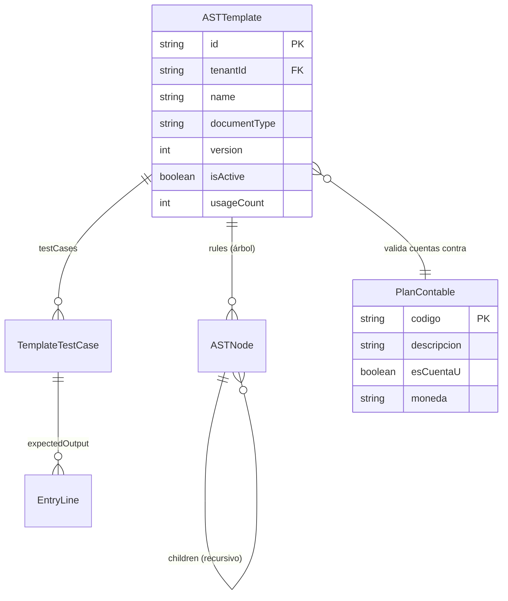
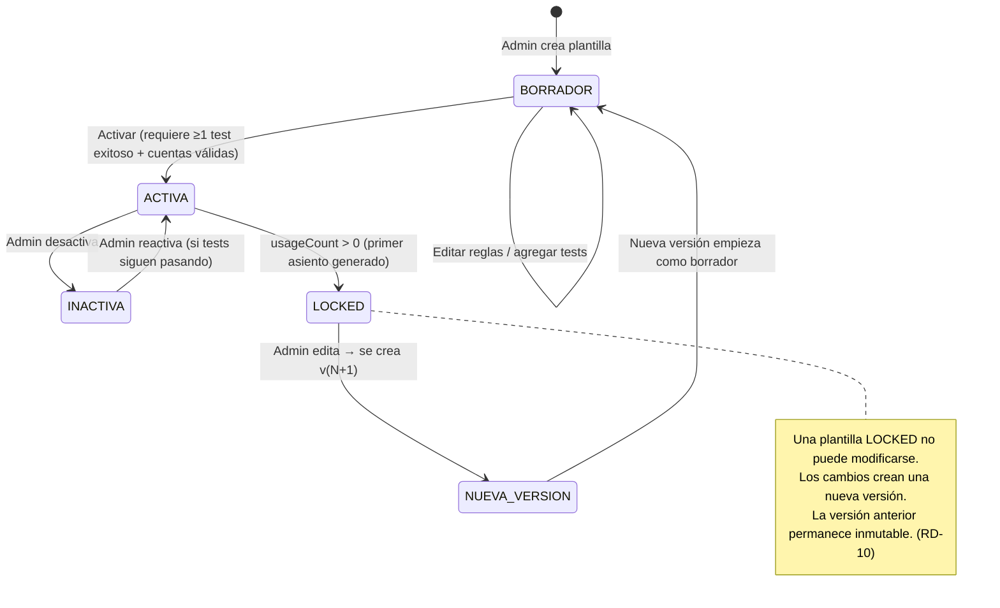

# Data Model: Motor de Plantillas AST

**Feature**: 001-motor-plantillas-ast
**SDD Reference**: §13.3 ASTTemplate, §10.1 ITemplateRepository

## Entidades

### ASTTemplate

Plantilla de reglas de traducción contable. Fuente de verdad: SDD §13.3.

| Campo              | Tipo              | Restricción                         | Descripción                                                   |
| ------------------ | ----------------- | ----------------------------------- | ------------------------------------------------------------- |
| `id`               | String (UUID)     | PK                                  | Identificador único de la plantilla                           |
| `tenantId`         | String            | NOT NULL                            | Tenant propietario (empresa)                                  |
| `name`             | String            | NOT NULL                            | Nombre legible (ej. "FACTURA_COMPRA_NACIONAL")                |
| `documentType`     | String            | NOT NULL                            | Tipo de documento al que aplica (FACTURA, NOTA_CREDITO, etc.) |
| `version`          | Int               | NOT NULL, ≥ 1                       | Número de versión incremental                                 |
| `rules`            | Object            | NOT NULL                            | Árbol de reglas AST serializado como JSON                     |
| `testCases`        | Array             | NOT NULL, ≥ 0                       | Casos de prueba vinculados                                    |
| `isActive`         | Boolean           | NOT NULL                            | Si es la versión activa para este tenant + documentType       |
| `createdBy`        | String            | NOT NULL                            | ID del usuario que creó esta versión                          |
| `createdAt`        | String (ISO 8601) | NOT NULL                            | Timestamp de creación                                         |
| `diffFromPrevious` | String            | NULL                                | Resumen de cambios vs. versión anterior                       |
| `usageCount`       | Int               | NOT NULL, default 0                 | Asientos generados con esta versión                           |
| **UNIQUE**         |                   | `(tenantId, documentType, version)` | Solo una versión por combinación                              |

### ASTNode (dentro de `rules`)

Nodo individual del árbol de reglas. Tipado recursivo.

```javascript
/** @typedef {Object} ASTNode
 * @property {'condition'|'action'|'split'|'group'} type - Tipo de nodo
 * @property {string} [field] - Campo del CanonicalDocument a evaluar (solo condition)
 * @property {'=='|'!='|'>'|'<'|'>='|'<='|'contains'|'in'} [operator] - Operador (solo condition)
 * @property {*} [value] - Valor de comparación (solo condition)
 * @property {'AND'|'OR'} [logic] - Lógica de agrupación (solo group)
 * @property {'debit'|'credit'} [side] - Lado del asiento (solo action)
 * @property {string} [accountCode] - Código de cuenta PCGE (solo action)
 * @property {string} [amountField] - Campo de monto del documento (solo action)
 * @property {string} [amountFormula] - Fórmula de cálculo (solo action, alternativa a amountField)
 * @property {string} [costCenter] - Centro de costo (solo action, opcional)
 * @property {Object} [analyticTags] - Tags analíticos (solo action, opcional)
 * @property {number[]} [proportions] - Proporciones de distribución (solo split)
 * @property {ASTNode[]} [children] - Nodos hijos
 */
```

**Tipos de nodo:**

- **`condition`**: Evaluación booleana sobre un campo del documento canónico
- **`group`**: Agrupación lógica (AND/OR) de condiciones
- **`action`**: Genera una línea de asiento (débito o crédito) con cuenta, monto y tags
- **`split`**: Distribuye un monto entre múltiples centros de costo según proporciones

### TestCase (dentro de `testCases`)

```javascript
/** @typedef {Object} TemplateTestCase
 * @property {string} id - UUID del test case
 * @property {string} name - Nombre descriptivo del caso
 * @property {Object} input - CanonicalDocument simplificado de entrada
 * @property {string} input.type - Tipo de documento
 * @property {string} input.currency - Moneda
 * @property {string} input.issueDate - Fecha de emisión
 * @property {Array} input.lines - Líneas financieras
 * @property {number} input.lines[].amount - Monto en céntimos
 * @property {string} input.lines[].taxCode - Código de impuesto
 * @property {Object} input.lines[].tags - Tags analíticos
 * @property {Array} expectedOutput - Líneas de asiento esperadas
 * @property {string} expectedOutput[].accountCode - Cuenta contable
 * @property {'debit'|'credit'} expectedOutput[].side - Lado del asiento
 * @property {number} expectedOutput[].amount - Monto en céntimos
 * @property {string} [expectedOutput[].costCenter] - Centro de costo esperado
 */
```

### EntryLine (salida del evaluador)

Línea de asiento producida por el evaluador AST. Compatible con SDD §10.1.

```javascript
/** @typedef {Object} EntryLine
 * @property {string} accountCode - Código de cuenta PCGE
 * @property {'debit'|'credit'} side - Lado del asiento
 * @property {number} amount - Monto en céntimos (entero)
 * @property {string} [currency] - Moneda ISO 4217
 * @property {number} [fxRate] - Tasa de cambio aplicada
 * @property {number} [functionalAmount] - Monto en moneda funcional
 * @property {string} [costCenter] - Centro de costo
 * @property {Object} [analyticTags] - Tags analíticos
 */
```

### AccountValidationResult

Resultado de la validación de cuentas contra el PCGE.

```javascript
/** @typedef {Object} AccountValidationResult
 * @property {string} accountCode - Cuenta evaluada
 * @property {'valid'|'not_found'|'not_leaf'|'inactive'} status - Resultado
 * @property {string} [message] - Mensaje descriptivo del problema
 * @property {string} [suggestion] - Sugerencia de corrección
 */
```

## Relaciones entre Entidades



## Transiciones de Estado de Plantilla



## Claves de localStorage

Siguiendo la convención del proyecto:

| Colección           | Clave                                | Contenido                      |
| ------------------- | ------------------------------------ | ------------------------------ |
| Plantillas          | `contableos:v1:<tenantId>:templates` | Array de ASTTemplate           |
| Plantillas globales | `contableos:v1:global:templates`     | Catálogo maestro de plantillas |

## Interfaces de Dominio (ITemplateRepository — SDD §10.1)

```javascript
/**
 * Obtener la plantilla activa para un tenant y tipo de documento.
 * @param {string} tenantId
 * @param {string} documentType
 * @returns {ASTTemplate|null}
 */
function getActiveTemplate(tenantId, documentType) {}

/**
 * Obtener una versión específica de plantilla.
 * @param {string} tenantId
 * @param {string} documentType
 * @param {number} version
 * @returns {ASTTemplate|null}
 */
function getTemplateByVersion(tenantId, documentType, version) {}

/**
 * Listar todas las plantillas de un tenant.
 * @param {string} tenantId
 * @returns {ASTTemplate[]}
 */
function listTemplates(tenantId) {}

/**
 * Guardar/actualizar una plantilla (respetando RD-10).
 * @param {ASTTemplate} template
 * @returns {ASTTemplate}
 */
function saveTemplate(template) {}
```
