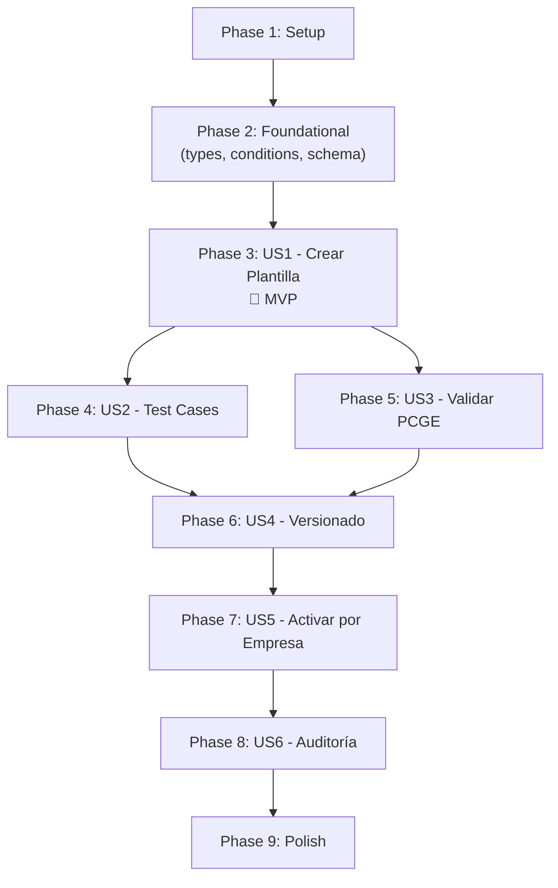

# Tasks: Motor de Plantillas AST

**Feature**: 001-motor-plantillas-ast | **Branch**: `001-motor-plantillas-ast` | **Date**: 2026-09-22

**Spec**: [spec.md](spec.md) | **Plan**: [plan.md](plan.md) | **Data Model**: [data-model.md](data-model.md) | **Contracts**: [contracts/services.md](contracts/services.md)

---

## Phase 1: Setup — Auditoría y Corrección de Base Existente

**Purpose**: Verificar código existente, corregir bugs encontrados por auditoría, confirmar que dominio + servicios + UI compilan y tests pasan.

- [x] T001 Auditar capa de dominio (`src/domain/templates/`) — 8 archivos, 57 tests passing. Sin bugs. ✅
- [x] T002 Auditar capa de servicios (`src/services/ingestion/`) — encontrados 2 CRITICAL + 1 HIGH + 3 MEDIUM/LOW.
- [x] T003 [P] Auditar capa de UI (`src/views/` + `src/components/templates/`) — encontrados 1 HIGH + 4 MEDIUM + 3 LOW.
- [x] T004 [P] Verificar build (`npm run build`) y tests (`npx vitest run`) — ambos passing. ✅

**🛑 CHECKPOINT**: Auditoría completa. 12 bugs encontrados y documentados. Build y tests pasan.

---

## Phase 2: Correcciones CRITICAL + HIGH

**Purpose**: Corregir los bugs críticos encontrados en la auditoría de servicios y UI.

- [x] T005 [C1] Agregar función `assertRole(ctx, allowedRoles)` en `src/services/ingestion/serviceKit.js` — faltaba por completo, causaba TypeError.
- [x] T006 [C2] Agregar guard `if (!ctx) return` en `resetDemoData()` de `src/services/ingestion/demoService.js` — crasheaba si usuario no logueado.
- [x] T007 [H1] Envolver `runTestCases` en try/catch en `src/services/ingestion/templateService.js` L243 — errores del evaluador AST no se capturaban.
- [x] T008 [M1] Validar `code` y `name` no vacíos en `createTemplate()` de `templateService.js` — prevenía IDs como `"PL-undefined"`.
- [x] T009 [M5] Deshabilitar botón "Activar Versión" en `src/components/templates/TemplateEditor.jsx` si tests no pasan — usuario recibía error después de click.

**🛑 CHECKPOINT**: `npx vitest run` — 57/57 en verde. `npm run build` — limpio. Bugs C1, C2, H1, M1, M5 corregidos.

---

## Phase 2b: Correcciones MEDIUM + LOW de UI

**Purpose**: Mejorar UX y corregir problemas menores de la interfaz.

- [x] T009b [M3] Cargar `accountErrors` al abrir el editor en `src/components/templates/TemplateEditor.jsx` — warnings de PCGE visibles desde el inicio.
- [x] T009c [L1] Resetear estado del modal al cancelar en `src/views/PlantillasGlobalesView.jsx` — datos sucios al reabrir.
- [x] T009d [M2] Corregir pérdida de foco en edición de tag keys en `src/components/templates/ActionEditor.jsx`.
- [x] T009e [M4] Preservar condición al convertir Simple→AND/OR en `src/components/templates/ConditionBuilder.jsx`.
- [x] T009f [H2] Corregir inputs decimales en `src/components/templates/SplitEditor.jsx`, `TestCasesPanel.jsx` y `ConditionBuilder.jsx`.
- [x] T009g [L2] Agregar loading skeleton en `src/views/PlantillasGlobalesView.jsx`.
- [x] T009h [L3] Agregar confirmación en botón "Recalcular IGV" de `src/components/templates/TestCasesPanel.jsx`.

---

## Phase 3: User Story 1 — Crear Plantilla de Traducción Contable (P1) 🎯 MVP

**Goal**: El Admin puede crear visualmente una plantilla AST con condiciones y acciones, guardarla como v1, y verla en el catálogo.

**Independent Test**: Crear una plantilla vía UI, ver que aparece en el listado con versión v1.

### Dominio (funciones puras)

- [x] T010 [US1] Crear `src/domain/templates/lifecycle.js` con funciones: `createTemplate(header, actor, clock)` → Template con versión 1 DRAFT, `saveDraft(template, versionNum, draft, actor, clock)` → actualiza borrador, `deleteDraft(template, versionNum)` → elimina borrador no publicado.
- [x] T011 [US1] Crear test `src/domain/templates/__tests__/lifecycle.test.js` — cubrir: creación produce Template con v1 DRAFT, saveDraft actualiza reglas y calcula diff, deleteDraft elimina borrador, deleteDraft rechaza si versión es ACTIVE.

### Servicio

- [x] T012 [US1] Implementar en `src/services/ingestion/templateService.js` las operaciones: `createTemplateService(deps)` factory, `listTemplateBank(ctx, options)`, `createTemplate(ctx, payload)`, `getTemplate(ctx, {templateId})`, `saveTemplateDraft(ctx, {templateId, version, draft})`. Seguir patrón de [contracts/services.md](contracts/services.md). Validar rol ADMIN. Persistir en `repo.getGlobal('templates')`.
- [x] T013 [US1] Crear `src/services/ingestion/serviceKit.js` con helpers: `assertRole(ctx, allowedRoles)`, `buildAuditEvent(ctx, action, details)`, `simulateLatency()`. Re-exportar todo desde `src/services/ingestion/index.js`.

### Datos Semilla

- [x] T014 [P] [US1] Crear `src/data/mockPlantillasReglas.js` con función `buildTemplateBankSeed(mockPlantillas, clock)` que genere al menos 2 plantillas completas: `FACTURA_COMPRA_NACIONAL` (con reglas para IGV 18%, cuentas 6011/4011/4212) y `NOTA_CREDITO_COMPRA` (inversión de factura). Cada una con defaults, reglas de línea, y al menos 1 test case con expected output.
- [x] T015 [US1] Integrar seeding en `src/services/storage/accountingStore.js` o `src/services/ingestion/demoService.js` — al iniciar, si no hay plantillas en localStorage, poblar con `buildTemplateBankSeed`.

### UI

- [x] T016 [US1] Implementar `src/views/PlantillasGlobalesView.jsx` — lista de plantillas con MetricCards (total, activas, borradores), búsqueda por nombre/código, filtro por tipo de operación, botón "Nueva Plantilla" que abre modal de creación. Consume `listTemplateBank` y `createTemplate` del servicio. Usar `useIngestionContext()` para obtener ctx.
- [x] T017 [US1] Implementar `src/components/templates/ConditionBuilder.jsx` — componente visual para construir condiciones: selector de campo (`doc.type`, `line.taxCode`, `line.tags.*`), selector de operador, campo de valor. Soportar agrupación AND/OR. Renderizar como árbol visual anidado.
- [x] T018 [US1] Implementar `src/components/templates/ActionEditor.jsx` — editor de acciones: selector de lado (débito/crédito), selector de cuenta contable (autocompletar desde planContable), campo de fórmula de monto (`line.amount`, `line.taxAmount`), centro de costo opcional.
- [x] T019 [US1] Implementar `src/components/templates/RuleList.jsx` — lista de reglas con: nombre, prioridad (numérica, ordenable), condición resumida, acción resumida. Botones de editar/eliminar por regla.
- [x] T020 [US1] Implementar `src/components/templates/TemplateEditor.jsx` — editor principal que integra ConditionBuilder, ActionEditor, RuleList. Tabs: "Reglas" | "Tests" | "Versiones". Botón "Guardar Borrador" que llama a `saveTemplateDraft`. Recibe `templateId` y carga el template completo.

**🛑 CHECKPOINT**: El Admin puede crear una plantilla, definir reglas visuales, guardarla, y verla en el catálogo. `npm run build` sin errores. `npx vitest run src/domain/templates/__tests__/lifecycle.test.js` en verde.

---

## Phase 4: User Story 2 — Ejecutar Casos de Prueba (P1)

**Goal**: El Admin puede definir test cases, ejecutarlos contra una plantilla, y ver resultados (pasa/falla con detalle).

**Independent Test**: Crear un test case, ejecutar el runner, ver resultado verde o rojo.

### Dominio

- [x] T021 [US2] Crear `src/domain/templates/evaluator.js` con función `evaluateTemplate({version, document, functionalAmounts, accountIndex, operationType})` → `{lines: EntryLine[], appliedRules: string[], analyticTags: Object}`. Implementar: (1) evaluar `documentRules` por prioridad para sobreescribir defaults, (2) evaluar `lineRules` por línea del documento para asignar cuentas/CC/splits, (3) construir líneas de asiento (base imponible + IGV + contrapartida), (4) montos en céntimos (enteros).
- [x] T022 [P] [US2] Crear test `src/domain/templates/__tests__/evaluator.test.js` — cubrir: factura simple (1 línea, IGV 18%), factura multi-línea, regla condicional que cambia cuenta según tag, split por centros de costo, balance correcto (Σ débitos === Σ créditos).
- [x] T023 [US2] Crear `src/domain/templates/testRunner.js` con función `runTestCases(version, pcgeIndex, options)` → `{allPassed, uncoveredRuleIds, results[]}`. Para cada testCase: (1) ejecutar evaluador, (2) verificar balance, (3) comparar líneas resultado vs. expectedOutput (ignorar orden), (4) reportar match/mismatch por línea, (5) verificar cobertura de reglas.
- [x] T024 [P] [US2] Crear test `src/domain/templates/__tests__/testRunner.test.js` — cubrir: test case que pasa, test case que falla (cuenta incorrecta), test case que falla (monto incorrecto), test desbalanceado, regla sin cobertura detectada.

### Servicio

- [x] T025 [US2] Implementar `runTemplateTests(ctx, {templateId, version})` en `templateService.js` — cargar template, ejecutar `runTestCases`, guardar resultado en `version.lastTestRun`, persistir.

### UI

- [x] T026 [US2] Implementar `src/components/templates/TestCasesPanel.jsx` — lista de test cases con: nombre, estado (✅/❌/⏳), botón "Ejecutar Todos". Formulario para agregar test case: input JSON (CanonicalDocument simplificado) y output esperado (líneas de asiento). Mostrar resultado detallado: líneas esperadas vs. obtenidas, diferencias resaltadas, indicador de balance.

**🛑 CHECKPOINT**: Tests del evaluador y testRunner en verde. El Admin puede crear un test case y ejecutarlo en la UI. `npm run build` sin errores.

---

## Phase 5: User Story 3 — Validar Cuentas contra PCGE (P1)

**Goal**: Las cuentas referidas en plantillas se validan automáticamente contra el catálogo PCGE activo.

**Independent Test**: Crear plantilla con cuenta válida e inválida, ver warnings apropiados.

### Dominio

- [x] T027 [US3] Crear `src/domain/templates/templateAccounts.js` con funciones: `accountsUsed(version)` → extrae todas las cuentas de defaults + documentRules + lineRules + splits; `validateAccounts(version, accountIndex)` → `AccountValidationResult[]` con estados `valid`, `NOT_FOUND`, `NOT_POSTABLE`.
- [x] T028 [P] [US3] Crear test `src/domain/templates/__tests__/templateAccounts.test.js` — cubrir: cuenta existente y de último nivel → valid, cuenta inexistente → NOT_FOUND, cuenta padre (no último nivel) → NOT_POSTABLE, extracción de cuentas de splits.

### UI

- [x] T029 [US3] Implementar `src/components/templates/AccountWarnings.jsx` — muestra lista de cuentas referidas con su estado de validación. Íconos: ✅ válida, ⚠️ no encontrada, ⚠️ no imputable. Enlace para navegar al catálogo de cuentas.
- [x] T030 [US3] Integrar `AccountWarnings` en `TemplateEditor.jsx` — mostrar panel de validación de cuentas al lado del editor de reglas. Actualizar en tiempo real cuando el Admin cambia cuentas en las acciones.

**🛑 CHECKPOINT**: Validación de cuentas funcional. Warnings visibles en el editor. `npx vitest run src/domain/templates/__tests__/templateAccounts.test.js` en verde.

---

## Phase 6: User Story 4 — Versionar Plantilla Usada (P2)

**Goal**: Cuando una plantilla ya fue usada (usageCount > 0), al editarla se crea una nueva versión automáticamente. Plantillas no usadas se editan in-place.

**Independent Test**: Marcar plantilla como usada, editarla, verificar que se crea v2 sin alterar v1.

### Dominio

- [x] T031 [US4] Agregar a `src/domain/templates/lifecycle.js` las funciones: `canActivate(version, pcgeIndex)` → verifica precondiciones (tests pasan, cuentas válidas, esquema válido); `activate(template, versionNum, actor, clock, pcgeIndex)` → promociona versión a ACTIVE, retira versiones anteriores; `editTemplate(template, actor, clock)` → si versión activa tiene usageCount > 0, clona como nueva versión DRAFT (RD-10), si no, permite edición directa.
- [x] T032 [US4] Crear `src/domain/templates/diff.js` con función `diffVersions(previous, next)` → `string[]` con diferencias en lenguaje natural en español (cambios en defaults, reglas agregadas/eliminadas/modificadas, test cases cambiados).
- [x] T033 [P] [US4] Crear test `src/domain/templates/__tests__/diff.test.js` — cubrir: diff de defaults cambiados, regla agregada, regla eliminada, regla con condición modificada, sin cambios → array vacío.
- [x] T034 [US4] Actualizar test `src/domain/templates/__tests__/lifecycle.test.js` — agregar tests para: `canActivate` rechaza si tests no pasan, `activate` retira versiones anteriores, `editTemplate` clona si usageCount > 0, `editTemplate` edita in-place si usageCount === 0.

### Servicio

- [x] T035 [US4] Implementar en `templateService.js` las operaciones: `editTemplate(ctx, {templateId})`, `activateTemplateVersion(ctx, {templateId, version})`, `deleteTemplateDraft(ctx, {templateId, version})`, `retireTemplate(ctx, {templateId})`. Integrar `canActivate` como gate antes de activar.

### UI

- [x] T036 [US4] Implementar `src/components/templates/VersionHistory.jsx` — lista de versiones con: número, estado (DRAFT/ACTIVE/RETIRED), autor, fecha, usageCount, diff expandible. Botón "Activar" en borradores elegibles.
- [x] T037 [US4] Integrar VersionHistory como tab en `TemplateEditor.jsx`. Al hacer clic en "Editar" una plantilla con usageCount > 0, mostrar diálogo confirmando que se creará una nueva versión.

**🛑 CHECKPOINT**: Versionado inmutable (RD-10) funcional. Diff muestra cambios en español. `npx vitest run src/domain/templates/` — todos en verde.

---

## Phase 7: User Story 5 — Activar/Desactivar por Empresa (P2)

**Goal**: El Admin puede activar o desactivar plantillas del catálogo global para cada empresa específica.

**Independent Test**: Activar plantilla para Empresa A, verificar que no aparece activa en Empresa B.

### Servicio

- [x] T038 [US5] Implementar en `templateService.js` las operaciones: `listCompanyTemplateActivations(ctx)` → lista plantillas con estado de activación y `accountWarnings` para el tenant; `setCompanyTemplateActivation(ctx, {templateId, active})` → activar/desactivar para un tenant. Persisir en `repo.getCollection(ctx.tenantId, 'templateActivations')`.
- [x] T039 [US5] Implementar `listTemplates(ctx)` → para el rol MAKER, listar solo las plantillas activas del tenant actual (interfaz que consumirán specs posteriores).

### UI

- [x] T040 [US5] Implementar `src/views/PlantillasEmpresaView.jsx` — requiere empresa activa. Muestra lista de plantillas del catálogo global con toggle de activación por empresa. Muestra AccountWarnings por plantilla (validación contra PCGE de esa empresa). Para ADMIN: toggles de activación. Para AUDITOR: solo lectura. Para MAKER: solo ve plantillas activas.
- [x] T041 [US5] Integrar navegación: al hacer clic en warning de cuenta, navegar a PlanContableView (`onNavigate('plan')`) para que el Admin pueda corregir el catálogo.

**🛑 CHECKPOINT**: Activación por empresa funcional. Multi-tenant verificado (distintas empresas, distintas activaciones). `npm run build` sin errores.

---

## Phase 8: User Story 6 — Auditoría de Solo Lectura (P3)

**Goal**: El Auditor puede ver el historial completo de versiones de cualquier plantilla sin poder modificar nada.

**Independent Test**: Iniciar sesión como auditora_ana, navegar a plantillas, verificar que todo es solo lectura.

- [x] T042 [US6] Actualizar `PlantillasGlobalesView.jsx` — si rol es AUDITOR, ocultar botones de crear/editar/retirar. Mostrar listado completo con historial.
- [x] T043 [US6] Actualizar `PlantillasEmpresaView.jsx` — si rol es AUDITOR, ocultar toggles de activación. Mostrar estado de solo lectura.
- [x] T044 [US6] Actualizar `TemplateEditor.jsx` — si modo es "readonly" (AUDITOR), deshabilitar todos los controles de edición. Permitir navegación por versiones y visualización de tests/diff.

**🛑 CHECKPOINT**: Auditor ve todo, no puede editar nada.

---

## Phase 9: Polish & Cross-Cutting Concerns

**Purpose**: Integración final, persistencia, y verificación completa.

- [x] T045 [P] Actualizar `src/hooks/useIngestionContext.js` — asegurar que el hook expone correctamente `{role, userId, tenantId}` del usuario y empresa activos, integrando con `AccountingContext` y `AccessManagementContext`.
- [x] T046 [P] Verificar persistencia — crear plantilla, recargar navegador (F5), verificar que persiste. Hacer reset a datos semilla, verificar que vuelven las plantillas de fábrica.
- [x] T047 Ejecutar validación completa de quickstart.md — reproducir los 4 escenarios manualmente en `npm run dev`.
- [x] T048 Ejecutar suite completa de tests: `npx vitest run src/domain/templates/` — todos en verde.
- [x] T049 Build de producción: `npm run build` — sin errores ni warnings.
- [x] T050 [P] Registrar evento de auditoría para operaciones críticas: `TEMPLATE_CREATED`, `TEMPLATE_VERSION_ACTIVATED`, `TEMPLATE_COMPANY_ACTIVATED`, `TEMPLATE_COMPANY_DEACTIVATED`, `TEMPLATE_RETIRED`. Cada evento con: usuario, rol, tenant, fecha, acción, traceId.

**🛑 CHECKPOINT FINAL**: Todo verde. Build limpio. Persistencia verificada. 4 escenarios del quickstart reproducidos.

---

## Dependencies & Execution Order

### Phase Dependencies

### User Story Dependencies

- **US1 (P1)**: Depende de Phase 2 (Foundational) — es el **MVP**
- **US2 (P1)**: Depende de US1 (necesita plantilla para ejecutar tests)
- **US3 (P1)**: Depende de US1 (necesita plantilla con cuentas)
- **US4 (P2)**: Depende de US2 + US3 (necesita activación con gates)
- **US5 (P2)**: Depende de US4 (necesita activación funcional)
- **US6 (P3)**: Depende de US5 (necesita vistas completas para modo lectura)

### Parallel Opportunities

- T005, T006, T007, T008, T009 pueden ejecutarse en paralelo (Phase 2)
- T017, T018 pueden ejecutarse en paralelo (componentes independientes)
- T021, T022 pueden ejecutarse en paralelo con T027, T028 (US2 || US3)
- T042, T043, T044 pueden ejecutarse en paralelo (Phase 8)

---

## Implementation Strategy

### MVP First (Solo User Story 1)

1. Phase 1: Setup (~15 min)
2. Phase 2: Foundational (~1 hora)
3. Phase 3: US1 - Crear Plantilla (~2 horas)
4. **STOP & VALIDATE**: Admin puede crear y ver plantillas ← **esto ya entrega valor**

### Incremental Delivery

1. MVP → US1 funcional
2. +US2 → Tests runner integrado → confianza en las reglas
3. +US3 → Validación PCGE → prevención de errores contables
4. +US4 → Versionado inmutable → cumplimiento RD-10
5. +US5 → Multi-tenant → activación por empresa
6. +US6 → Auditoría → cumplimiento RF-08

---

## Notes

- **[P]** = tarea paralelizable (archivos distintos, sin dependencias)
- **[USn]** = tarea vinculada a User Story n
- **🛑 CHECKPOINT** = parada obligatoria para revisión humana
- Cada checkpoint debe incluir: resultado de tests, resultado de build, screenshot/demo si hay UI
- Los montos se manejan en **céntimos** (enteros) — NUNCA flotantes acumulativos
- El Admin tiene permisos totales — no implementar restricciones de rol para Admin
- La constitución prohíbe agregar dependencias nuevas — todo con APIs nativas
